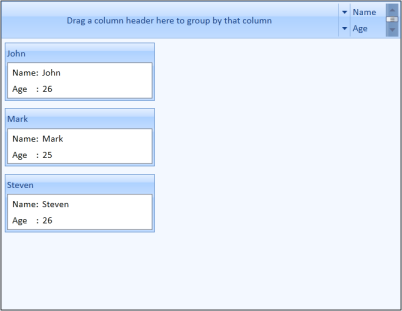
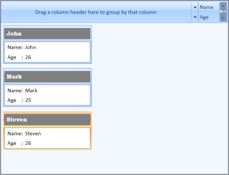

# Customizing Data Templates

Data templates can be customized for items and headers. This section explains how to customize the data templates.

## Item Template 

You can customize how a business object is displayed using ItemTemplate of CardViewItem. The following example shows the usage of ItemTemplate.

[XAML]

  &lt;syncfusion:CardView ItemsSource="{Binding Contacts}" &gt;

                &lt;syncfusion:CardView.ItemTemplate&gt;

                    &lt;DataTemplate &gt;

                        &lt;ListBox ScrollViewer.HorizontalScrollBarVisibility="Disabled"&gt;

                            &lt;ListBoxItem&gt;

                                &lt;StackPanel Orientation="Horizontal"&gt;

                                    &lt;TextBlock Text="Name:"/&gt;

                                    &lt;TextBlock Text="{Binding Name}" Margin="5,0,0,0"/&gt;

                                &lt;/StackPanel&gt;

                            &lt;/ListBoxItem&gt;

                            &lt;ListBoxItem&gt;

                                &lt;StackPanel Orientation="Horizontal"&gt;

                                    &lt;TextBlock Text="Age    :"/&gt;

                                    &lt;TextBlock Text="{Binding Age}" Margin="5,0,0,0"/&gt;

                                &lt;/StackPanel&gt;

                            &lt;/ListBoxItem&gt;

                        &lt;/ListBox&gt;

                    &lt;/DataTemplate&gt;

                &lt;/syncfusion:CardView.ItemTemplate&gt;

            &lt;/syncfusion:CardView&gt;

Implementing the above code generates the following output.

{  | markdownify }
{:.image }

## Header Template 

You can also customize header of the CardViewItem using a header template. This is illustrated in the following example.

1. Define a data template for the header as follows.

[XAML]

  &lt;DataTemplate x:Key="headerTemplate"&gt;

            &lt;Grid&gt;

                &lt;Border Background="Gray"&gt;

                &lt;TextBlock Text="{Binding Path=Name}" Margin="5" Foreground="White" VerticalAlignment="Center" FontWeight="Bold" FontFamily="Bookman Old Style" Grid.Column="1"/&gt;

                &lt;/Border&gt;

            &lt;/Grid&gt;

  &lt;/DataTemplate&gt;

2. Set the HeaderTemplate for the CardViewItem to the above template.

[XAML]

<syncfusion:CardView ItemsSource="{Binding Contacts}" 

                                 ItemTemplate="{StaticResource contactTemplate}" 

                                 HeaderTemplate="{StaticResource headerTemplate}"

                                />

This generates the following CardView control.

{  | markdownify }
{:.image }

## EditItem Template

You can edit the values loaded in CardViewItem using EditItemTemplate. This is illustrated in the following example.

1. Define a data template for the content as follows.

[XAML]

   &lt;DataTemplate x:Key="contactEditTemplate"&gt;

            &lt;ListBox ScrollViewer.HorizontalScrollBarVisibility="Disabled" SelectedIndex="0" ToolTip="{Binding Path=Validation.HasError, ElementName=txt}"&gt;

                &lt;ListBoxItem HorizontalContentAlignment="Stretch" Padding="1"&gt;

                    &lt;Grid &gt;

                        &lt;Grid.ColumnDefinitions&gt;

                            &lt;ColumnDefinition Width="75"/&gt;

                            &lt;ColumnDefinition /&gt;

                        &lt;/Grid.ColumnDefinitions&gt;

                        &lt;TextBlock Text="Name:"/&gt;

                        &lt;TextBox Grid.Column="1"   x:Name="txt" HorizontalAlignment="Stretch" Text="{Binding Name, UpdateSourceTrigger=PropertyChanged, ValidatesOnDataErrors=True}" /&gt;

                    &lt;/Grid&gt;

                &lt;/ListBoxItem&gt;

                &lt;ListBoxItem HorizontalContentAlignment="Stretch" Padding="1"&gt;

                    &lt;Grid &gt;

                        &lt;Grid.ColumnDefinitions&gt;

                            &lt;ColumnDefinition Width="75"/&gt;

                            &lt;ColumnDefinition Width="*"/&gt;

                        &lt;/Grid.ColumnDefinitions&gt;

                        &lt;TextBlock Text="Age:"/&gt;

                        &lt;TextBox  Grid.Column="1"  Text="{Binding Age, UpdateSourceTrigger=PropertyChanged, ValidatesOnDataErrors=True}" /&gt;

                    &lt;/Grid&gt;

                &lt;/ListBoxItem&gt;

            &lt;/ListBox&gt;

        &lt;/DataTemplate&gt;

2. Set EditItemTemplate for the CardView to the above template.

[XAML]

<syncfusion:CardView ItemsSource="{Binding Contacts}" CanEdit="True" 

                                 ItemTemplate="{StaticResource contactTemplate}" 

                                 EditItemTemplate="{StaticResource contactEditTemplate}"

                                 HeaderTemplate="{StaticResource headerTemplate}"

                                />

Implementing the above codes generate the following CardView control. 

{  | markdownify }
{:.image }

> _Note: You can edit the values in the CardView control by double-clicking the CardViewItem._

