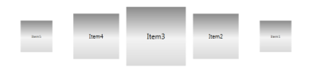

# ItemsPerPage support

Using ItemsPerPage property, you can get or set the number of items to be displayed in the Carousel control. Carousel panel displays only items for the currently visible items.

Using ItemsPerPage in an Application

In the below sample, ItemsPerPage is set as 5. Hence, while running the sample, only 5 items will be displayed in the path.

<table>
<tr>
<td>
[XAML]&lt;syncfusion:Carousel x:Name="carousel" Height="400" Width="450" ItemsPerPage="5"&gt;     &lt;syncfusion:Carousel.Path&gt;         &lt;Path Data="M0,300 L600,300" Stroke="Blue" StrokeThickness="2" HorizontalAlignment="Stretch" VerticalAlignment="Stretch"/&gt;     &lt;/syncfusion:Carousel.Path&gt;     &lt;syncfusion:Carousel.OpacityFractions&gt;         &lt;syncfusion:PathFractionCollection&gt;             &lt;syncfusion:FractionValue Fraction="0" Value="1"/&gt;         &lt;/syncfusion:PathFractionCollection&gt;     &lt;/syncfusion:Carousel.OpacityFractions&gt;     &lt;syncfusion:Carousel.ItemTemplate&gt;         &lt;DataTemplate&gt;             &lt;Border Height="100" Width="100"&gt;                 &lt;Border.Background&gt;                     &lt;LinearGradientBrush EndPoint="0.5,1" StartPoint="0.5,0"&gt;                         &lt;GradientStop Color="#FF8B8B8B" Offset="0"/&gt;                         &lt;GradientStop Color="#FFDADADA" Offset="1"/&gt;                         &lt;GradientStop Color="#FFF3F3F3" Offset="0.536"/&gt;                     &lt;/LinearGradientBrush&gt;                 &lt;/Border.Background&gt;                 &lt;ContentControl Content="{Binding}" HorizontalAlignment="Center" VerticalAlignment="Center"/&gt;             &lt;/Border&gt;         &lt;/DataTemplate&gt;     &lt;/syncfusion:Carousel.ItemTemplate&gt; &lt;/syncfusion:Carousel&gt;</td></tr>
<tr>
<td>
[C#]carousel.ItemsSource = new ObservableCollection<string>() { "Item1", "Item2", "Item3", "Item4", "Item5", "Item6", "Item7", "Item8", "Item9" };</td></tr>
</table>

{  | markdownify }
{:.image }

Properties

 _Plan Projection Table_

<table>
<tr>
<td>
Property </td><td>
Description </td><td>
Type </td><td>
Data Type </td><td>
Reference links </td></tr>
<tr>
<td>
ItemsPerPage</td><td>
Gets or sets the number of items to be displayed in the Carousel control.</td><td>
DependencyProperty</td><td>
Integer</td><td>
</td></tr>
</table>

