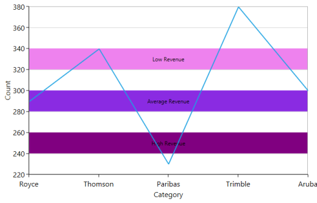
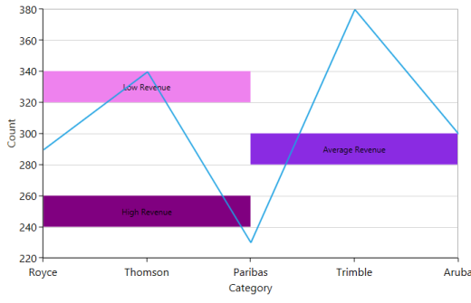

# Striplines

SfChart allows you to add Striplines to the chart, to provide classification about the chart. For instance, when a chart has a Stripline drawn in it, it gives clear understanding about the specific region. This feature provides an informative look and feel to the chart. 

The following APIs are used with the Stripline.

_Stripline_

<table>
<tr>
<td>
Property</td><td>
Definition</td></tr>
<tr>
<td>
Start</td><td>
Gets or sets the double value that represents the stripline start value.</td></tr>
<tr>
<td>
Background</td><td>
Gets or sets the Brush value that represents the background color of stripline.</td></tr>
<tr>
<td>
BorderBrush</td><td>
Gets or sets the Brush value that represents the border brush for stripline.</td></tr>
<tr>
<td>
BorderThickness                             </td><td>
Gets or sets the Thickness value that represents the border thickness of stripline.</td></tr>
<tr>
<td>
SegmentStartValue</td><td>
Gets or sets the double value that represents the initial segment start value of stripline.</td></tr>
<tr>
<td>
SegmentEndValue</td><td>
Gets or sets the double value that represents the segment end value of stripline.</td></tr>
<tr>
<td>
SegmentAxisName</td><td>
Gets or sets the string value that represents the segment axis name for strip line.</td></tr>
<tr>
<td>
IsSegmented</td><td>
Gets or sets the bool value that represents the segmented value for stripline.</td></tr>
<tr>
<td>
RepeatEvery</td><td>
Gets or sets the double value that represents the frequency of stripline being repeated.</td></tr>
<tr>
<td>
RepeatUntil</td><td>
Gets or sets the double value that represents the value where the striplines are repeated.</td></tr>
<tr>
<td>
Label</td><td>
Gets or sets the string value that represents the label associated with stripline.</td></tr>
<tr>
<td>
LabelTemplate</td><td>
Gets or sets the DataTemplate value that represents the label content description for striplines</td></tr>
<tr>
<td>
Width</td><td>
Gets or sets the double value that represents the width of stripline.</td></tr>
<tr>
<td>
LabelAngle</td><td>
Gets or sets the double value that represents the label angle value for striplines.</td></tr>
<tr>
<td>
IsPixelWidth</td><td>
Gets or sets the bool value that represents the value for validating width property to be measured in axis or pixel.</td></tr>
<tr>
<td>
LabelHorizontalAlignment</td><td>
Gets or sets the HorizontalAlignment value that represents the stripline position in Left, Right, Center or Stretch.</td></tr>
<tr>
<td>
LabelVerticalAlignment</td><td>
Gets or sets the VerticalAlignment value that represents the stripline position in Top, Bottom, Center or Stretch.</td></tr>
<tr>
<td>
Striplines</td><td>
Represents the stripline for chart axis.</td></tr>
</table>

The following example illustrates the Stripline feature of chart.

[XAML]

&lt;syncfusion:SfChart&gt;

            &lt;syncfusion:SfChart.PrimaryAxis&gt;

                &lt;syncfusion:CategoryAxis Header="Category" ShowGridLines="False"/&gt;

            &lt;/syncfusion:SfChart.PrimaryAxis&gt;

            &lt;syncfusion:SfChart.SecondaryAxis&gt;

                &lt;syncfusion:NumericalAxis Header="Count"&gt;

                    &lt;syncfusion:NumericalAxis.StripLines&gt;

                        &lt;syncfusion:ChartStripLine Start="240" Width="20" Label="High Revenue" Background="Purple"/&gt;

                        &lt;syncfusion:ChartStripLine Start="280" Width="20" Label="Average Revenue" Background="BlueViolet"/&gt;

                        &lt;syncfusion:ChartStripLine Start="320" Width="20" Label="Low Revenue" Background="Violet" /&gt;

                    &lt;/syncfusion:NumericalAxis.StripLines&gt;

                &lt;/syncfusion:NumericalAxis&gt;

            &lt;/syncfusion:SfChart.SecondaryAxis&gt;

            &lt;syncfusion:LineSeries XBindingPath="CompanyName" YBindingPath="CompanyTurnOver" ItemsSource="{Binding CompanyDetails}"/&gt;

        &lt;/syncfusion:SfChart&gt;

{  | markdownify }
{:.image }

The following example illustrates the Segmented Stripline feature of chart.

[XAML]

&lt;syncfusion:SfChart x:Name="Chart"   Margin="10"&gt;

                &lt;syncfusion:SfChart.PrimaryAxis&gt;

                    &lt;syncfusion:CategoryAxis Header="Category" ShowGridLines="False"/&gt;

                &lt;/syncfusion:SfChart.PrimaryAxis&gt;

                &lt;syncfusion:SfChart.SecondaryAxis&gt;

                    &lt;syncfusion:NumericalAxis Header="Count"&gt;

                        &lt;syncfusion:NumericalAxis.StripLines&gt;

                            &lt;syncfusion:ChartStripLine  IsSegmented="True" SegmentStartValue="0" SegmentEndValue="2" Start="240" Width="20" Label="High Revenue" Background="Purple"/&gt;

                            &lt;syncfusion:ChartStripLine  IsSegmented="True" SegmentStartValue="2" SegmentEndValue="4" Start="280" Width="20" Label="Average Revenue" Background="BlueViolet"/&gt;

                            &lt;syncfusion:ChartStripLine  IsSegmented="True" SegmentStartValue="0" SegmentEndValue="2" Start="320" Width="20" Label="Low Revenue" Background="Violet" /&gt;

                        &lt;/syncfusion:NumericalAxis.StripLines&gt;

                    &lt;/syncfusion:NumericalAxis&gt;

                &lt;/syncfusion:SfChart.SecondaryAxis&gt;

                &lt;syncfusion:LineSeries XBindingPath="CompanyName" YBindingPath="CompanyTurnOver" ItemsSource="{Binding CompanyDetails}"/&gt;

        &lt;/syncfusion:SfChart&gt;

{  | markdownify }
{:.image }

