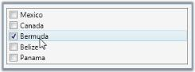

# Layout Related Features

This section illustrates the Layout-related features of CheckListBox control. The following features are discussed:

## Alignment for CheckListBox

The check box in the CheckListBox Item can be aligned to the left or right side of the control using the CheckBoxAlignment property. This dependency property sets the alignment of the check box of the items. Following are the alignment options.

* Left: Check box in the CheckListBox Item is aligned to the left
* Right: Check box in the CheckListBox Item is aligned to the right

To set the CheckBoxAlignment to Right, use the following code.

<table>
<tr>
<td>
[XAML]&lt;!-- Adding CheckListBox with CheckBoxAlignment --&gt;&lt;syncfusion:CheckListBox Name="checkListBox" CheckBoxAlignment="Right"&gt;    &lt;!-- Adding CheckListBox items --&gt;    &lt;syncfusion:CheckListBoxItem Content="Mexico"/&gt;    &lt;syncfusion:CheckListBoxItem Content="Canada" /&gt;    &lt;syncfusion:CheckListBoxItem Content="Bermuda" /&gt;    &lt;syncfusion:CheckListBoxItem Content="Belize" /&gt;    &lt;syncfusion:CheckListBoxItem Content="Panama" /&gt;&lt;/syncfusion:CheckListBox&gt;</td></tr>
<tr>
<td>
[C#]// Align the Check Box.checkListBox.CheckBoxAlignment = CheckBoxAlignment.Right;</td></tr>
</table>

{  | markdownify }
{:.image }

## Flow Direction

The flow direction for the CheckListBox control is set through the FlowDirection property.

_Property table_

<table>
<tr>
<td>
Property</td><td>
Description</td></tr>
<tr>
<td>
FlowDirection</td><td>
Sets the flow direction for the CheckListBox control. The options provided are as follows.* LeftToRight* RightToLeft</td></tr>
</table>

To set the FlowDirection to RightToLeft, use the below code:

<table>
<tr>
<td>
[XAML]&lt;!-- Adding CheckListBox with FlowDirection as right  --&gt;&lt;syncfusion:CheckListBox Name="checkListBox" FlowDirection="RightToLeft"&gt;    &lt;!-- Adding CheckListBox items --&gt;    &lt;syncfusion:CheckListBoxItem Content="Mexico"/&gt;    &lt;syncfusion:CheckListBoxItem Content="Canada" /&gt;    &lt;syncfusion:CheckListBoxItem Content="Bermuda" /&gt;    &lt;syncfusion:CheckListBoxItem Content="Belize" /&gt;    &lt;syncfusion:CheckListBoxItem Content="Panama" /&gt;&lt;/syncfusion:CheckListBox&gt;</td></tr>
<tr>
<td>
[C#]// Set FlowDirection property as RightToLeft.checkListBox.FlowDirection = FlowDirection.RightToLeft;  </td></tr>
</table>

{  | markdownify }
{:.image }

## Set VisualStyle for CheckListBox

The appearance of the CheckListBox control is customized by applying a suitable style using the VisualStyle property.

_Property table_

<table>
<tr>
<td>
Property</td><td>
Description</td></tr>
<tr>
<td>
VisualStyle</td><td>
Sets the visual style for the CheckListBox control. The options provided are as follows.BlendOffice2003Office2007BlueOffice2007BlackOffice2007SilverShinyBlueShinyRedSyncOrangeVS2010MetroTransparent</td></tr>
</table>

For setting Blend style, refer the below code snippet.

<table>
<tr>
<td>
[XAML]&lt;!-- Adding CheckListBox with Visual Style as Blend --&gt;&lt;syncfusion:CheckListBox Name="checkListBox" syncfusion:SkinStorage.VisualStyle="Blend"&gt;    &lt;!-- Adding CheckListBox items --&gt;    &lt;syncfusion:CheckListBoxItem Content="Mexico"/&gt;    &lt;syncfusion:CheckListBoxItem Content="Canada" /&gt;    &lt;syncfusion:CheckListBoxItem Content="Bermuda" /&gt;    &lt;syncfusion:CheckListBoxItem Content="Belize" /&gt;    &lt;syncfusion:CheckListBoxItem Content="Panama" /&gt;&lt;/syncfusion:CheckListBox&gt;</td></tr>
<tr>
<td>
[C#]// Setting the visual style as Blend.SkinStorage.SetVisualStyle(checkListBox, "Blend"); </td></tr>
</table>

{  | markdownify }
{:.image }

{  | markdownify }
{:.image }

{  | markdownify }
{:.image }

{  | markdownify }
{:.image }

{  | markdownify }
{:.image }

{  | markdownify }
{:.image }

