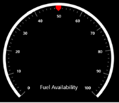

# Header Settings

Header support allows you to show text, an image, or any UI content inside the Gauge control. A Circular Gauge can be made self-descriptive about the data it is measuring through the use of a header. For example, the header can display Speed (in km/h), RPM, etc.

Adding Header in Circular Gauge

To add a header in the gauge, the following properties are required:

* GaugeHeader
* GaugeHeaderPosition

Gauge Header

The GaugeHeader is an object that can be used to set a unique header for the Circular Gauge. You can add text as well as images as headers in a circular gauge and only one header can be added in a circular gauge.

GaugeHeaderPosition

This property places the header in a Circular Gauge. The value for GaugeHeaderPosition is specified in point type. By default, it is placed at (0, 0).

Code Example:

[XAML]

        &lt;syncfusion:SfCircularGauge GaugeHeaderPosition="300,600" &gt;

            &lt;syncfusion:SfCircularGauge.GaugeHeader&gt;

                <TextBlock Text="Temperature (K)" 

                              Height="20" Width="150" 

                              FontSize="20" Foreground="White"/>

            &lt;/syncfusion:SfCircularGauge.GaugeHeader&gt;

        &lt;/syncfusion:SfCircularGauge&gt; 

[C#]

            SfCircularGauge circularGauge = new SfCircularGauge();

            circularGauge.GaugeHeaderPosition = new Point(300,600);    

            TextBlock _textBlock = new TextBlock() { Text = "Temperature (K)", Height = 20, Width = 150, FontSize = 20, Foreground=new SolidColorBrush(Colors.White) };

            circularGauge.GaugeHeader = _textBlock;

            this.Grid.Children.Add(circularGauge);

Screenshot:

{  | markdownify }
{:.image }

Gauge Header as Text

[XAML]

<syncfusion:SfCircularGauge  GaugeHeader="Fual Availability"  

                             GaugeHeaderPosition="300,400" FontSize="20"  >

     &lt;syncfusion:SfCircularGauge.MainScale&gt;

          <syncfusion:CircularScale  RimStroke="White" 

                                     RimStrokeThickness="20” Interval="10" 

                                     StartAngle="120" SweepAngle="175" StartValue="0"  

                                     EndValue="100" >

             &lt;syncfusion:CircularScale.Ranges&gt;

               <syncfusion:CircularRange StartValue="0" EndValue="40" 

                                         Stroke="#39b2c6"/>

               <syncfusion:CircularRange StartValue="40" EndValue="70" 

                                         Stroke="#bcc8c9"/>

               <syncfusion:CircularRange StartValue="70" EndValue="100" 

                                          Stroke="#d1dbdb"/>

             &lt;/syncfusion:CircularScale.Ranges&gt;

          &lt;syncfusion:CircularScale.Pointers&gt;

             <syncfusion:CircularPointer   Value="65" SymbolPointerStroke="Red"

                                          PointerType="SymbolPointer"    />

         &lt;/syncfusion:CircularScale.Pointers&gt;

    &lt;/syncfusion:CircularScale&gt;

&lt;/syncfusion:SfCircularGauge.MainScale&gt;

        &lt;/syncfusion:SfCircularGauge&gt;

[C#]

            SfCircularGauge circularGauge = new SfCircularGauge();

            circularGauge.GaugeHeader = "Fual Availability";

            circularGauge.GaugeHeaderPosition = new Point(300, 400);

            circularGauge.FontSize = 20;

            CircularScale _mainscale = new CircularScale();

            _mainscale.RimStroke = new SolidColorBrush(Colors.White);

            _mainscale.RimStrokeThickness = 20;

            _mainscale.Interval = 10;

            _mainscale.StartValue = 0;

            _mainscale.EndValue = 100;

            _mainscale.StartAngle =120;

            _mainscale.SweepAngle = 175;

            _mainscale.Ranges.Add(new CircularRange() { StartValue = 0, EndValue = 40, Stroke=new SolidColorBrush(Color.FromArgb(0x00,0x39,0xb2,0xc6))});

            _mainscale.Ranges.Add(new CircularRange() {StartValue=40,EndValue=70,Stroke=new SolidColorBrush(Color.FromArgb(0xFF,0xbc,0xc8,0xc9)) });

            _mainscale.Ranges.Add(new CircularRange() {StartValue=70, EndValue=100,Stroke=new SolidColorBrush(Color.FromArgb(0xFF,0xd1,0xdb,0xdb))});

            _mainscale.Pointers.Add(new CircularPointer() { PointerType = PointerType.SymbolPointer, SymbolPointerStroke = new SolidColorBrush(Colors.Red),  Value=65,Symbol=Symbol.Pentagon});

            circularGauge.MainScale = _mainscale;

            this.Grid.Children.Add(circularGauge);

Screenshot:

{  | markdownify }
{:.image }

Gauge Header as UI Element

[XAML]

&lt;syncfusion:SfCircularGauge GaugeHeaderPosition="300,600"&gt;

&lt;syncfusion:SfCircularGauge.GaugeHeader&gt;

                &lt;Grid&gt;

                    &lt;Grid.RowDefinitions&gt;

                        &lt;RowDefinition/&gt;

                        &lt;RowDefinition/&gt;

                    &lt;/Grid.RowDefinitions&gt;

                    <TextBlock Grid.Row="1"  Text="Fual Availability" 

                               Foreground="White" FontSize="20" />

                    <Image Grid.Row="0" Height="20" Width="20"  

                           Source="Assets/FuelIcon.jpg"/>

                 &lt;/Grid&gt;

&lt;/syncfusion:SfCircularGauge.GaugeHeader&gt;

   &lt;/syncfusion:SfCircularGauge&gt;

[C#]

           SfCircularGauge circularGauge = new SfCircularGauge();

           circularGauge.GaugeHeaderPosition = new Point(300, 600);

           Grid grid1 = new Grid();

           RowDefinition rowDef1;

           rowDef1 = new RowDefinition();

           RowDefinition rowDef2;

           rowDef2 = new RowDefinition();

           grid1.RowDefinitions.Add(rowDef1);

           grid1.RowDefinitions.Add(rowDef2);

           BitmapImage _mapimage = new BitmapImage(new Uri("Assets/FuelIcon.jpg")); 

           TextBlock _textBlock = new TextBlock() {Text = "Fuel Availability", Foreground = new SolidColorBrush(Colors.White),FontSize=20};

           Grid.SetRow(_textBlock,1);

           Image image = new Image(){ Height=20,Width=20};

           image.Source = _mapimage;

           Grid.SetRow(image,0);

           circularGauge.GaugeHeader = grid1;      

           this.Grid.Children.Add(circularGauge);

Screenshot:

{  | markdownify }
{:.image }

