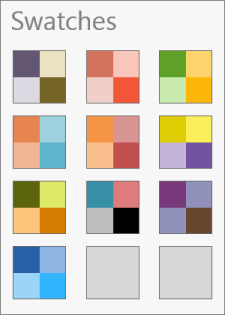
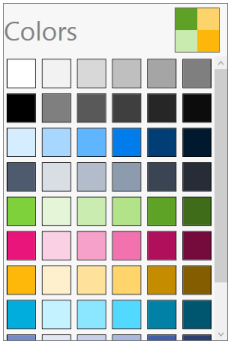
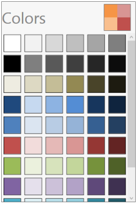
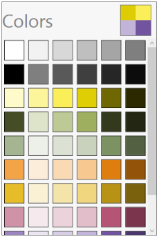
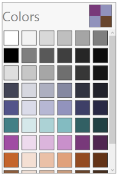

# Interaction

## Swatches Button

ColorPalette having the Swatches button on the right top corner of the control, on clicking the button will navigates to the list of swatches.

{  | markdownify }
{:.image }

## Swatches

Swatches page has the list of swatches, each swatches will have the list of colors.

Apex

{  | markdownify }
{:.image }

Hardcover

{  | markdownify }
{:.image }

Metro

{  | markdownify }
{:.image }

Module

{  | markdownify }
{:.image }

Office

{  | markdownify }
{:.image }

Paper

{  | markdownify }
{:.image }

Pushpin

{  | markdownify }
{:.image }

Solstice

{  | markdownify }
{:.image }

Urban

{  | markdownify }
{:.image }

Waveform

{  | markdownify }
{:.image }

