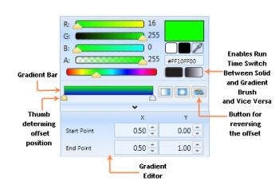
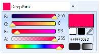
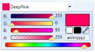

# ColorPicker with Gradient Support

Color Picker now comes with Gradient tool which returns a brush of type Solid, Linear or Radial. The offsets can be added or dropped dynamically and its position can be changed to produce different color combinations.

{  | markdownify }
{:.image }

## Interactive Features with Gradient Support

The following are the key features of the ColorPicker with Gradient support.

### Brush Mode

This property specifies whether Brush is of type Solid or Gradient. The following code snippets illustrate this:

<table>
<tr>
<td>
[XAML]&lt;Syncfusion:ColorPicker x:Name="colorPicker"  BrushMode="Solid"   &gt;</  Syncfusion: ColorPicker >&lt;Syncfusion: ColorPicker x:Name="colorPicker"  BrushMode="Gradient"   &gt;</  Syncfusion: ColorPicker ></td></tr>
<tr>
<td>
[C#]ColorPicker colorPicker = new ColorPicker ();colorPicker.BrushMode =  BrushModes.Solid;colorPicker.BrushMode =  BrushModes.Gradient;</td></tr>
</table>

{  | markdownify }
{:.image }

{  | markdownify }
{:.image }

### Enable Solid To Gradient Switch

This property specifies whether switching between Solid and Gradient BrushMode and vice-versa is enabled at runtime or not.

The following code examples illustrate this:

<table>
<tr>
<td>
[XAML]&lt;Syncfusion: ColorPicker x:Name="colorPicker"  EnableSolidToGradientSwitch="true"   &gt;</  Syncfusion: ColorPicker >&lt;Syncfusion:ColorEdit x:Name="colorPicker"  EnableSolidToGradientSwitch="false"   &gt;</  Syncfusion: ColorEdit ></td></tr>
<tr>
<td>
[C#]ColorPicker colorPicker = new ColorPicker ();colorPicker.EnableSolidToGradientSwitch =  true;colorPicker.EnableSolidToGradientSwitch =  false;</td></tr>
</table>

{  | markdownify }
{:.image }

{  | markdownify }
{:.image }

### IsGradientPropertyEnabled

ColorPicker with Gradient tool comes with a Gradient Editor to change the Start Point/End Point when Brush is of type LinearGradient and Gradient Origin is Center/Radius, if Brush is of type RadialGradient dynamically.  IsGradientPropertyEnabled property specifies whether GradientEditor is made visible or hidden.

The following code example illustrate this:

<table>
<tr>
<td>
[XAML]&lt;Syncfusion:ColorPicker x:Name="colorPicker"  IsGradientEditorEnabled="true"   &gt;</  Syncfusion: ColorPicker >&lt;Syncfusion: ColorPicker x:Name="colorPicker"  IsGradientEditorEnabled="false"   &gt;</  Syncfusion: ColorPicker ></td></tr>
<tr>
<td>
[C#]ColorPicker colorPicker = new ColorPicker ();colorPicker.IsGradientEditorEnabled =  true;colorPicker. IsGradientEditorEnabled =  false;</td></tr>
</table>

{  | markdownify }
{:.image }

{  | markdownify }
{:.image }

### GradientPropertyEditorMode

The property specifies whether GradientEditor should be displayed as a Popup or in extended mode.

<table>
<tr>
<td>
[XAML]&lt;Syncfusion:ColorPicker x:Name="colorPicker"    GradientPropertyEditorMode="Popup" &gt;&lt;/ Syncfusion: ColorPicker &gt;&lt;Syncfusion: ColorPicker x:Name="colorPicker"  GradientPropertyEditorMode="Extended"  &gt;&lt;/Syncfusion: ColorPicker &gt;</td></tr>
<tr>
<td>
[C#]ColorPicker colorPicker = new ColorPicker ();colorPicker.GradientPropertyEditorMode =  GradientPropertyEditorMode.Popup;colorPicker. GradientPropertyEditorMode =  GradientPropertyEditorMode.Extended;</td></tr>
</table>

The GradientEditor is displayed accordingly.

### IsAlphaVisible in ColorPicker

ColorPicker now allows you to restrict the change in Alpha value, thus maintaining it as a constant. This can be achieved by setting _IsAlphaVisible_property to false. This collapses the slider which changes the alpha value in RGB mode and text block for editing alpha value is collapsed in HSV mode.

The following code example illustrate this:

<table>
<tr>
<td>
[XAML]&lt;syncfusion:ColorPicker IsAlphaVisible="True"&gt;&lt;/syncfusion:ColorPicker&gt;  &lt;syncfusion:ColorPicker IsAlphaVisible="false"&gt;&lt;/syncfusion:ColorPicker&gt;</td></tr>
<tr>
<td>
[C#]ColorPicker colorPicker = new ColorPicker();colorPicker.IsAlphaVisible = true;colorPicker.IsAlphaVisible = false;</td></tr>
</table>

{  | markdownify }
{:.image }

{  | markdownify }
{:.image }

{  | markdownify }
{:.image }

{  | markdownify }
{:.image }

