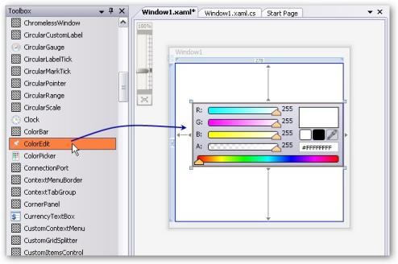
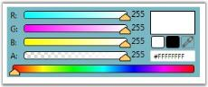

# Getting Started

This section guides you on getting started with ColorPicker and ColorEdit controls. It covers the following topics:

## Why to use our ColorPicker control

Here are some highlights about our ColorPicker control.

* The selected color is visualized in a tooltip for the benefit of the users
* ColorPicker is used in two modes—RGB and HSV
* Support for picking colors using eyedropper. Drag the eyedropper to anywhere in your application to pick the color of a specific location or even a point
## Create ColorPicker control

There are two possible ways to create a ColorPicker control.

Through Designer

To create a ColorPicker control through designer, follow the below steps.

1. Drag the ColorPicker control from the toolbox onto the design area. 

{  | markdownify }
{:.image }

2. Set the properties for the ColorPicker in the design mode, using the Smart Tag feature.

Programmatically

You can create a ColorPicker control either by using XAML code or C# code. Use the following code example to create a ColorPicker control.

<table>
<tr>
<td>
[XAML]&lt;!-- Adding ColorPicker --&gt;&lt;syncfusion:ColorPicker  Name="colorPicker"/&gt;</td></tr>
<tr>
<td>
[C#]//Creating an instance of color pickerColorPicker colorPicker = new ColorPicker();//Adding control to the windowthis.Content = colorPicker; </td></tr>
</table>

{  | markdownify }
{:.image }

## Create ColorEdit control

There are two possible ways to create a simple ColorEdit control.

Through Designer 

To create the ColorEdit control through designer, follow the below steps.

1. Drag a ColorEdit control from the toolbox onto the design area.

{  | markdownify }
{:.image }

2. Set the properties for ColorEdit in design mode, using the Smart Tag feature. 

Programmatically

You can create a ColorEdit control either by using XAML code or C# code. Use the following code snippet to create a ColorEdit control.

<table>
<tr>
<td>
[XAML]&lt;!-- Adding ColorEdit --&gt;<syncfusion:ColorEdit  Name="colorEdit"/</td></tr>
<tr>
<td>
[C#]//Creating an instance of ColorEdit controlColorEdit colorEdit = new ColorEdit();//Adding control to the windowthis.Content = colorEdit; </td></tr>
</table>

{  | markdownify }
{:.image }

