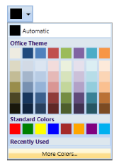
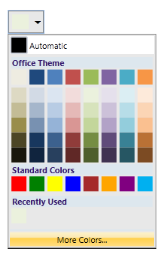

# Appearance

The appearance of the ColorPickerPalette control can be customized by using the VisualStyle property. The following are the various built-in visual styles for ColorPickerPalette control.

* Blend
* Office2003
* Office2007Blue
* Office2007Black
* Office2007Silver
* VS2010
* Metro
* Transparent

{  | markdownify }
{:.image }

{  | markdownify }
{:.image }

{  | markdownify }
{:.image }

{  | markdownify }
{:.image }

{  | markdownify }
{:.image }

{  | markdownify }
{:.image }

{  | markdownify }
{:.image }

