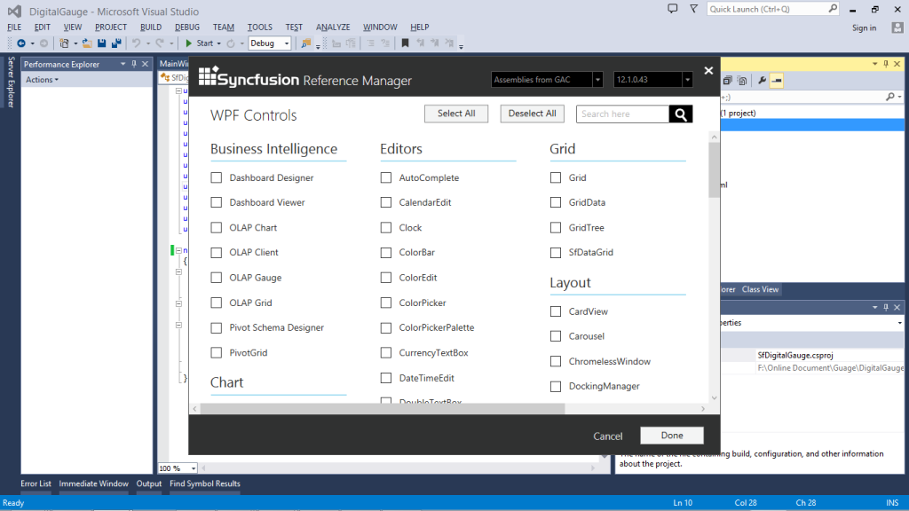
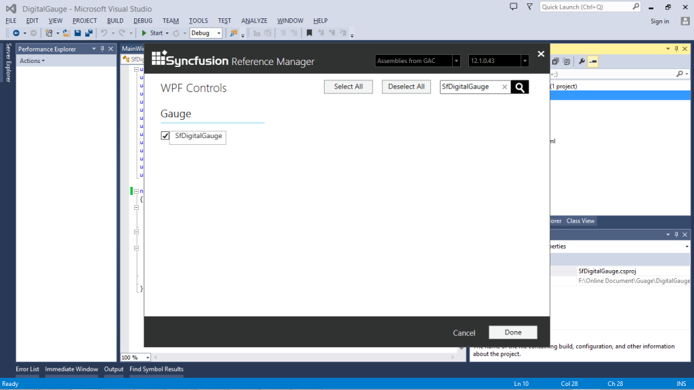
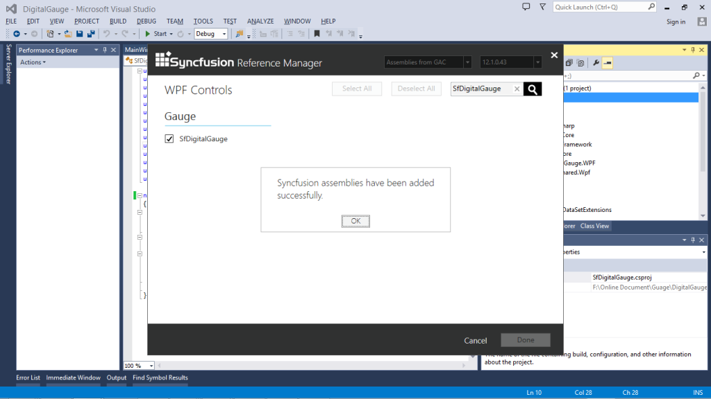

# Getting Started 

## Creating Digital Gauge Programmatically

The following code example explains how to add a Digital Gauge in your application:

[XAML]

<Window x:Class="SfDigitalGauge.MainWindow"

        xmlns="http://schemas.microsoft.com/winfx/2006/xaml/presentation"

        xmlns:x="http://schemas.microsoft.com/winfx/2006/xaml"

        xmlns:syncfusion="http://schemas.syncfusion.com/wpf"

        Title="MainWindow" Height="350" Width="525">

    &lt;Grid Name="Grid"&gt;

        &lt;syncfusion:SfDigitalGauge&gt;&lt;/syncfusion:SfDigitalGauge&gt;

    &lt;/Grid&gt;

&lt;/Window&gt;

[C#]

            SfDigitalGauge digitalgauge = new SfDigitalGauge();

            this.Grid.Children.Add(digitalgauge);

Screenshot:

{  | markdownify }
{:.image }

## Creating a SfDigitalGauge with the Syncfusion Reference Manager

Syncfusion Reference Manager is used to add Syncfusion Tools.

To add SfDigitalGauge Control, refer to the following steps:

1. Create a simple WPF application by using Visual Studio.

{  | markdownify }
{:.image }

2. Right-Click on the Project and select Syncfusion Reference Manager.

{  | markdownify }
{:.image }

3. The Syncfusion Reference Manager Wizard is opened as follows.

{  | markdownify }
{:.image }

4. Search SfDigitalGauge by using Search Box and select SfDigitalGauge Control.  Click done to add selected SfDigitalGauge Control.

{  | markdownify }
{:.image }

5. The SfDigitalGauge  assemblies are automatically added to the Project after Clicking OK.

{  | markdownify }
{:.image }

{  | markdownify }
{:.image }

6. Create a namespace reference to the SfDigitalGauge control by using Syncfusion’s global namespace reference schemas.syncfusion.com or the SfDigitalGauge control’s namespace reference by using Syncfusion.UI.Xaml.Gauges available in the Syncfusion. SfDigitalGauge.WPF assembly.

[XAML]

xmlns:syncfusion ="http://schemas.syncfusion.com/wpf" 

7. Add the following code example to create a simple SfDigitalGauge control.

[XAML]

<Window x:Class="SfDigitalGauge.MainWindow"

        xmlns="http://schemas.microsoft.com/winfx/2006/xaml/presentation"

        xmlns:x="http://schemas.microsoft.com/winfx/2006/xaml"

        xmlns:syncfusion="http://schemas.syncfusion.com/wpf"

        Title="MainWindow" Height="350" Width="525">

    &lt;Grid Name="Grid"&gt;

        &lt;syncfusion:SfDigitalGauge&gt;&lt;/syncfusion:SfDigitalGauge&gt;  

    &lt;/Grid&gt;

&lt;/Window&gt; 

[C#]

using System.Windows;

using Syncfusion.UI.Xaml.Gauges;

namespace  DigitalGauge

{

    public partial class MainWindow : Window

    {

        public MainWindow()

        {

            InitializeComponent();

            SfDigitalGauge digitalgauge = new SfDigitalGauge();

            this.Grid.Children.Add(digitalgauge);

         }

    }

}

8. The SfDigitalGauge control is created as follows.

{  | markdownify }
{:.image }

> _Note:_   

> _1.   The Syncfusion Reference Manager is available in versions 11.3.0.30 and later. It supports referencing assemblies from version 10.4.0.71 version to the current version._

> _2.   The Syncfusion Reference Manager is used only in Visual Studio 2010, 2012, and 2013._

