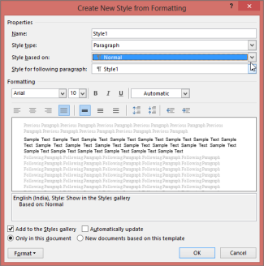
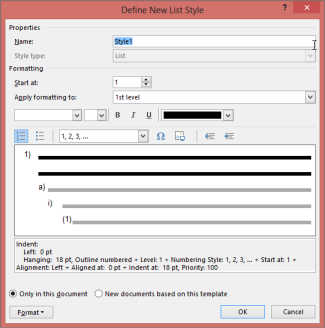

# Styles and Formatting

Styles and Formatting make a Word document a full fledged and well formatted one. Word document and document elements have their own styles and formatting.

Styles or Formattings can be classified into three types based on its behavior:

* Character style
* Paragraph style
* Table style

The following are the types of formattings supported by DocIO.

* Character formatting
* Paragraph formatting
* List style fromatting

> _Note: DocIO currently does not support table styles._

Introduction to styles and formatting in DocIO

DocIO allows you to create your own paragraph style and list styles (user-defined style), which can be applied to any paragraph or list item. Refer to the Paragraph formatting section to know more about the user-defined styles.

> _Note: In a Word document style hierarchy, “Normal” is the base style and is the default style for paragraphs and tables, if the user has not specified style definition._

Collection of DocIO Character and Paragraph styles are accessible through the WordDocument.Styles property. Collection of List styles is accessible through the WordDocument.ListStyles property.

Style Class

DocIO Style class is a base class for the other style classes. Style is an abstract class. CharacterFormat property of Style class specifies character formatting. This property returns the instance of WCharacterFormat type. Name property specifies the name of the style. BaseStyle property specifies the base style (style inherits formatting of base style). User can apply one of the built-in Word styles by using the WParagraph.ApplyStyle method. The built-in styles are accessible through the BuiltinStyle enumeration.

Public Properties

_Public Properties_

<table>
<tr>
<td>
Properties</td><td>
Description</td></tr>
<tr>
<td>
CharacterFormat</td><td>
Gets the character format.    </td></tr>
<tr>
<td>
Name</td><td>
Gets or sets the style name.  </td></tr>
<tr>
<td>
StyleType</td><td>
Gets the type of style.  </td></tr>
<tr>
<td>
IsPrimaryStyle</td><td>
Gets or sets the Primary style definition. If you set this to true, then the corresponding style will be displayed in Syles ribbon of Microsoft Word.</td></tr>
</table>
Public Methods

_Public Methods_

<table>
<tr>
<td>
Methods</td><td>
Description</td></tr>
<tr>
<td>
ApplyBaseStyle</td><td>
Applies base style for current style.</td></tr>
<tr>
<td>
Clone</td><td>
Clones itself.</td></tr>
</table>
Acessing Styles

You can access the collection of styles defined in the document by using the Styles property. This collection holds both the built-in and user-defined styles in a document. A particular style can be obtained by its name or index.

The following code example illustrates how to access the collection of styles defined in the Word document.

[C#]

//Gets a collection of styles defined in the document.

IStyleCollection coll = document.Styles;

//Accesses a particular style.

IStyle style= coll.FindByName(string Stylename ) ;

IStyle style= coll.FindByName(string Stylename,StyleType styleType) ;

//Accesses a particular style by using the index.

IStyle style1=coll[0];

[VB.NET]

'Gets a collection of styles defined in the document.

Dim coll As IStyleCollection = document.Styles

'Accesses a particular style.

Dim style As IStyle= coll.FindByName(String Stylename)

Dim style As IStyle= coll.FindByName(String Stylename,StyleType styleType)

'Accesses a particular style using the index.

Dim style1 As IStyle = coll(0)

## Character Formatting Properties

Character Styles

This sections elaborates how to deal with the Character Styles. The class CharacterStyle takes resposibilty for handling the character styles. 

> _Note: DocIO does not provide support to add user-defined character styles to the document_

Class Hierarchy

Style

   |

    CharacterStyle

Public Properties

_Public Properties_

<table>
<tr>
<td>
Properties</td><td>
Description</td></tr>
<tr>
<td>
BaseStyle</td><td>
Gets the base style.</td></tr>
<tr>
<td>
StyleType</td><td>
Gets the type of style.  </td></tr>
<tr>
<td>
UseContextualAlternates</td><td>
Gets or sets a value indicating whether to use contextual alternates (Microsoft Word 2010 specific property).</td></tr>
<tr>
<td>
Ligatures</td><td>
Gets or sets the ligatures type (Microsoft Word 2010 specific property).</td></tr>
<tr>
<td>
NumberForm</td><td>
Gets or sets the number form type (Microsoft Word 2010 specific property).</td></tr>
<tr>
<td>
NumberSpacing</td><td>
Gets or sets the number spacing type (Microsoft Word 2010 specific property).</td></tr>
<tr>
<td>
StylisticSet</td><td>
Gets or sets the stylistic set type (Microsoft Word 2010 specific property).</td></tr>
</table>

Public Methods

_Public Methods_

<table>
<tr>
<td>
Methods</td><td>
Description</td></tr>
<tr>
<td>
Clone</td><td>
Clones itself.</td></tr>
<tr>
<td>
NameToBuiltIn</td><td>
Converts string style names to BuiltinStyle.</td></tr>
</table>
Character Formatting

The class WCharacterFormat represents the character formats in EssentialDocIO. It is used to get or set the formatting for text chunks, special symbol, or marker (for example marker of picture, text box, footnote, etc.). WCharacterFormat customizes the appearance of the element (for example text chunk or symbol) in the document, starting with font name to the style of texture and spacing between characters.

Class Hierarchy

FormatBase

         |

         WCharacterFormat

Public Constructor

_Public Constructor_

<table>
<tr>
<td>
Constructor </td><td>
Description</td></tr>
<tr>
<td>
WCharacterFormat.WCharacterFormat (IWordDocument)</td><td>
Initializes a new instance of the WCharacterFormat class.</td></tr>
</table>

Public Properties

_Public Properties_

<table>
<tr>
<th>
Properties</th><th>
Description</th></tr>
<tr>
<th>
AllCaps</th><th>
Gets or sets the AllCaps property of text.</th></tr>
<tr>
<th>
Bidi</th><th>
Gets or sets the right-to-left property of text.  </th></tr>
<tr>
<th>
Bold</th><th>
Gets or sets the bold style of text.</th></tr>
<tr>
<th>
BoldBidi</th><th>
Gets or sets the bold property for right-to-left text.  </th></tr>
<tr>
<th>
Border</th><th>
Gets the border for text.</th></tr>
<tr>
<th>
CharacterSpacing</th><th>
Gets or sets the space width between characters in text.  </th></tr>
<tr>
<th>
DoubleStrike</th><th>
Gets or sets the doublestrikeout style to text.  </th></tr>
<tr>
<th>
Emboss           </th><th>
Gets or sets the emboss property of text.  </th></tr>
<tr>
<th>
Engrave</th><th>
Gets or sets the engrave property of text.  </th></tr>
<tr>
<th>
Font</th><th>
Gets or sets the font as System.Drawing.Font. </th></tr>
<tr>
<th>
FontName</th><th>
Gets or sets the font name for text.</th></tr>
<tr>
<th>
FontNameBidi</th><th>
Gets or sets the font name for right-to-left text.  </th></tr>
<tr>
<th>
FontSize</th><th>
Gets or sets the font size (in points).</th></tr>
<tr>
<th>
FontSizeBidi</th><th>
Gets or sets the font size of the right-to-left text (in points).  </th></tr>
<tr>
<th>
Hidden</th><th>
Gets or sets the hidden property of text.  </th></tr>
<tr>
<th>
HighlightColor</th><th>
Gets or sets the highlight color of text.  </th></tr>
<tr>
<th>
Italic</th><th>
Gets or sets the italic style to text.  </th></tr>
<tr>
<th>
ItalicBidi</th><th>
Gets or sets the italic property for right-to-left text.  </th></tr>
<tr>
<th>
LineBreak</th><th>
Gets or sets the line break after the text.  </th></tr>
<tr>
<th>
OutLine</th><th>
Gets or sets the outline character property.  </th></tr>
<tr>
<th>
Position</th><th>
Gets or sets the text vertical position.  </th></tr>
<tr>
<th>
Shadow</th><th>
Gets or sets the shadow property of text.  </th></tr>
<tr>
<th>
SmallCaps</th><th>
Gets or sets the SmallCaps property of text.  </th></tr>
<tr>
<th>
Strikeout</th><th>
Gets or sets the strikeout style to text.  </th></tr>
<tr>
<th>
SubSuperScript</th><th>
Gets or sets the subscript/superscript mode to text.  </th></tr>
<tr>
<th>
TextBackgroundColor</th><th>
Gets or sets the text background color.  </th></tr>
<tr>
<th>
TextColor</th><th>
Gets or sets the text color.  </th></tr>
<tr>
<th>
UnderlineStyle</th><th>
Gets or sets the underline style to text.</th></tr>
<tr>
<th>
LocaleIdASCII</th><th>
Gets or sets the localeidentifier (language) of the formatted characters.</th></tr>
<tr>
<th>
LocaleIdFarEast</th><th>
Gets or sets the the localeidentifier (language) of the formatted Asian characters.</th></tr>
</table>

The following code example illustrates how to use the WCharacterFormat class.

[C#]

//Writes different font name or font size.

string[] fontNames = new string[] {"Times New Roman", "Verdana", "Symbol", };

IWSection section = doc.AddSection();

IWParagraph paragraph;

IWTextRange textRange;

for (int j = 0, len = fontNames.Length; j < len; j++)

{

    paragraph = section.AddParagraph();

    string fontName = fontNames[j];

    for (int i = 9; i < 40; i++)

    {

        textRange = paragraph.AppendText(fontName + " " + i.ToString() + " ");

        textRange.CharacterFormat.FontSize = i;

        textRange.CharacterFormat.FontName = fontName;

        if (i > 15)

        {

            i += 5;

        }

    }

    IWTextRange txtRange2 = paragraph.AppendText(fontName + "34,5 ");

    txtRange2.CharacterFormat.FontSize = (float)34.5;

    txtRange2.CharacterFormat.FontName = fontName;

}

//Writes bold or italic or underline or strike text.

paragraph = section.AddParagraph();

textRange = paragraph.AppendText("Bold Text_Bold Text   ");

textRange.CharacterFormat.Bold = true;

textRange = paragraph.AppendText("Italic Text_Italic Text   ");

textRange.CharacterFormat.Italic = true;

textRange = paragraph.AppendText("Underline Text_Underline Text   ");

textRange.CharacterFormat.UnderlineStyle = UnderlineStyle.Dash;

textRange = paragraph.AppendText("Strike Text_Strike Text   ");

textRange.CharacterFormat.Strikeout = true;

textRange = paragraph.AppendText("Shadow Text_Shadow Text   ");

textRange.CharacterFormat.Shadow = true;

paragraph = section.AddParagraph();

paragraph = section.AddParagraph();

textRange = paragraph.AppendText("Merged Font Style Text_Merged Font Style Text");

textRange.CharacterFormat.Bold = true;

textRange.CharacterFormat.Italic = true;

textRange.CharacterFormat.Strikeout = true;

textRange.CharacterFormat.UnderlineStyle = UnderlineStyle.Dash;

//Specifies the locale for recognition of Microsoft Word.

//For the list of locale identifiers see, http://www.microsoft.com/globaldev/reference/lcid-all.mspx.

//Sets the locale identifier (language) of the formatted characters. 
textRange.CharacterFormat.LocaleIdASCII = ( short )LocaleIDs.uk_UA;

//or

textRange.CharacterFormat.LocaleIdASCII = 1093;

//Sets the locale identifier (language) of the formatted Asian characters.

textRange.CharacterFormat.LocaleIdFarEast = 2052

[VB.NET]

'Writes different font name or font size.

Dim fontNames As String() = New String() { "Times New Roman", "Verdana","Symbol", }

Dim section As IWSection = doc.AddSection()

Dim paragraph As IWParagraph

Dim textRange As IWTextRange

Dim j As Integer = 0

len = fontNames.Length

Do While j < len

      paragraph = section.AddParagraph()

Dim fontName As String = fontNames(j)

      For i As Integer = 9 To 39

            textRange = paragraph.AppendText(fontName and " " and i.ToString() and " ")

            textRange.CharacterFormat.FontSize = i

            textRange.CharacterFormat.FontName = fontName

            If i > 15 Then

                  i += 5

            End If

      Next i

Dim txtRange2 As IWTextRange = paragraph.AppendText(fontName and "34,5 ")

      txtRange2.CharacterFormat.FontSize = CSng(34.5)

      txtRange2.CharacterFormat.FontName = fontName

      j += 1

Loop

'Writes bold or italic or underline or strike text.

paragraph = section.AddParagraph()

textRange = paragraph.AppendText("Bold Text_Bold Text   ")

textRange.CharacterFormat.Bold = True

textRange = paragraph.AppendText("Italic Text_Italic Text   ")

textRange.CharacterFormat.Italic = True

textRange = paragraph.AppendText("Underline Text_Underline Text   ")

textRange.CharacterFormat.UnderlineStyle = UnderlineStyle.Dash

textRange = paragraph.AppendText("Strike Text_Strike Text   ")

textRange.CharacterFormat.Strikeout = True

textRange = paragraph.AppendText("Shadow Text_Shadow Text   ")

textRange.CharacterFormat.Shadow = True

paragraph = section.AddParagraph()

paragraph = section.AddParagraph()

textRange = paragraph.AppendText("Merged Font Style Text_Merged Font Style Text")

textRange.CharacterFormat.Bold = True

textRange.CharacterFormat.Italic = True

textRange.CharacterFormat.Strikeout = True

textRange.CharacterFormat.UnderlineStyle = UnderlineStyle.Dash

'Specifies the locale for recognition of Microsoft Word.

'For the list of locale identifiers, seehttp://www.microsoft.com/globaldev/reference/lcid-all.mspx.

'Sets the locale identifier (language) of the formatted characters.

textRange.CharacterFormat.LocaleIdASCII = CType(LocaleIDs.uk_UA, Short)

'or

textRange.CharacterFormat.LocaleIdASCII = 1093

'Sets the locale identifier (language) of the formatted Asian characters.

textRange.CharacterFormat.LocaleIdFarEast = 2052

## Paragraph Formatting Properties

Paragraph Style

WParagraphStyle class represents paragraph style in DocIO. Paragraph Style is a pattern of paragraph formatting. You can also apply custom paragraph styles to the paragraph. The following screenshot illustrates how to achieve this in Microsoft Word.

{  | markdownify }
{:.image }

_Setting Paragraph Style_

DocIO also lets you add your own paragraph styles to the document. A collection of DocIOParagraph Styles is accessible through WordDocument.Styles property. You can apply one of the built-in Word paragraph styles by using the WParagraph.ApplyStyle method. You can also use the ApplyBaseStyle method to apply the base style for the current paragraph style.

Class Hierarchy

Style

  |

    WParagraphStyle

Public Constructors

_Public Constructor_

<table>
<tr>
<td>
Constructor </td><td>
Description</td></tr>
<tr>
<td>
WParagraphStyle.WParagraphStyle (IWordDocument)</td><td>
Initializes a new instance of the WParagraphStyle class.  </td></tr>
</table>
Public Properties

_Public Properties_

<table>
<tr>
<td>
Properties</td><td>
Description</td></tr>
<tr>
<td>
BaseStyle</td><td>
Gets a base style of paragraph.  </td></tr>
<tr>
<td>
ParagraphFormat</td><td>
Gets formatting of paragraph.  </td></tr>
<tr>
<td>
StyleType</td><td>
Gets the type of the style.</td></tr>
</table>

Public Methods

_Public Methods_

<table>
<tr>
<td>
Methods</td><td>
Description</td></tr>
<tr>
<td>
ApplyBaseStyle</td><td>
Applies base style for current style.</td></tr>
<tr>
<td>
Clone</td><td>
Clones itself.</td></tr>
</table>

The following code example illustrates how to create user-defined Paragraph Styles by using DocIO.

[C#]

IWordDocument doc = new WordDocument();

IWParagraphStyle style = (IWParagraphStyle)doc.AddParagraphStyle("Normal");

style = (IWParagraphStyle)doc.AddParagraphStyle("UserStyle_Heading1");

style.CharacterFormat.Bold = true;

style.CharacterFormat.FontName = "Verdana";

style.CharacterFormat.FontSize = 25;

style = (IWParagraphStyle)doc.AddParagraphStyle("UserStyle_Heading2");

style.CharacterFormat.Italic = true;

style.CharacterFormat.FontName = "Verdana";

style.CharacterFormat.FontSize = 20;

style = (IWParagraphStyle)doc.AddParagraphStyle("UserStyle_Heading3");

style.CharacterFormat.Bold = true;

style.CharacterFormat.FontName = "Times New Roman";

style.CharacterFormat.FontSize = 20;

style.CharacterFormat.UnderlineStyle = UnderlineStyle.Single;

IWSection section = doc.AddSection();

for (int i = 0; i < doc.Styles.Count; i++)

{

    style = (IWParagraphStyle)doc.Styles[i];

    IWParagraph paragraph = section.AddParagraph();

    paragraph.ApplyStyle(style.Name);

    paragraph.AppendText("[ Style Applied ]: ");

    paragraph.AppendText(style.Name);

}

section.AddParagraph();

doc.Save("UserStyle.doc");

[VB.NET]

Dim doc As IWordDocument = New WordDocument()

Dim style As IWParagraphStyle = CType(doc.AddParagraphStyle("Normal"), IWParagraphStyle)

Dim style = CType(doc.AddParagraphStyle("UserStyle_Heading1"), IWParagraphStyle)

style.CharacterFormat.Bold = True

style.CharacterFormat.FontName = "Verdana"

style.CharacterFormat.FontSize = 25

style = CType(doc.AddParagraphStyle("UserStyle_Heading2"), IWParagraphStyle)

style.CharacterFormat.Italic = True

style.CharacterFormat.FontName = "Verdana"

style.CharacterFormat.FontSize = 20

style = CType(doc.AddParagraphStyle("UserStyle_Heading3"), IWParagraphStyle)

style.CharacterFormat.Bold = True

style.CharacterFormat.FontName = "Times New Roman"

style.CharacterFormat.FontSize = 20

style.CharacterFormat.UnderlineStyle = UnderlineStyle.Single

Dim section As IWSection = doc.AddSection()

Dim i As Integer = 0

Do While i < doc.Styles.Count

style = CType(doc.Styles(i), IWParagraphStyle)

Dim paragraph As IWParagraph = section.AddParagraph()

paragraph.ApplyStyle(style.Name)

paragraph.AppendText("[ Style Applied ]: ")

paragraph.AppendText(style.Name)

i += 1

Loop

section.AddParagraph()

doc.Save("UserStyle.doc")

The following code illustrates how to apply built-in paragraph styles to the Word document.

[C#]

IWordDocument doc = new WordDocument();

doc.EnsureMinimal();

doc.LastParagraph.AppendText("Heading 1");

doc.LastParagraph.ApplyStyle(BuiltinStyle.Heading1);

doc.Save("BuiltinStyle.doc");

[VB.NET]

Dim doc As IWordDocument = New WordDocument()

doc.EnsureMinimal()

doc.LastParagraph.AppendText("Heading 1")

doc.LastParagraph.ApplyStyle(BuiltinStyle.Heading1)

doc.Save("BuiltinStyle.doc")

Paragraph Format

WParagraphFormat class represents paragraph formatting in Essential DocIO. The following screenshot illustrates how to define Paragraph Format to a paragraph in Microsoft Word.

{  | markdownify }
{:.image }

_Paragraph Formatting_

Class Hierarchy

FormatBase

           |

            WParagraphFormat 

Public Constructors

_Public Constructors_

<table>
<tr>
<td>
Constructors </td><td>
Description</td></tr>
<tr>
<td>
WParagraphFormat.WParagraphFormat ()</td><td>
Initializes a new instance of WParagraphFormat class. </td></tr>
<tr>
<td>
WParagraphFormat.WParagraphFormat (IWordDocument)</td><td>
Initializes a new instance of WParagraphFormat class.</td></tr>
</table>
Public Properties

_Public Properties_

<table>
<tr>
<td>
Properties</td><td>
Description</td></tr>
<tr>
<td>
AfterSpacing</td><td>
Gets or sets the spacing (in points) after the paragraph.</td></tr>
<tr>
<td>
BackColor</td><td>
Gets or sets the background color of the paragraph.</td></tr>
<tr>
<td>
BeforeSpacing</td><td>
Gets or sets the spacing (in points) before the paragraph.</td></tr>
<tr>
<td>
Bidi</td><td>
Gets or sets the right-to-left property of the paragraph.</td></tr>
<tr>
<td>
Borders</td><td>
Gets collection of borders in the paragraph.</td></tr>
<tr>
<td>
ColumnBreakAfter</td><td>
True if a column break is forced after the paragraph.</td></tr>
<tr>
<td>
FirstLineIndent</td><td>
Gets or sets the first paragraph line indent.</td></tr>
<tr>
<td>
HorizontalAlignment</td><td>
Gets or sets the horizontal alignment for the paragraph.  </td></tr>
<tr>
<td>
Keep</td><td>
True if all lines in the paragraph are to remain on the same page.  </td></tr>
<tr>
<td>
KeepFollow</td><td>
True if the paragraph is to remain on the same page as the paragraph that follows it.  </td></tr>
<tr>
<td>
FirstLineIndent</td><td>
Gets or sets the first paragraph line indent (in points).</td></tr>
<tr>
<td>
HorizontalAlignment</td><td>
Gets or sets the horizontal alignment for the paragraph.  </td></tr>
<tr>
<td>
Keep</td><td>
True if all lines in the paragraph are to remain on the same page.  </td></tr>
<tr>
<td>
KeepFollow</td><td>
True if the paragraph is to remain on the same page as the paragraph that follows it.  </td></tr>
<tr>
<td>
LeftIndent</td><td>
Gets or sets the value that represents the left indent for paragraph (in points). </td></tr>
<tr>
<td>
LineSpacing</td><td>
Gets or sets the line spacing property of the paragraph   (in points) that specifies the space between two paragraphs.</td></tr>
<tr>
<td>
LineSpacingRule</td><td>
Gets or sets the line spacing rule property of the paragraph.  </td></tr>
<tr>
<td>
PageBreakAfter</td><td>
True if a page break is forced after the paragraph.  </td></tr>
<tr>
<td>
PageBreakBefore</td><td>
True if a page break is forced before the paragraph.</td></tr>
<tr>
<td>
RightIndent</td><td>
Gets or sets the right indent for paragraph (in points). </td></tr>
<tr>
<td>
MirrorIndents</td><td>
Gets or sets a value indicating whether the indentation type is mirror indents (Microsoft Word 2007 and 2010 specific property).</td></tr>
</table>

[C#]

para.ParagraphFormat.OutlineLevel = OutlineLevel.Level8;

[VB.NET]

para.ParagraphFormat.OutlineLevel = OutlineLevel.Level8

Tabs

Tabs class represents a tab collection within a paragraph. Tab class represents a single tab within the tab collection.

Class Hierarchy

WParagraphFormat

   |

    Tabs

Public Properties

_Public Properties_

<table>
<tr>
<td>
Properties</td><td>
Description</td></tr>
<tr>
<td>
Justification</td><td>
Gets or sets the tab justification.</td></tr>
<tr>
<td>
TabLeader</td><td>
Gets or sets the tab leader.</td></tr>
<tr>
<td>
Position</td><td>
Gets or sets the tab position.</td></tr>
<tr>
<td>
DeletePostion</td><td>
Gets or sets the Clear tab position.</td></tr>
</table>

Public Methods

_Public Methods_

<table>
<tr>
<td>
Methods</td><td>
Description</td></tr>
<tr>
<td>
AddTab()</td><td>
Adds default tab to the paragraph.</td></tr>
<tr>
<td>
AddTab(float position)</td><td>
Adds tab at the specfied position.</td></tr>
<tr>
<td>
AddTab(float position, TabJustification justification TabLeader leader)</td><td>
Adds tab at specified location with the specified tab justification and leader.</td></tr>
<tr>
<td>
RemoveAt(int index)</td><td>
Removes tab at specified index from the tab collection.</td></tr>
<tr>
<td>
RemoveByTabPosition(float position)</td><td>
Removes tab at specified tab position from the tab collection.</td></tr>
</table>

The following code example illustrates how to add the tab to a paragraph and delete the tab from a paragraph.

[C#]

//Creates a new instance for a Word document.

WordDocument document = new WordDocument();

//Adds one section to the document.

IWSection section=document .AddSection ();

//Adds one paragraph to the section.

IWParagraph paragraph=section.AddParagraph ();

//Adds tab stop at the postion 36 with tab justification [left] and tab leader[dotted].

paragraph .ParagraphFormat .Tabs.AddTab(36,TabJustification .Left ,Syncfusion.DocIO.DLS.TabLeader .Dotted );

//Adds tab stop at the postion 80 with tab justification[Right] and tab leader[Hyphenated].

paragraph .ParagraphFormat .Tabs.AddTab(80,TabJustification .Right ,Syncfusion.DocIO.DLS.TabLeader.Hyphenated  );

//Adds tab stop at the postion 144 with tab justification[Center] and with no tab leader.

paragraph .ParagraphFormat .Tabs.AddTab(144,TabJustification .Centered ,Syncfusion.DocIO.DLS.TabLeader .NoLeader );

//Removes tab at index 1 from the tab collection.

paragraph .ParagraphFormat .Tabs .RemoveAt (1);

//Removes tab at the position 144.

paragraph .ParagraphFormat .Tabs .RemoveByTabPosition (144);

//Appends tab character.

paragraph.AppendText("\t");

//Appends Text to the paragraph.

paragraph.AppendText("Tabs are added and removed");

//Saves a Word document.

document .Save ("Sample.doc",FormatType.Doc  );

[VB.NET]

'Creates a new instance for a Word document.

Dim document As New WordDocument()

'Adds one section to the document.

Dim section As IWSection = document.AddSection()

'Adds one paragraph to the section.

Dim paragraph As IWParagraph = section.AddParagraph()

'Adds tab stop at the postion 36 with tab justification[left] and tab leader[dotted].

paragraph.ParagraphFormat.Tabs.AddTab(36, TabJustification.Left, Syncfusion.DocIO.DLS.TabLeader.Dotted)

'Adds tab stop at the postion 80 with tab justification[Right] and tab leader[Hyphenated].

paragraph.ParagraphFormat.Tabs.AddTab(80, TabJustification.Right, Syncfusion.DocIO.DLS.TabLeader.Hyphenated)

'Adds tab stop at the postion 144 with tab justification[Center] and with no tab leader.

paragraph.ParagraphFormat.Tabs.AddTab(144, TabJustification.Centered, Syncfusion.DocIO.DLS.TabLeader.NoLeader)

'Removes tab at index 1 from the tab collection.

paragraph.ParagraphFormat.Tabs.RemoveAt(1)

'Removes tab at the position 144.

paragraph.ParagraphFormat.Tabs.RemoveByTabPosition(144)

'Appends tab character.

paragraph.AppendText("\t")

'Appends Text to the paragraph.

paragraph.AppendText("Tabs are added and removed")

'Saves a Word document.

document.Save("Sample.doc", FormatType.Doc)

## List Style Properties

List is one of the popular features available in Word document. It lets you arrange the contents in an arranged and sequential representation. This section elaborates how DocIO handles List and list items effectively.

List Style

ListStyle class represents list properties in the Paragraph style. Collection of list styles is accessible through the WordDocument.ListStyles property.

DocIO allows you to create your own list style definition that can be applied to any list. To add a list style by using DocIO, use the WordDocument.AddListStyle method. Every list style has its own name. You can use the Name property to access the style names. The following are possible list types in DocIO.

* Numbered
* Bulleted

You can specify the type of the list style by using the ListType property. Every ListStyle instance contains the collection of list levels. This collection can contain from one to nine levels (maximum number of list levels). Collection of list levels is accessible through the Levels property. This property returns the ListLevelCollection instance. List Level Collection (ListLevelCollection class) contains objects of the WListLevel class.

The following screenshot demonstrates how to create list styles by using Microsoft Word.

{  | markdownify }
{:.image }

_Creating List Styles_

Public Properties

_Public Properties_

<table>
<tr>
<td>
Properties</td><td>
Description</td></tr>
<tr>
<td>
Levels</td><td>
Gets the list levels collection.  </td></tr>
<tr>
<td>
ListType</td><td>
Gets or sets list type.  </td></tr>
<tr>
<td>
Name</td><td>
Gets the style name.  </td></tr>
<tr>
<td>
StyleType</td><td>
Gets the type of the style.  </td></tr>
<tr>
<td>
ListStyle.ListStyle (IWordDocument, ListType)</td><td>
Initializes a new instance of the ListStyle class.</td></tr>
</table>

Public Methods

_Public Methods_

<table>
<tr>
<td>
Methods</td><td>
Description</td></tr>
<tr>
<td>
Clone</td><td>
Clones current style object.  </td></tr>
<tr>
<td>
CreateEmptyListStyle</td><td>
Static method. Creates empty list style.</td></tr>
</table>

WListLevel class represents list level in Essential DocIO. By using the WListLevel class, you can customize the list level options.

Public Constructor

_Public Constructor_

<table>
<tr>
<td>
Constructor </td><td>
Description</td></tr>
<tr>
<td>
WListLevel.WListLevel (ListStyle)</td><td>
Initializes new instance of WListLevel class.</td></tr>
</table>
 Public Methods

_Public Methods_

<table>
<tr>
<td>
Methods</td><td>
Description</td></tr>
<tr>
<td>
Clone</td><td>
Clones this instance.  </td></tr>
<tr>
<td>
GetListItemText</td><td>
Gets list symbol for specified item index.</td></tr>
</table>
Public Properties

_Public Properties_

<table>
<tr>
<td>
Properties</td><td>
Description</td></tr>
<tr>
<td>
BulletCharacter</td><td>
Gets or sets bullet pattern.  </td></tr>
<tr>
<td>
CharacterFormat</td><td>
Gets or sets the character formats of list symbol.  </td></tr>
<tr>
<td>
FollowCharacter</td><td>
Gets or sets the type of character following the number text for the paragraph.  </td></tr>
<tr>
<td>
IsLegalStyleNumbering</td><td>
Gets or sets the ArabicNumberFormat property ( true if the level turns all inherited numbers to arabic, false if it preserves their number format code ).  </td></tr>
<tr>
<td>
NoRestartByHigher</td><td>
True if the level's number sequence is not restarted by higher (more significant) levels in the list.  </td></tr>
<tr>
<td>
NumberAlignment</td><td>
Gets or sets the alignment (left, right, or centered) of the paragraph number.  </td></tr>
<tr>
<td>
NumberPosition</td><td>
Gets or sets the number/bullet position for current listlevel (in points).</td></tr>
<tr>
<td>
NumberPrefix</td><td>
Gets or sets the prefix pattern for numbered level.  </td></tr>
<tr>
<td>
NumberSuffix</td><td>
Gets or sets the suffix pattern for numbered level.  </td></tr>
<tr>
<td>
ParagraphFormat</td><td>
Gets or sets the paragraph format of list level.  </td></tr>
<tr>
<td>
PatternType</td><td>
Gets or sets the list numbering type.  </td></tr>
<tr>
<td>
StartAt</td><td>
Gets or sets the start at value.  </td></tr>
<tr>
<td>
TabSpaceAfter</td><td>
Gets or sets the spacing after list level's number or bullet ( tab position if follow character is tab ).  </td></tr>
<tr>
<td>
TextPosition</td><td>
Gets or sets the the left listlevel indent (in points).</td></tr>
<tr>
<td>
UsePrevLevelPattern</td><td>
When true, number generated will include previous levels (used for legal numbering).  </td></tr>
</table>

The following code example illustrates how to create user-defined list styles and apply it to a paragraph.

[C#]

//User bullet list style.

ListStyle bulStyle = doc.AddListStyle(ListType.Bulleted, "BulletStyle");

WListLevel bulLevel1 = bulStyle.Levels[0];

bulLevel1.FollowCharacter = FollowCharacterType.Space;

bulLevel1.TextPosition = 40f;

bulLevel1.NumberAlignment = ListNumberAlignment.Right;

WListLevel bulLevel2 = bulStyle.Levels[1];

bulLevel2.FollowCharacter = FollowCharacterType.Space;

bulLevel2.TextPosition = 60f;

bulLevel2.NumberAlignment = ListNumberAlignment.Right;

bulLevel2.TabSpaceAfter = 40f;

paragraph = section.AddParagraph();

paragraph.AppendText("First bulleted ( level 0 )");

paragraph.ListFormat.ApplyStyle("BulletStyle");

paragraph = section.AddParagraph();

paragraph.AppendText("Level 1");

paragraph.ListFormat.ContinueListNumbering();

paragraph.ListFormat.IncreaseIndentLevel();

paragraph = section.AddParagraph();

paragraph.AppendText("Level 0");

paragraph.ListFormat.ContinueListNumbering();

paragraph.ListFormat.DecreaseIndentLevel();

//User numbered list style.

ListStyle newStyle = doc.AddListStyle(ListType.Numbered, "NewStyle");

WListLevel listLevelNew = newStyle.Levels[0];

listLevelNew.FollowCharacter = FollowCharacterType.Tab;

listLevelNew.TextPosition = 80f;

listLevelNew.NumberAlignment = ListNumberAlignment.Right;

listLevelNew.TabSpaceAfter = 40f;

listLevelNew.StartAt = 2;

listLevelNew.NumberPrefix = ">>";

listLevelNew.NumberSufix = "<<";

listLevelNew.CharacterFormat.FontSize = 15;

listLevelNew.CharacterFormat.TextColor = Color.Blue;

WListLevel listLevelNew1 = newStyle.Levels[1];

listLevelNew1.IsLegalStyleNumbering = true;

WListLevel listLevelNew2 = newStyle.Levels[2];

listLevelNew1.NoRestartByHigher = true;

paragraph = section.AddParagraph();

paragraph.AppendText("First Numbered ( level 0 )");

paragraph.ListFormat.ApplyStyle("NewStyle");

paragraph = section.AddParagraph();

paragraph.AppendText("Level 1");

paragraph.ListFormat.ContinueListNumbering();

paragraph.ListFormat.IncreaseIndentLevel();

paragraph = section.AddParagraph();

paragraph.AppendText("Level 0");

paragraph.ListFormat.ContinueListNumbering();

paragraph.ListFormat.ListLevelNumber = 0;

 [VB.NET]

'User bullet list style.

Dim bulStyle As ListStyle = doc.AddListStyle(ListType.Bulleted, "BulletStyle")

Dim bulLevel1 As WListLevel = bulStyle.Levels(0)

bulLevel1.FollowCharacter = FollowCharacterType.Space

bulLevel1.TextPosition = 40f

bulLevel1.NumberAlignment = ListNumberAlignment.Right

Dim bulLevel2 As WListLevel = bulStyle.Levels(1)

bulLevel2.FollowCharacter = FollowCharacterType.Space

bulLevel2.TextPosition = 60f

bulLevel2.NumberAlignment = ListNumberAlignment.Right

bulLevel2.TabSpaceAfter = 40f

paragraph = section.AddParagraph()

paragraph.AppendText("First bulleted ( level 0 )")

paragraph.ListFormat.ApplyStyle("BulletStyle")

paragraph = section.AddParagraph()

paragraph.AppendText("Level 1")

paragraph.ListFormat.ContinueListNumbering()

paragraph.ListFormat.IncreaseIndentLevel()

paragraph = section.AddParagraph()

paragraph.AppendText("Level 0")

paragraph.ListFormat.ContinueListNumbering()

paragraph.ListFormat.DecreaseIndentLevel()

'User numbered list style.

Dim newStyle As ListStyle = doc.AddListStyle(ListType.Numbered, "NewStyle")

Dim listLevelNew As WListLevel = newStyle.Levels(0)

listLevelNew.FollowCharacter = FollowCharacterType.Tab

listLevelNew.TextPosition = 80f

listLevelNew.NumberAlignment = ListNumberAlignment.Right

listLevelNew.TabSpaceAfter = 40f

listLevelNew.StartAt = 2

listLevelNew.NumberPrefix = ">>"

listLevelNew.NumberSufix = "<<"

listLevelNew.CharacterFormat.FontSize = 15

listLevelNew.CharacterFormat.TextColor = Color.Blue

listLevelNew1 As WListLevel = newStyle.Levels(1)

listLevelNew1.IsLegalStyleNumbering = True

listLevelNew2 As WListLevel = newStyle.Levels(2)

listLevelNew1.NoRestartByHigher = True

paragraph = section.AddParagraph()

paragraph.AppendText("First Numbered ( level 0 )")

paragraph.ListFormat.ApplyStyle("NewStyle")

paragraph = section.AddParagraph()

paragraph.AppendText("Level 1")

paragraph.ListFormat.ContinueListNumbering()

paragraph.ListFormat.IncreaseIndentLevel()

paragraph = section.AddParagraph()

paragraph.AppendText("Level 0")

paragraph.ListFormat.ContinueListNumbering()

paragraph.ListFormat.ListLevelNumber = 0

List Format

WListFormat class specifies the formatting for DocIO list paragraph. The type of the list is specified by using the ListType property of WListFormat. ListLevelNumber property specifies the level number for the list paragraph. CurrentListStyle property specifies the list style, applied for the current list paragraph. CurrentListLevel property returns the instance of the WListLevel type, which specifies the formatting for the list level (paragraph). For example, a value that the list starts at (for numbered lists), list symbols, alignment of list text, and so forth. 

* To apply default bullet or numbered style to the paragraph, use ApplyDefBulletStyle or ApplyDefNumberedStyle method.
* To apply custom style, use ApplyStyle method.
* ContinueListNumbering method is used to continue previous list numbering.
* Use IncreaseIndentLevel or DecreaseIndentLevel to increase or decrease indent for the level.
* To remove list from the paragraph, use RemoveList method.

Class Hierarchy

FormatBase

|

            WListFormat 

Public Constructor

_Public Constructors_

<table>
<tr>
<td>
Constructor </td><td>
Description</td></tr>
<tr>
<td>
WListFormat.WListFormat (IWParagraph)</td><td>
Initializes new instance of WListFormat class.</td></tr>
</table>

Public Properties

_Public Properties_

<table>
<tr>
<td>
Properties</td><td>
Description</td></tr>
<tr>
<td>
CurrentListLevel</td><td>
Gets or sets the paragraph's ListLevel.</td></tr>
<tr>
<td>
CurrentListStyle</td><td>
Gets the paragraph's list style.</td></tr>
<tr>
<td>
CustomStyleName</td><td>
Gets or sets the name of custom style.</td></tr>
<tr>
<td>
ListLevelNumber</td><td>
Gets or sets the list nesting level.</td></tr>
<tr>
<td>
ListType</td><td>
Gets or sets the type of the list.</td></tr>
<tr>
<td>
RestartNumbering</td><td>
Gets or sets whether numbering of the list must restart from previous list.</td></tr>
</table>

Public Methods

 _Public Methods_

<table>
<tr>
<td>
Methods</td><td>
Description</td></tr>
<tr>
<td>
ApplyDefBulletStyle</td><td>
Applies default bullet style for current paragraph.  </td></tr>
<tr>
<td>
ApplyDefNumberedStyle</td><td>
Applies default numbered style for current paragraph.  </td></tr>
<tr>
<td>
ApplyStyle</td><td>
Gets or sets the name of custom style.  </td></tr>
<tr>
<td>
ContinueListNumbering</td><td>
Continues last list.  </td></tr>
<tr>
<td>
DecreaseIndentLevel</td><td>
Decreases level indent.  </td></tr>
<tr>
<td>
IncreaseIndentLevel</td><td>
Increases level indent.  </td></tr>
<tr>
<td>
RemoveList</td><td>
Removes the list from current paragraph.  </td></tr>
</table>

The following code example illustrates how to use the WListFormat and List Styles in DocIO.

[C#]

//Writes default numbered list.         

IWParagraph paragraph = section.AddParagraph();

paragraph.AppendText( "First Numbered ( level 0 )" );     

paragraph.ListFormat.ApplyDefNumberedStyle();

paragraph = section.AddParagraph();

paragraph.AppendText( "Level 1" );

paragraph.ListFormat.ContinueListNumbering();

paragraph.ListFormat.IncreaseIndentLevel();

paragraph = section.AddParagraph();

paragraph.AppendText( "Level 0" );

paragraph.ListFormat.ContinueListNumbering();

paragraph.ListFormat.DecreaseIndentLevel();

section.AddParagraph();

section.AddParagraph();

//Writes default bulleted list 

paragraph = section.AddParagraph();

paragraph.AppendText( "First bulleted ( level 0 )" );     

paragraph.ListFormat.ApplyDefBulletStyle();

paragraph = section.AddParagraph();

paragraph.AppendText( "Level 1" );

paragraph.ListFormat.ContinueListNumbering();

paragraph.ListFormat.IncreaseIndentLevel();

paragraph = section.AddParagraph();

paragraph.AppendText( "Level 0" );

paragraph.ListFormat.ContinueListNumbering();

paragraph.ListFormat.DecreaseIndentLevel();

section.AddParagraph();

section.AddParagraph();

//Writes mixed bulleted and numbered list.

ListStyle myStyle = doc.AddListStyle( ListType.Numbered, "UserStyle");

WListLevel listLevel1 = myStyle.Levels[ 0 ];

listLevel1.FollowCharacter = FollowCharacterType.Tab;

listLevel1.TextPosition = 80f;

listLevel1.NumberAlignment = ListNumberAlignment.Right;

listLevel1.TabSpaceAfter = 40f;

listLevel1.StartAt = 3;

listLevel1.NumberPrefix = "(((";

listLevel1.NumberSufix = "***.";

paragraph = section.AddParagraph();

paragraph.AppendText( "First numbered" );

paragraph.ListFormat.ApplyStyle( "UserStyle" );

paragraph = section.AddParagraph();

ListStyle bulletStyle = doc.AddListStyle( ListType.Bulleted, "UserStyle1");

WListLevel level = bulletStyle.Levels[ 0 ];

level.NumberPosition = 30f;

level.TabSpaceAfter = 15f;

level.FollowCharacter = FollowCharacterType.Tab;

paragraph.AppendText( "First bullet" );     

paragraph.ListFormat.ApplyStyle( "UserStyle1" );    

paragraph = section.AddParagraph();

paragraph.AppendText( "Bulleted level 1" );     

paragraph.ListFormat.ContinueListNumbering();

paragraph = section.AddParagraph();

paragraph.AppendText( "Numbered level 0 again" );            

paragraph.ListFormat.ApplyStyle( "UserStyle" );

section.AddParagraph();

section.AddParagraph();

[VB.NET]

'Writes default numbered list.         

Dim paragraph As IWParagraph = section.AddParagraph()

paragraph.AppendText("First Numbered ( level 0 )")

paragraph.ListFormat.ApplyDefNumberedStyle()

paragraph = section.AddParagraph()

paragraph.AppendText("Level 1")

paragraph.ListFormat.ContinueListNumbering()

paragraph.ListFormat.IncreaseIndentLevel()

paragraph = section.AddParagraph()

paragraph.AppendText("Level 0")

paragraph.ListFormat.ContinueListNumbering()

paragraph.ListFormat.DecreaseIndentLevel()

section.AddParagraph()

section.AddParagraph()

'Writes default bulleted list. 

paragraph = section.AddParagraph()

paragraph.AppendText("First bulleted ( level 0 )")

paragraph.ListFormat.ApplyDefBulletStyle()

paragraph = section.AddParagraph()

paragraph.AppendText("Level 1")

paragraph.ListFormat.ContinueListNumbering()

paragraph.ListFormat.IncreaseIndentLevel()

paragraph = section.AddParagraph()

paragraph.AppendText("Level 0")

paragraph.ListFormat.ContinueListNumbering()

paragraph.ListFormat.DecreaseIndentLevel()

section.AddParagraph()

section.AddParagraph()

'Writes mixed bulleted and numbered list.

Dim myStyle As ListStyle = doc.AddListStyle(ListType.Numbered, "UserStyle")

Dim listLevel1 As WListLevel = myStyle.Levels(0)

listLevel1.FollowCharacter = FollowCharacterType.Tab

listLevel1.TextPosition = 80f

listLevel1.NumberAlignment = ListNumberAlignment.Right

listLevel1.TabSpaceAfter = 40f

listLevel1.StartAt = 3

listLevel1.NumberPrefix = "((("

listLevel1.NumberSufix = "***."

paragraph = section.AddParagraph()

paragraph.AppendText("First numbered")

paragraph.ListFormat.ApplyStyle("UserStyle")

paragraph = section.AddParagraph()

Dim bulletStyle As ListStyle = doc.AddListStyle(ListType.Bulleted,"UserStyle1")

Dim level As WListLevel = bulletStyle.Levels(0)

level.NumberPosition = 30f

level.TabSpaceAfter = 15f

level.FollowCharacter = FollowCharacterType.Tab

paragraph.AppendText("First bullet")

paragraph.ListFormat.ApplyStyle("UserStyle1")

paragraph = section.AddParagraph()

paragraph.AppendText("Bulleted level 1")

paragraph.ListFormat.ContinueListNumbering()

paragraph = section.AddParagraph()

paragraph.AppendText("Numbered level 0 again")

paragraph.ListFormat.ApplyStyle("UserStyle")

section.AddParagraph()

section.AddParagraph()

## Text Box Format

Text Box control is a container that provides support to insert text, images, and so on. DocIO supports text box and its methods. The WTextBoxFormat class specifies formatting for the Text Box.

{  | markdownify }
{:.image }

_Formatting Text Box_

Position

Absolute positioning of Text Box is defined by using the VerticalPosition and HorizontalPosition properties. Measure unit is point. Relative positioning is defined by using the HorizontalAlignment and VerticalAlignment properties. 

HorizontalAlignment returns an instance of type, ShapeHorizontalAlignment. The following are the variants for setting the Horizontal alignment of a picture.

* None: No horizontal alignment.
* Left: Left horizontal alignment.
* Center: Center horizontal alignment.
* Right: Right horizontal alignment.
* Inside: Inside horizontal alignment.
* Outside: Outside horizontal alignment.

VerticalAlignment returns an instance of type, ShapeVerticalAlignment. The following are the variants for setting the Vertical alignment of a picture.

* Bottom: Picture is aligned to the bottom of the reference origin.
* Center: Picture is centered relative to the reference origin.
* Inline: Inline vertical alignment.
* Inside: Inside vertical alignment.
* None: Picture is explicitly positioned by using position properties.
* Outside: Outside vertical alignment.
* Top: Picture is aligned to the top of the reference origin.

HorizontalOrigin and VerticalOrigin properties define the reference origin, which is used for relative positioning of the picture.

HorizontalOrigin property returns a value of type, HorizontalOrigin. The following are the variants for setting the Horizontal origin of a picture.

* Margin
* Page
* Column
* Character

VerticalOrigin property returns a value of type, VerticalOrigin. The following are the variants for setting the Vertical origin of a picture. 

* Margin
* Page
* Paragraph
* Line

 Border Style

You can specify the style of the border line of the text box by using the LineStyle property. It provides the following options.

* Simple
* Double
* ThickThin
* ThinThick
* Triple 

Class Hierarchy

 FormatBase

            |

            WTextBoxFormat

 Public Constructor

_Public Constructor_

<table>
<tr>
<td>
Constructor Name</td><td>
Description</td></tr>
<tr>
<td>
WTextBoxFormat.WTextBoxFormat (IWordDocument)</td><td>
Initializes a new instance of the WTextBoxFormat class.</td></tr>
</table>

Public Properties

_Public Properties_

<table>
<tr>
<td>
Properties</td><td>
Description</td></tr>
<tr>
<td>
FillColor</td><td>
Gets or sets the fill color for textbox.</td></tr>
<tr>
<td>
Height</td><td>
Gets or sets the textbox height (in points). </td></tr>
<tr>
<td>
HorizontalAlignment</td><td>
Gets or sets the horizontal alignment of textbox. </td></tr>
<tr>
<td>
HorizontalOrigin</td><td>
Gets or sets the horizontal origin.  </td></tr>
<tr>
<td>
HorizontalPosition</td><td>
Gets or sets the horizontal position of textbox (in points).  </td></tr>
<tr>
<td>
LineColor</td><td>
Gets or sets the line color.  </td></tr>
<tr>
<td>
LineDashing</td><td>
Gets or sets the line dashing for textbox.  </td></tr>
<tr>
<td>
LineStyle</td><td>
Gets or sets the linestyle of textbox.  </td></tr>
<tr>
<td>
LineWidth</td><td>
Gets or sets the line width of textbox (in points).  </td></tr>
<tr>
<td>
NoLine</td><td>
Gets or sets the value that specifies if there is a line around textbox shape.</td></tr>
<tr>
<td>
TextWrappingStyle</td><td>
Gets or sets the text Wrapping style.</td></tr>
<tr>
<td>
TextWrappingType</td><td>
Gets or sets the wrapping type for textbox.  </td></tr>
<tr>
<td>
VerticalAlignment</td><td>
Gets or sets the vertical alignment of textbox.  </td></tr>
<tr>
<td>
VerticalOrigin</td><td>
Gets or sets the vertical origin.  </td></tr>
<tr>
<td>
VerticalPosition</td><td>
Gets or sets  the textbox vertical position (in points).  </td></tr>
<tr>
<td>
Width</td><td>
Gets or sets  the textbox width (in points).  </td></tr>
</table>
 Public Methods

_Public Methods_

<table>
<tr>
<td>
Method </td><td>
Description</td></tr>
<tr>
<td>
Clone</td><td>
Clones textbox format.</td></tr>
</table>

The following code example illustrates how to use the WTextBox and TextBoxFormat classes.

[C#]

IWordDocument doc = new WordDocument();

IWSection section = doc.AddSection();

IWParagraph paragraph = section.AddParagraph();

section.PageSetup.DifferentFirstPage = true;

section.PageSetup.DifferentOddAndEvenPages = true;

//Main doc textboxes.

paragraph.AppendText("Testing textboxes");

//1 text box.

IWTextBox mainTextbox = paragraph.AppendTextBox(150, 110);

mainTextbox.TextBoxBody.AddParagraph().AppendText("Textbox text 1");

mainTextbox.TextBoxFormat.FillColor = System.Drawing.Color.Blue;

mainTextbox.TextBoxFormat.LineDashing = LineDashing.LongDashDotDotGEL;

mainTextbox.TextBoxFormat.LineWidth = 4.0f;

//2 text box.

IWTextBox mainTextbox1 = paragraph.AppendTextBox(150, 100);

mainTextbox1.TextBoxFormat.VerticalPosition = 500;

mainTextbox1.TextBoxBody.AddParagraph().AppendText("Another textbox");

mainTextbox1.TextBoxFormat.FillColor = System.Drawing.Color.Yellow;

mainTextbox1.TextBoxFormat.LineDashing = LineDashing.DashGEL;

mainTextbox1.TextBoxFormat.LineWidth = 3.75f;

mainTextbox1.TextBoxFormat.TextWrappingStyle = TextWrappingStyle.Through;

mainTextbox1.TextBoxFormat.TextWrappingType = TextWrappingType.Both;

mainTextbox1.TextBoxFormat.HorizontalAlignment =

ShapeHorizontalAlignment.Center;

mainTextbox1.TextBoxFormat.VerticalAlignment = ShapeVerticalAlignment.Bottom;

//Header or footer text boxes.

paragraph = new WParagraph(doc);

paragraph.AppendText("Hello textboxes");

IWTextBox textbox = paragraph.AppendTextBox(20, 50);

textbox.TextBoxBody.AddParagraph().AppendText("Header textbox");

textbox.TextBoxFormat.FillColor = System.Drawing.Color.Blue;

textbox.TextBoxFormat.LineDashing = LineDashing.LongDashDotDotGEL;

textbox.TextBoxFormat.LineWidth = 4.0f;

IWTextBox textbox1 = paragraph.AppendTextBox(250, 50);

textbox1.TextBoxBody.AddParagraph().AppendText("Header textbox 2");

textbox1.TextBoxFormat.FillColor = System.Drawing.Color.Tomato;

textbox1.TextBoxFormat.VerticalPosition = 250;

textbox1.TextBoxFormat.LineStyle = TextBoxLineStyle.Triple;

textbox1.TextBoxFormat.LineDashing = LineDashing.LongDashGEL;

textbox1.TextBoxFormat.LineWidth = 6.0f;

textbox1.TextBoxFormat.NoLine = true;           

section.HeadersFooters.FirstPageHeader.Paragraphs.Add(paragraph);

paragraph = new WParagraph(doc);

paragraph.AppendText("Hello footer textbox");

IWTextBox textbox2 = paragraph.AppendTextBox(120, 100);

textbox2.TextBoxFormat.VerticalPosition = 5;

textbox2.TextBoxBody.AddParagraph().AppendText("Footer textbox");

textbox2.TextBoxFormat.FillColor = System.Drawing.Color.Yellow;

textbox2.TextBoxFormat.LineDashing = LineDashing.DashGEL;

textbox2.TextBoxFormat.LineWidth = 3.75f;

textbox2.TextBoxFormat.TextWrappingStyle = TextWrappingStyle.Square;

textbox2.TextBoxFormat.HorizontalAlignment = ShapeHorizontalAlignment.Left;

textbox2.TextBoxFormat.VerticalAlignment = ShapeVerticalAlignment.Bottom;

section.HeadersFooters.FirstPageFooter.Paragraphs.Add(paragraph);

doc.Save("TextBoxes.doc");

[VB.NET]

Dim doc As IWordDocument = New WordDocument()

Dim section As IWSection = doc.AddSection()

Dim paragraph As IWParagraph = section.AddParagraph()

section.PageSetup.DifferentFirstPage = True

section.PageSetup.DifferentOddAndEvenPages = True

'Main doc text boxes.

paragraph.AppendText("Testing textboxes")

'1 text box.

Dim mainTextbox As IWTextBox = paragraph.AppendTextBox(150, 110)

mainTextbox.TextBoxBody.AddParagraph().AppendText("Textbox text 1")

mainTextbox.TextBoxFormat.FillColor = System.Drawing.Color.Blue

mainTextbox.TextBoxFormat.LineDashing = LineDashing.LongDashDotDotGEL

 mainTextbox.TextBoxFormat.LineWidth = 4.0f

'2 text box.

Dim mainTextbox1 As IWTextBox = paragraph.AppendTextBox(150, 100)

mainTextbox1.TextBoxFormat.VerticalPosition = 500

mainTextbox1.TextBoxBody.AddParagraph().AppendText("Another textbox")

mainTextbox1.TextBoxFormat.FillColor = System.Drawing.Color.Yellow

mainTextbox1.TextBoxFormat.LineDashing = LineDashing.DashGEL

mainTextbox1.TextBoxFormat.LineWidth = 3.75f

mainTextbox1.TextBoxFormat.TextWrappingStyle = TextWrappingStyle.Through

mainTextbox1.TextBoxFormat.TextWrappingType = TextWrappingType.Both

mainTextbox1.TextBoxFormat.HorizontalAlignment = ShapeHorizontalAlignment.Center

mainTextbox1.TextBoxFormat.VerticalAlignment = ShapeVerticalAlignment.Bottom

'Header or footer text boxes.

paragraph = New WParagraph(doc)

paragraph.AppendText("Hello textboxes")

Dim textbox As IWTextBox = paragraph.AppendTextBox(20, 50)

textbox.TextBoxBody.AddParagraph().AppendText("Header textbox")

textbox.TextBoxFormat.FillColor = System.Drawing.Color.Blue

textbox.TextBoxFormat.LineDashing = LineDashing.LongDashDotDotGEL

textbox.TextBoxFormat.LineWidth = 4.0f

Dim textbox1 As IWTextBox = paragraph.AppendTextBox(250, 50)

textbox1.TextBoxBody.AddParagraph().AppendText("Header textbox 2")

textbox1.TextBoxFormat.FillColor = System.Drawing.Color.Tomato

textbox1.TextBoxFormat.VerticalPosition = 250

textbox1.TextBoxFormat.LineStyle = TextBoxLineStyle.Triple

textbox1.TextBoxFormat.LineDashing = LineDashing.LongDashGEL

textbox1.TextBoxFormat.LineWidth = 6.0f

textbox1.TextBoxFormat.NoLine = True

section.HeadersFooters.FirstPageHeader.Paragraphs.Add(paragraph)

paragraph = New WParagraph(doc)

paragraph.AppendText("Hello footer textbox")

Dim textbox2 As IWTextBox = paragraph.AppendTextBox(120, 100)

Private textbox2.TextBoxFormat.VerticalPosition = 5

textbox2.TextBoxBody.AddParagraph().AppendText("Footer textbox")

textbox2.TextBoxFormat.FillColor = System.Drawing.Color.Yellow

textbox2.TextBoxFormat.LineDashing = LineDashing.DashGEL

textbox2.TextBoxFormat.LineWidth = 3.75f

textbox2.TextBoxFormat.TextWrappingStyle = TextWrappingStyle.Square

textbox2.TextBoxFormat.HorizontalAlignment = ShapeHorizontalAlignment.Left

textbox2.TextBoxFormat.VerticalAlignment = ShapeVerticalAlignment.Bottom

section.HeadersFooters.FirstPageFooter.Paragraphs.Add(paragraph)

doc.Save("TextBoxes.doc")

