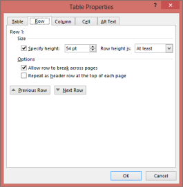
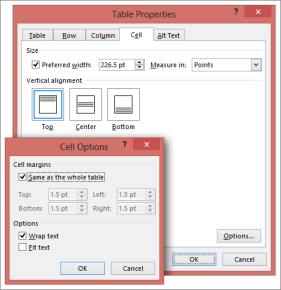
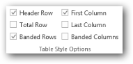

# Working with Tables

WTable class represents a table in a Word document. Each table in the Word document consists of table rows (one or more). Every table row consists of table cells (one or more). 

This collection is accessible through the Rows property that returns the instance of the WRowCollection type. It contains a collection of table rows, each row is represented by a WTableRow instance. For more details about WTableRow, refer to the WTableRow topic. This class also contains the TableFormat property that specifies the formatting for a whole table. This property returns the instance of the RowFormat type. For more details about RowFormat, see RowFormat.

* ResetCells: Allows you to define tables with the specified number of rows and specified number of cells in each row.
* WTableRow AddRow(bool isCopyFormat): Enables you to add a new row to the existing table. The isCopyFormat parameter specifies whether to copy the row format from the previous row.
* WTableRow AddRow(bool isCopyFormat, bool autoPopulateCells): Allows you to add a new row to the existing table. The second parameter autoPopulateCells specifies whether to create same number of cells as in the previous row and copy its formatting.

Class Hierarchy

TextBodyItem

|

WTable

Public Constructors

_Public Constructors_

<table>
<tr>
<td>
Constructor Name</td><td>
Description</td></tr>
<tr>
<td>
WTable.WTable (IWordDocument)</td><td>
Initializes a new instance of the WTable class.</td></tr>
<tr>
<td>
WTable.WTable (IWordDocument, bool)</td><td>
Initializes a new instance of the WTable class.  </td></tr>
</table>
Public Properties

_Public Properties_

<table>
<tr>
<td>
Property Name</td><td>
Description</td></tr>
<tr>
<td>
ChildEntities</td><td>
Gets child entities as EntityCollection instance.  </td></tr>
<tr>
<td>
EntityType</td><td>
Gets the type of the entity.</td></tr>
<tr>
<td>
FirstRow</td><td>
Gets first row of the table.</td></tr>
<tr>
<td>
LastCell</td><td>
Gets last cell of the table.</td></tr>
<tr>
<td>
LastRow</td><td>
Gets last row of the table.</td></tr>
<tr>
<td>
Rows</td><td>
Gets all the table rows as WRowCollection.</td></tr>
<tr>
<td>
TableFormat</td><td>
Sets table formatting after ResetCells call.</td></tr>
<tr>
<td>
Width</td><td>
Gets the width of the table (in points).</td></tr>
<tr>
<td>
StyleName</td><td>
Gets the applied table style name.</td></tr>
<tr>
<td>
Title</td><td>
Gets or sets the title for a table (Specific property for later versions of Microsoft Word 2007)</td></tr>
<tr>
<td>
Description</td><td>
Gets or sets the description for a table (Specific property for later versions of Microsoft Word 2007).</td></tr>
<tr>
<td>
ApplyStyleForBandedColumns </td><td>
Gets or sets the value, indicating whether to apply style for banded columns.</td></tr>
<tr>
<td>
ApplyStyleForBandedRows </td><td>
Gets or sets the value, indicating whether to apply style for banded rows.</td></tr>
<tr>
<td>
ApplyStyleForFirstColumn </td><td>
Gets or sets the value, indicating whether to apply style for first column.</td></tr>
<tr>
<td>
ApplyStyleForHeaderRow</td><td>
Gets or sets the value, indicating whether to apply style for header row.</td></tr>
<tr>
<td>
ApplyStyleForLastColumn</td><td>
Gets or sets the value, indicating whether to apply style for last column.</td></tr>
<tr>
<td>
ApplyStyleForLastRow</td><td>
Gets or sets the value, indicating whether to apply style for last row.</td></tr>
</table>
Public Methods

_Public Methods_

<table>
<tr>
<td>
Method Name</td><td>
Description</td></tr>
<tr>
<td>
AddRow</td><td>
Adds a new row to a table.</td></tr>
<tr>
<td>
Clone</td><td>
Clones the specified instance.</td></tr>
<tr>
<td>
Find</td><td>
Finds text by specified pattern in a table.  </td></tr>
<tr>
<td>
Replace</td><td>
Replaces the text by specified pattern in a table.</td></tr>
<tr>
<td>
ResetCells</td><td>
Resets number of rows or columns in a table.</td></tr>
<tr>
<td>
ApplyStyle</td><td>
Applied table styles are preserved only in converted Docx formats. Whereas PDF and HTML preserve table style formattings as direct formatting.</td></tr>
<tr>
<td>
GetStyle</td><td>
Gets information of the related style.</td></tr>
<tr>
<td>
ApplyVerticalMerge</td><td>
Applies vertical merge to the specified column from the specified start row index to end row index.</td></tr>
<tr>
<td>
ApplyHorizontalMerge</td><td>
Applies horizontal merge to the specified row from the specified start column index to end column index.</td></tr>
<tr>
<td>
RemoveAbsPosition</td><td>
Removes absolute positioning information from the table.</td></tr>
</table>
The following code example illustrates how to create an empty table with two rows. Each row has two cells (two columns).

<table>
<tr>
<td>
[C#]IWordDocument doc = new WordDocument();IWSection section = doc.AddSection();IWParagraph paragraph = section.AddParagraph();paragraph.AppendText("Tiny table");paragraph = section.AddParagraph();IWTable table = section.AddTable();table.ResetCells(2, 2);doc.Save("Table.doc");</td></tr>
<tr>
<td>
[VB.NET]Dim doc As IWordDocument = New WordDocument()Dim section As IWSection = doc.AddSection()Dim paragraph As IWParagraph = section.AddParagraph()paragraph.AppendText("Tiny table")paragraph = section.AddParagraph()Dim table As IWTable = section.AddTable()table.ResetCells(2, 2)doc.Save("Table.doc")</td></tr>
</table>

{  | markdownify }
{:.image }

_Table with Two Rows and Two Columns_

Nested Table

You can create nested tables by creating a table in the cell of the parent table by using DocIO. The following code example illustrates how to add a table to a cell.

<table>
<tr>
<td colspan = "2">
[C#]//Adds a nested Table to the cell (2,2)of the parent table.IWTable nestTable = table[2, 2].AddTable();nestTable.ResetCells(3, 3);</td></tr>
<tr>
<td>
[VB.NET]'Adds a new Table to the cell (2,2) of the parent table.Dim nestTable as IWTable = table[2, 2].AddTable()nestTable.ResetCells(3, 3)</td></tr>
</table>
## Table Row

WTableRow class represents a table row in the Word document. WTableRow class has a collection of table cells (WTableCell objects). Table row formatting is defined by the RowFormat property. This property returns the instance of the RowFormat type.

Table Row Height

Table row height provides the following options:

* AtLeast: Row is rendered with height greater than or equal to the specified height.
* Exactly: Row is rendered with specified height.

The following screenshot illustrates how to set the above properties by using the Table Properties dialog box in Microsoft Word.

{  | markdownify }
{:.image }

_Table Properties Dialog Box_

Adding Cells

You can use the AddCell and AddCell(bool isCopyFormat) methods to add new cells to the table row, where isCopyFormat parameter specifies whether to copy formatting from the adjacent cell in the previous row. AddCell method without parameters is the same as AddCell(true).

Public Constructors

_Public Constructors_

<table>
<tr>
<td>
Constructor Name</td><td>
Description</td></tr>
<tr>
<td>
WTableRow.WTableRow (IWordDocument)</td><td>
Initializes a new instance of the WTableRow class.  </td></tr>
</table>
Public Properties

_Public Properties_

<table>
<tr>
<td>
Property Name</td><td>
Description</td></tr>
<tr>
<td>
Cells</td><td>
Gets or sets cells in a row as WCellCollection.</td></tr>
<tr>
<td>
ChildEntities</td><td>
Specifies the child entities.  </td></tr>
<tr>
<td>
EntityType</td><td>
Specifies the type of the entity.  </td></tr>
<tr>
<td>
Height</td><td>
Gets or sets the height of a row (in points).</td></tr>
<tr>
<td>
HeightType</td><td>
Gets or sets the height type of a table row.  </td></tr>
<tr>
<td>
IsHeader</td><td>
Gets or sets a value indicating whether a row is a table header. </td></tr>
<tr>
<td>
RowFormat</td><td>
Specifies table format.  </td></tr>
</table>
Public Methods

_Public Methods_

<table>
<tr>
<td>
Method Name</td><td>
Description</td></tr>
<tr>
<td>
AddCell</td><td>
Adds a new cell to a row.</td></tr>
<tr>
<td>
Clone</td><td>
Clones this instance.  </td></tr>
<tr>
<td>
GetRowIndex</td><td>
Returns index of a row in owner table.    </td></tr>
<tr>
<td>
WTableRow</td><td>
Initializes a new instance of the WTableRow class.</td></tr>
</table>
## Table Cell

WTableCell class represents a table cell in a Word document. WTextBody is thebase class of WTableCell that means it holds all the text body items and acts as a text body. You can format a table cell by using the CellFormat property.

The following screenshot illustrates how to set the Cell Format in Microsoft Word.

{  | markdownify }
{:.image }

_Cell Format Options in Table Properties Dialog Box_

Cell Format Public Properties

_Cell Format Public Properties_

<table>
<tr>
<td>
Property Name</td><td>
Description</td></tr>
<tr>
<td>
BackColor</td><td>
Gets or sets the background color for a cell.   </td></tr>
<tr>
<td>
Borders</td><td>
Gets Borders instance of a cell’s borders.</td></tr>
<tr>
<td>
FitText</td><td>
Gets or sets whether to turn on or off FitText.</td></tr>
<tr>
<td>
HorizontalMerge</td><td>
Gets or sets value indicating whether to merge a cell horizontally. </td></tr>
<tr>
<td>
Paddings</td><td>
Gets paddings values of a cell.  </td></tr>
<tr>
<td>
TextDirection</td><td>
Gets or sets the cell text direction.  </td></tr>
<tr>
<td>
TextWrap</td><td>
Gets or sets a value indicating whether to wrap text in a cell. </td></tr>
<tr>
<td>
VerticalAlignment</td><td>
Gets or sets a value indicating vertical alignment of a cell. </td></tr>
<tr>
<td>
VerticalMerge</td><td>
Gets or sets a value indicating vertical merging of a cell. </td></tr>
</table>
Public Constructors

_Public Constructors_

<table>
<tr>
<td>
Constructor Name</td><td>
Description</td></tr>
<tr>
<td>
WTableCell.WTableCell (IWordDocument)</td><td>
Initializes a new instance of the WTableCell class.  </td></tr>
</table>
Public Properties

_Public Properties_

<table>
<tr>
<td>
Property Name</td><td>
Description</td></tr>
<tr>
<td>
CellFormat</td><td>
Gets the cell format as WCellFormat instance.  </td></tr>
<tr>
<td>
EntityType</td><td>
Gets the type of the entity. </td></tr>
<tr>
<td>
OwnerRow</td><td>
Gets the owner row of the cell.  </td></tr>
<tr>
<td>
Width</td><td>
Specifies the cell width (in points).</td></tr>
</table>
Public Methods

_Public Methods_

<table>
<tr>
<td>
Method Name</td><td>
Description</td></tr>
<tr>
<td>
Clone</td><td>
Clones this instance.  </td></tr>
<tr>
<td>
GetCellIndex</td><td>
Gets the cell index in a table row.  </td></tr>
</table>
The following code example illustrates how to create a table with basic formatting.

<table>
<tr>
<td>
[C#]paragraph = section.AddParagraph();paragraph.AppendText("Table with different formatting");paragraph = section.AddParagraph();//Adds a table.table = section.AddTable();//Sets number of rows and columns.table.ResetCells(3, 3);table.TableFormat.Borders.LineWidth = 2f;table.TableFormat.Borders.Color = Color.Green;//Selects the first row and appends text in each cell.WTableRow row0 = table.Rows[0];row0.Cells[0].AddParagraph().AppendText("1");row0.Cells[0].CellFormat.Borders.LineWidth = 2f;row0.Cells[0].CellFormat.Borders.Color = Color.Magenta;WTableRow row = table.Rows[0];row0.Cells[1].AddParagraph().AppendText("2");row0.Cells[2].AddParagraph().AppendText("3");WTableRow row1 = table.Rows[1];row = table.Rows[1];row1.Cells[0].AddParagraph().AppendText("4");row1.Cells[1].AddParagraph().AppendText("5");row1.Cells[1].CellFormat.Borders.LineWidth = 2f;row1.Cells[1].CellFormat.Borders.Color = Color.Brown;row1.Cells[2].AddParagraph().AppendText("6");WTableRow row2 = table.Rows[2];row2.Cells[0].AddParagraph().AppendText("7");row2.Cells[1].AddParagraph().AppendText("8");row2.Cells[2].AddParagraph().AppendText("9");row2.Cells[2].CellFormat.Borders.LineWidth = 2f;row2.Cells[2].CellFormat.Borders.Color = Color.Cyan;row2.Cells[2].CellFormat.Borders.Shadow = true;</td></tr>
<tr>
<td>
[VB.NET]paragraph = Section.AddParagraph()paragraph.AppendText("Table with different formatting")paragraph = Section.AddParagraph()'Adds a table.Table = Section.AddTable()'Sets number of rows and columns.Table.ResetCells(3, 3)Table.TableFormat.Borders.LineWidth = 2.0FTable.TableFormat.Borders.Color = Color.Green'Selects the first row and appends text in each cell.Dim row0 As WTableRow = Table.Rows(0)row0.Cells(0).AddParagraph().AppendText("1")row0.Cells(0).CellFormat.Borders.LineWidth = 2.0Frow0.Cells(0).CellFormat.Borders.Color = Color.MagentaDim row As WTableRow = Table.Rows(0)row0.Cells(1).AddParagraph().AppendText("2")row0.Cells(2).AddParagraph().AppendText("3")Dim row1 As WTableRow = Table.Rows(1)row = Table.Rows(1)row1.Cells(0).AddParagraph().AppendText("4")row1.Cells(1).AddParagraph().AppendText("5")row1.Cells(1).CellFormat.Borders.LineWidth = 2.0Frow1.Cells(1).CellFormat.Borders.Color = Color.Brownrow1.Cells(2).AddParagraph().AppendText("6")Dim row2 As WTableRow = Table.Rows(2)row2.Cells(0).AddParagraph().AppendText("7")row2.Cells(1).AddParagraph().AppendText("8")row2.Cells(2).AddParagraph().AppendText("9")row2.Cells(2).CellFormat.Borders.LineWidth = 2.0Frow2.Cells(2).CellFormat.Borders.Color = Color.Cyanrow2.Cells(2).CellFormat.Borders.Shadow = True</td></tr>
</table>
## Adding Content to a Table Cell

The AddParagraph method of the WTableCell class is used to add paragraphs to the table cell. The AddTable method is used to add a nested table to the cell. For details, see Nested Table_Text_Range.

<table>
<tr>
<td>
[C#]//Adds a new Table to the text body.IWTable table = sec.body.AddTable();//Inserts rows to the table. This will apply the format to a whole table.table.ResetCells(6, 6, format, 80);WTableCell cell = table.Rows[0].Cells[0] as WTableCell;WTextRange range = cell.AddParagraph().AppendText("aaaaaaaaaaaaaaaaaaaa") as WTextRange ;//Formats first cell first paragraph.range.CharacterFormat.FontName = "Arial";range.CharacterFormat.FontSize = 10;//Formats first cell second paragraph.range = cell.AddParagraph().AppendText("bbbbbbbbbbbbbbbbbbb") as WTextRange;range.CharacterFormat.Italic = true;                    range.CharacterFormat.FontSize = 12;</td></tr>
<tr>
<td>
[VB.NET]‘Adds a new Table to the text body.Dim table As IWTable = sec.body.AddTable()'Inserts rows to the table. This will apply the format to whole table.table.ResetCells(6, 6, Format, 80)Dim cell As WTableCell = TryCast(table.Rows(0).Cells(0), WTableCell)Dim range As WTextRange = TryCast(cell.AddParagraph().AppendText("aaaaaaaaaaaaaaaaaaaa"), WTextRange)'Formats first cell first paragraph.range.CharacterFormat.FontName = "Arial"range.CharacterFormat.FontSize = 10'Formats first cell second paragraph.range = TryCast(cell.AddParagraph().AppendText("bbbbbbbbbbbbbbbbbbb"), WTextRange)range.CharacterFormat.Italic = Truerange.CharacterFormat.FontSize = 12</td></tr>
</table>

The following code example illustrates how to insert a picture to a table cell.

<table>
<tr>
<td>
[C#]IWTable table = section.Body.AddTable();table.ResetCells(1, 1);          WTableRow row = table.Rows[0];paragraph = (IWParagraph)row.Cells[0].AddParagraph();paragraph.AppendPicture(new Bitmap("image.png"));</td></tr>
<tr>
<td>
[VB.NET]Dim table As IWTable = section.Body.AddTable()table.ResetCells(1, 1)Dim row As WTableRow = table.Rows(0)Paragraph = DirectCast(row.Cells(0).AddParagraph(), IWParagraph)Paragraph.AppendPicture(New Bitmap("image.png"))</td></tr>
</table>
## Row Format

RowFormat class represents table and table row formatting in a Word document.

Properties

* Borders: Specifies format of row borders (width of line, line color, and so on).
* Paddings: Specifies margins for cells in a row or table.
* CellSpacing: Specifies spacing between cells.
* LeftIndent: Specifies left indent of a table or table row.
* IsAutoResized: Specifies if a table autoresizes to fit text.

The following screenshot illustrates how to set Row Format in Microsoft Word.

{  | markdownify }
{:.image }

_Row Format Options in Table Properties Dialog Box_

Public Properties

_Public Properties_

<table>
<tr>
<td>
Property Name</td><td>
Description</td></tr>
<tr>
<td>
Bidi</td><td>
Specifies whether table is right to left.</td></tr>
<tr>
<td>
Borders</td><td>
Gets borders. </td></tr>
<tr>
<td>
CellSpacing</td><td>
Gets or sets spacing between cells (in points).  </td></tr>
<tr>
<td>
HorizontalAlignment</td><td>
Gets or sets horizontal alignment for a paragraph.  </td></tr>
<tr>
<td>
IsAutoResized</td><td>
Gets or sets a boolean value indicating whether the table is autoresized.</td></tr>
<tr>
<td>
IsBreakAcrossPages</td><td>
Gets or sets a boolean value indicating whether there is a break across pages.</td></tr>
<tr>
<td>
LeftIndent</td><td>
Gets or sets table indent (in points). </td></tr>
<tr>
<td>
Paddings</td><td>
Gets paddings.</td></tr>
</table>

<table>
<tr>
<td>
[C#]//Adds a new Table to the textbody.IWTable table = sec.body.AddTable();RowFormat format = new RowFormat();format.Paddings.All = 5;format.Borders.BorderType = Syncfusion.DocIO.DLS.BorderStyle.Dot;format.Borders.LineWidth = 2;//Inserts rows to a table. This will apply the format to a whole table.table.ResetCells(6, 6, format, 80);</td></tr>
<tr>
<td>
[VB.NET]'Adds a new Table to the textbody.Dim table As IWTable = sec.body.AddTable()Dim format As New RowFormat()format.Paddings.All = 5format.Borders.BorderType = Syncfusion.DocIO.DLS.BorderStyle.Dotformat.Borders.LineWidth = 2'Inserts rows to a table. This will apply the format to a whole table.table.ResetCells(6, 6, format, 80)</td></tr>
</table>
## Table Styles

WTableStyle class represents table style in a Word document. Table style specifies a set of formatting characteristics for a table.

{  | markdownify }
{:.image }

_Table Styles_

* You can apply Word built-in table styles by using the WTable.ApplyStyle method with Built-inTableStyle enumeration parameter that specifies the built-in table style.
* You can get information of the related style that is applied to the table by using the GetStyle method of WTable class.
> 

> _Note: Essential DocIO currently provides support for built-in table styles in Word2007, Word2010, and Word2013 formats. The visual formatting is also preserved in Word to PDF, Word to Image, and Word to HTML conversions._

> 

The following code illustrates how to apply and get the table styles in the table.

<table>
<tr>
<td>
[C#]//Creates a new Word document.WordDocument document = new WordDocument();//Initializes a new word document with one section and one paragraph           document.EnsureMinimal();//Adds a tableIWTable table = document.LastSection.AddTable();//Resets table with two rows and two columnstable.ResetCells(3, 3);//Applies "LightShading" style to tabletable.ApplyStyle(BuiltinTableStyle.LightShading);//Gets the table styles.IWTableStyle style = table.GetStyle()</td></tr>
<tr>
<td>
[VB.NET]'Creates a new Word document.Dim document As WordDocument = New WordDocument()'Initializes a new word document with one section and one paragraphdocument.EnsureMinimal()'Adds a table Dim table As IWTable = document.LastSection.AddTable()'Resets table with two rows and two columns table.ResetCells(3, 3)'Applies "LightShading" style to table table.ApplyStyle(BuiltinTableStyle.LightShading)'Gets the table style. Dim style As IWTableStyle = table.GetStyle()</td></tr>
</table>

Table style options

You can choose the features of the table style that is to be applied in the rows and columns of the table, such as first column, last column, banded rows, banded columns, header row and last row. 

The following screenshot illustrates how to set the conditional formatting to the table by using the Table Style Options ribbon in Microsoft Word.

{  | markdownify }
{:.image }

_Table style options_

The following code illustrates how to set the table style options to the table that contains the Built in Table style.

<table>
<tr>
<td>
[C#]//Creates a new Word document.WordDocument document = new WordDocument();//Initializes a new word document with one section and one paragraph           document.EnsureMinimal();//Adds a tableIWTable table = document.LastSection.AddTable();//Resets table with two rows and two columnstable.ResetCells(3, 3);//Applies "LightShading" style to tabletable.ApplyStyle(BuiltinTableStyle.LightShading);//Formatting the applied built in Table styletable.ApplyStyleForBandedColumns = true;table.ApplyStyleForBandedRows = true;table.ApplyStyleForFirstColumn = false;table.ApplyStyleForHeaderRow = true;table.ApplyStyleForLastColumn = true;table.ApplyStyleForLastRow = false;//Save document. document.Save("sample.docx”,FormatType.Docx);</td></tr>
<tr>
<td>
[VB.NET]'Creates a new Word document.Dim document As WordDocument = New WordDocument()'Initializes a new word document with one section and one paragraphdocument.EnsureMinimal()'Adds a table Dim table As IWTable = document.LastSection.AddTable()'Resets table with two rows and two columns table.ResetCells(3, 3)'Applies "LightShading" style to table table.ApplyStyle(BuiltinTableStyle.LightShading)'Formatting the applied built in Table style table.ApplyStyleForBandedColumns = Truetable.ApplyStyleForBandedRows = Truetable.ApplyStyleForFirstColumn = Falsetable.ApplyStyleForHeaderRow = Truetable.ApplyStyleForLastColumn = Truetable.ApplyStyleForLastRow = False'Save document document.Save("sample.docx", FormatType.Docx)</td></tr>
</table>

