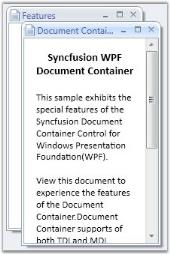

# Setting MDIBounds

This property helps the Document Container control in properly placing its elements within the container.

The general syntax of the MDI bound property is given below.

syncfusion:DocumentContainer.MDIBounds="a,b,c,d"

where, 

* The first two values (a and b) stands for X and Y co-ordinates for the MDI bounds. 
* The second two values(c and d) stands for width and height of the element in a Document Container.

To set the MDI Bounds, use the following code snippet.

[XAML]

&lt;!-- Adding Document Container --&gt;

&lt;syncfusion:DocumentContainer Name="DocContainer"  Mode="MDI"&gt;

&lt;FlowDocumentScrollViewer syncfusion:DocumentContainer.MDIBounds="0,0,200,300"&gt;

&lt;/FlowDocumentScrollViewer&gt;

…....

…....

&lt;/syncfusion:DocumentContainer&gt;

{  | markdownify }
{:.image }

