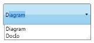

# Custom Filtration Support

AutoComplete supports Custom Filtration of items, which allows you to specify three different search modes for displaying the drop-down list. The StringMode property is used to specify the search mode.

When the value of the StringMode property is set as StartChar, AutoComplete begins its search from starting index of the strings in the source list collection and the matching results will be displayed in the drop-down list. In the figure shown below, AutoComplete searches using the entered key “D” and displays the matched list.

{  | markdownify }
{:.image }

When the value of the StringMode property is set as IndexBased, starting index value can be set using the StringModeIndex property. In this mode AutoComplete begins its search from the user specified index of the strings in the source list collection and the matching results will be displayed in the drop-down list. In the figure shown below StringModeIndex value is set as “2” and the entered text is “i”. The AutoComplete displays the list of items which has “i” in the specified index.

{  | markdownify }
{:.image }

When the value of the StringMode property is set as AnyChar, the AutoComplete searches for the strings which has substrings entered in the AutoComplete control. In the figure shown below, based on the entered text “I”, the AutoComplete displays the list of items which has as a substring in it.

{  | markdownify }
{:.image }

Using Custom Filtration Support in an Application 

The StringMode property will be used to attain this functionality by setting its value as StartChar or IndexBased or AnyChar.

<table>
<tr>
<td>
[XAML]&lt;syncfusion:AutoComplete x:Name="AutoComplete1" StringMode="StartChar"/&gt;&lt;syncfusion:AutoComplete x:Name="AutoComplete2" StringMode="IndexBased"/&gt;&lt;syncfusion:AutoComplete x:Name="AutoComplete3" StringMode="AnyChar"/&gt;</td></tr>
<tr>
<td>
[C#]AutoComplete autoComplete1 = new AutoComplete();this.autoComplete1.StringMode = StringMode.StartChar;AutoComplete autoComplete2 = new AutoComplete();this.autoComplete2.StringMode = StringMode.IndexBased;this.autoComplete2.StringModeIndex = 2;AutoComplete autoComplete3 = new AutoComplete();this.autoComplete3.StringMode = StringMode.AnyChar;</td></tr>
</table>

Properties

   _Property Table for Filter_

<table>
<tr>
<td>
Property </td><td>
Description </td><td>
Type </td><td>
Data Type </td><td>
Reference links </td></tr>
<tr>
<td>
StringMode</td><td>
Gets or sets the value of StringMode in the AutoComplete.</td><td>
DependencyProperty</td><td>
StringMode(enum)</td><td>
</td></tr>
</table>

Sample Link

WPF Sample Browser-> Tools -> Editors -> AutoComplete Demo

