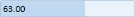

# Range Adorner

The EnableRangeAdorner property is used to show the adorner range based on the minimum and maximum values given to that control.

{  | markdownify }
{:.image }

Properties

_Property Table_

<table>
<tr>
<td>
Property </td><td>
Description </td><td>
Data Type </td></tr>
<tr>
<td>
EnableRangeAdorner </td><td>
The Adorner range will displayed based on the value.</td><td>
bool </td></tr>
</table>
## Adding Range Adorner to an Application 

The EnableRangeAdorner property must be set either in XAML or the code file.

<table>
<tr>
<td>
[XAML]  EnableRangeAdorner="True"</td></tr>
<tr>
<td>
[C#]   control.EnableRangeAdorner = true;</td></tr>
</table>

