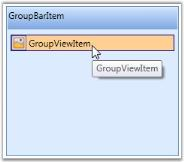

# Adding Content to GroupBar Item

You can add content to a GroupBar Item using a Panel or a GroupView control. Any content can be added to the GroupBar Item by adding any control inside the panel. To view the contents of a GroupBar Item in ListView mode, add the GroupView as content in the GroupBar Item.

Adding GroupView to GroupBar Item

GroupView control can be added to the GroupBar Item by using XAML or C# code. Here is the code snippet.

<table>
<tr>
<td>
[XAML]&lt;!-- Adding GroupBar --&gt;&lt;syncfusion:GroupBar Height="200" Width="230" Name="groupBar"&gt;  &lt;!-- Adding GroupBarItem --&gt;  &lt;syncfusion:GroupBarItem Name="groupBarItem" Header="GroupBarItem"&gt;    &lt;!-- Adding GroupView to GroupBarItem --&gt;    &lt;syncfusion:GroupView Name="groupView"/&gt;  &lt;/syncfusion:GroupBarItem&gt;&lt;/syncfusion:GroupBar&gt;</td></tr>
<tr>
<td>
[C#]//Creating an instance of GroupBarGroupBar groupBar = new GroupBar();//Creating an instance of GroupBarItemGroupBarItem groupBarItem = new GroupBarItem();//Setting header for groupbar itemgroupBarItem.Header = "GroupBarItem";//Creating an instance of GroupViewGroupView groupView = new GroupView();//Adding GroupView to GroupViewItemgroupBarItem.Content = groupView;//Adding GroupBar item to GroupBargroupBar.Items.Add(groupBarItem);//Adding GroupBar to the windowthis.Content = groupBar;</td></tr>
</table>

{  | markdownify }
{:.image }

Adding GroupView Item to GroupView

GroupView Item can be added to a GroupView using XAML or C# code. Here is the code snippet.

<table>
<tr>
<td>
[XAML]&lt;!-- Adding GroupBar --&gt;&lt;syncfusion:GroupBar Height="200" Width="230" Name="groupBar"&gt;  &lt;!-- Adding GroupBarItem --&gt;  &lt;syncfusion:GroupBarItem Name="groupBarItem" Header="GroupBarItem"&gt;    &lt;!-- Adding GroupView to GroupBarItem --&gt;    &lt;syncfusion:GroupView Name="groupView"&gt;      &lt;!-- Adding GroupViewItem to GroupView --&gt;      <syncfusion:GroupViewItem Name="groupViewItem"                 Text="GroupViewItem"/>    &lt;/syncfusion:GroupView&gt;  &lt;/syncfusion:GroupBarItem&gt;&lt;/syncfusion:GroupBar&gt;</td></tr>
<tr>
<td>
[C#]//Creating an instance of GroupBarGroupBar groupBar = new GroupBar();//Creating an instance of GroupBarItemGroupBarItem groupBarItem = new GroupBarItem();//Setting header for groupbar itemgroupBarItem.Header = "GroupBarItem";//Creating an instance of GroupViewGroupView groupView = new GroupView();//Creating an instance of GroupViewItemGroupViewItem groupViewItem = new GroupViewItem();//Adding content to GroupViewItemgroupViewItem.Text = "GroupViewItem";//Adding GroupViewItem to GroupViewgroupView.Items.Add(groupViewItem);//Adding content of GroupBarItem as GroupView;groupBarItem.Content = groupView;//Adding GroupBar item to GroupBargroupBar.Items.Add(groupBarItem);//Adding GroupBar to the windowthis.Content = groupBar;</td></tr>
</table>

{  | markdownify }
{:.image }

Adding Panel to GroupBar Item

You can add content to the GroupBar Item using a Panel as follows. This is achieved using the following code snippet.

[XAML]

&lt;!-- Adding GroupBar --&gt;

&lt;syncfusion:GroupBar Height="200" Width="230" Name="groupBar"&gt;

  &lt;!-- Adding GroupBarItem --&gt;

  &lt;syncfusion:GroupBarItem Name="groupBarItem" Header="GroupBarItem"&gt;

    &lt;!-- Adding content for groupbar item using panel --&gt;

    &lt;StackPanel Orientation="Vertical"&gt;

      &lt;TextBlock Text="GroupBar Orientation" Margin="4,4,2,2"/&gt;

      <RadioButton IsChecked="True" Margin="4,2,2,2">Horizontal</RadioButton>

      <RadioButton Margin="4,2,2,2">Vertical</RadioButton>

      &lt;TextBlock Text="GroupView Orientation" Margin="4,4,2,2"/&gt;

      <RadioButton Margin="4,2,2,2">Horizontal</RadioButton>

      <RadioButton IsChecked="True" Margin="4,2,2,2">Vertical</RadioButton>

    &lt;/StackPanel&gt;

  &lt;/syncfusion:GroupBarItem&gt;

&lt;/syncfusion:GroupBar&gt;

{  | markdownify }
{:.image }

> _Note: To display the GroupView Item, you must already have a GroupView control in which you are going to add the GroupView Item._ 

Events to handle with GroupBar Item

The events of GroupBarItem are GroupBarItemAdded and GroupBarItemRemoved. 

* GroupBarItemAdded – which is called when GroupBarItem is added. GroupBarItem can be added either by using procedural code or by using context menu to add new item.
* GroupBarItemRemoved – which is called when GroupBarItem is removed. GroupBarItem can be removed by using procedural code or by using context menu to remove an existing item.

