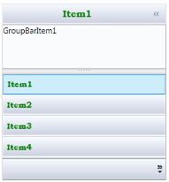
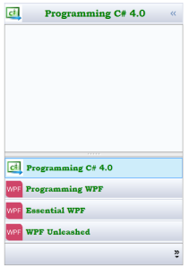

# Customizing Data Templates

Data templates can be customized for items, headers, and content. The next sections explain how to customize data templates.

## Item Template

You can customize how a business object is displayed by using ItemTemplate of GroupBarItem. The following example shows how to use ItemTemplate.following code, GroupBarItem’s header is customized with DataTemplate. The value of Header is assigned to the TextBlock’s text and TextBlock’s properties like FontWeight, FontFamily and Foreground are modified for a customized look.

[XAML]

   &lt;syncfusion:GroupBar Name="groupBar1"  Margin="20" AllowCollapse="True" VisualMode="StackMode" ItemsSource="{Binding GroupItems}"  &gt;

            &lt;syncfusion:GroupBar.ItemTemplate&gt;

                &lt;DataTemplate&gt;

                    &lt;Grid&gt;

                        &lt;TextBlock Text="{Binding Header}" Margin="5" Foreground="Green" VerticalAlignment="Center" FontWeight="Bold" FontFamily="Bookman Old Style" Grid.Column="1"/&gt;

                    &lt;/Grid&gt;

                &lt;/DataTemplate&gt;

            &lt;/syncfusion:GroupBar.ItemTemplate&gt;   

        &lt;/syncfusion:GroupBar&gt;

Implementing the above code will create the following GroupBar control.

{  | markdownify }
{:.image }

## Item Template Selector

Using ItemTemplateSelector, you can use different templates for items depending on specific constraints. The following example illustrates this.

1. Create the template selector in the code.

[C#]

public class GroupBarItemTemplateSelector : DataTemplateSelector

    {

        public override DataTemplate SelectTemplate(object item, DependencyObject container)

        {

            Window window = Application.Current.MainWindow;

            string bookname = (item as System.Xml.XmlElement).GetAttribute("Name").ToString().ToLower();

            if (bookname.Contains("wpf"))

            {

                return ((DataTemplate)window.Resources["WpfBookTemplate"]);

            }

            else

            {

                return ((DataTemplate)window.Resources["CsBookTemplate"]);

            }

        }

    }

2. Define the data templates in the Window’s resources.

[XAML]

&lt;DataTemplate x:Key="WpfBookTemplate"&gt;

            &lt;Grid&gt;

                &lt;Grid.ColumnDefinitions&gt;

                    &lt;ColumnDefinition Width="25" /&gt;

                    &lt;ColumnDefinition Width="*" /&gt;

                &lt;/Grid.ColumnDefinitions&gt;

                &lt;Image Source="wpf.png"/&gt;

                &lt;TextBlock Text="{Binding XPath=@Name}" Margin="5" Foreground="Green" VerticalAlignment="Center" FontWeight="Bold" FontFamily="Bookman Old Style" Grid.Column="1"/&gt;

            &lt;/Grid&gt;

        &lt;/DataTemplate&gt;

        &lt;DataTemplate x:Key="CsBookTemplate"&gt;

            &lt;Grid&gt;

                &lt;Grid.ColumnDefinitions&gt;

                    &lt;ColumnDefinition Width="25" /&gt;

                    &lt;ColumnDefinition Width="*" /&gt;

                &lt;/Grid.ColumnDefinitions&gt;

                &lt;Image Source="images.jpg"/&gt;

                &lt;TextBlock Text="{Binding XPath=@Name}" Margin="5" Foreground="Green" VerticalAlignment="Center" FontWeight="Bold" FontFamily="Bookman Old Style" Grid.Column="1"/&gt;

            &lt;/Grid&gt;

        &lt;/DataTemplate&gt;

3. The template selector in the Window’s resources.

[XAML]

&lt;local:GroupBarItemTemplateSelector x:Key="groupBarItemTemplateSelector"/&gt;

4. Use this template selector to choose a template for the GroupBar control.

[XAML]

   &lt;syncfusion:GroupBar Name="groupBar1"  Margin="20" AllowCollapse="True" VisualMode="StackMode" ItemTemplateSelector="{StaticResource groupBarItemTemplateSelector}" ItemsSource="{Binding Source={StaticResource xmlSource}, XPath=Book}"  &gt;

        &lt;/syncfusion:GroupBar&gt;

This will generate the following GroupBar control.

{  | markdownify }
{:.image }

## Header Template

You can customize the header of a GroupViewItem by using a header template. This is illustrated in the following example.

1. Define the data template for the header as follows.

[XAML]

  &lt;DataTemplate x:Key="headerTemplate"&gt;

            &lt;Grid&gt;

                &lt;Border Background="Gray"&gt;

                &lt;TextBlock Text="{Binding XPath=@Name}" Margin="5" Foreground="White" VerticalAlignment="Center" FontWeight="Bold" FontFamily="Bookman Old Style" Grid.Column="1"/&gt;

                &lt;/Border&gt;

            &lt;/Grid&gt;

  &lt;/DataTemplate&gt;

2. Set HeaderTemplate for GroupBarItem to the above template.

[XAML]

&lt;syncfusion:GroupBar Name="groupBar1"  Margin="20"  VisualMode="StackMode" ItemsSource="{Binding Source={StaticResource xmlSource}, XPath=Book}"&gt;

            &lt;syncfusion:GroupBar.ItemContainerStyle&gt;

                &lt;Style TargetType="{x:Type syncfusion:GroupBarItem}"&gt;

                    &lt;Setter Property="HeaderTemplate" Value="{StaticResource headerTemplate}" /&gt;                                      

                &lt;/Style&gt;

            &lt;/syncfusion:GroupBar.ItemContainerStyle&gt;

        &lt;/syncfusion:GroupBar&gt;

The code above applies HeaderTemplate to the GroupBar, so the headers of the group-bar items will contains a text box with a white foreground. 

## Content Template

You can customize the content of GroupViewItem by using ContentTemplate. This is demonstrated in the following example.

1. Define DataTemplate for the content as follows.

[XAML]

  &lt;DataTemplate x:Key="contentTemplate"&gt;

            &lt;Grid &gt;

                &lt;Grid.ColumnDefinitions&gt;

                    &lt;ColumnDefinition Width="4*"/&gt;

                    &lt;ColumnDefinition Width="6*"/&gt;

                &lt;/Grid.ColumnDefinitions&gt;

                &lt;Image Source="{Binding XPath=@ImagePath}"/&gt;

                &lt;TextBlock Text="{Binding XPath=@Description}" TextWrapping="Wrap" Grid.Column="1"/&gt;

            &lt;/Grid&gt;

  &lt;/DataTemplate&gt;

2. Set ContentTemplate for GroupBarItem to the above template.

[XAML]

&lt;syncfusion:GroupBar Name="groupBar1"  Margin="20"  VisualMode="StackMode" ItemsSource="{Binding Source={StaticResource xmlSource}, XPath=Book}"&gt;

            &lt;syncfusion:GroupBar.ItemContainerStyle&gt;

                &lt;Style TargetType="{x:Type syncfusion:GroupBarItem}"&gt;

                    &lt;Setter Property="HeaderTemplate" Value="{StaticResource headerTemplate}" /&gt;  

                    &lt;Setter Property="ContentTemplate" Value="{StaticResource contentTemplate}"/&gt;

                &lt;/Style&gt;

            &lt;/syncfusion:GroupBar.ItemContainerStyle&gt;

        &lt;/syncfusion:GroupBar&gt;

This will populate the GroupBar control.

{  | markdownify }
{:.image }

## Header Template Selector

With HeaderTemplateSelector, you can use different templates for the GroupBarItem’s header depending on specific constraints. The following example illustrates this. 

1. Create the template selector in code.

[C#]

public class GroupBarItemHeaderTemplateSelector : DataTemplateSelector

    {

        public override DataTemplate SelectTemplate(object item, DependencyObject container)

        {

            Window window = Application.Current.MainWindow;

            string bookname = (item as System.Xml.XmlElement).GetAttribute("Name").ToString().ToLower();

            if (bookname.Contains("wpf"))

            {

                return ((DataTemplate)window.Resources["WpfBookHeaderTemplate"]);

            }

            else

            {

                return ((DataTemplate)window.Resources["CsBookHeaderTemplate"]);

            }

        }

    }

2. Define the data templates in the Window’s resources.

[XAML]

   &lt;DataTemplate x:Key="WpfBookHeaderTemplate"&gt;

            &lt;Grid&gt;

                &lt;Grid.ColumnDefinitions&gt;

                    &lt;ColumnDefinition Width="25" /&gt;

                    &lt;ColumnDefinition Width="*" /&gt;

                &lt;/Grid.ColumnDefinitions&gt;

                &lt;Image Source="wpficon.png"/&gt;

                &lt;TextBlock Text="{Binding XPath=@Name}" Margin="5" Foreground="Green" VerticalAlignment="Center" FontWeight="Bold" FontFamily="Bookman Old Style" Grid.Column="1"/&gt;

            &lt;/Grid&gt;

        &lt;/DataTemplate&gt;

        &lt;DataTemplate x:Key="CsBookHeaderTemplate"&gt;

            &lt;Grid&gt;

                &lt;Grid.ColumnDefinitions&gt;

                    &lt;ColumnDefinition Width="25" /&gt;

                    &lt;ColumnDefinition Width="*" /&gt;

                &lt;/Grid.ColumnDefinitions&gt;

                &lt;Image Source="csicon.png"/&gt;

                &lt;TextBlock Text="{Binding XPath=@Name}" Margin="5" Foreground="Blue" VerticalAlignment="Center" FontWeight="Bold" FontFamily="Bookman Old Style" Grid.Column="1"/&gt;

            &lt;/Grid&gt;

        &lt;/DataTemplate&gt;

3. Create an instance for the template selector in the Window’s resources.

[XAML]

  &lt;local:GroupBarItemHeaderTemplateSelector x:Key="groupBarItemHeaderTemplateSelector"/&gt;

Now assign the key given in the above code to GroupBar’s HeaderTemplateSelector.

## Content Template Selector

With ContentTemplateSelector, you can use different templates for GroupBarItem’s content depending on specific constraints. The following example illustrates this.

1. Create the template selector in the code as follows.

[C#]

public class GroupBarItemContentTemplateSelector : DataTemplateSelector

    {

        public override DataTemplate SelectTemplate(object item, DependencyObject container)

        {

            Window window = Application.Current.MainWindow;

            string bookname = (item as System.Xml.XmlElement).GetAttribute("Name").ToString().ToLower();

            if (bookname.Contains("wpf"))

            {

                return ((DataTemplate)window.Resources["WpfBookContentTemplate"]);

            }

            else

            {

                return ((DataTemplate)window.Resources["CsBookContentTemplate"]);

            }

        }

    }

2. Define the data templates in the Window’s resources.

[XAML]

          &lt;DataTemplate x:Key="CsBookHeaderTemplate"&gt;

            &lt;Grid&gt;

                &lt;Grid.ColumnDefinitions&gt;

                    &lt;ColumnDefinition Width="25" /&gt;

                    &lt;ColumnDefinition Width="*" /&gt;

                &lt;/Grid.ColumnDefinitions&gt;

                &lt;Image Source="csicon.png"/&gt;

                &lt;TextBlock Text="{Binding XPath=@Name}" Margin="5" Foreground="Blue" VerticalAlignment="Center" FontWeight="Bold" FontFamily="Bookman Old Style" Grid.Column="1"/&gt;

            &lt;/Grid&gt;

        &lt;/DataTemplate&gt;

        &lt;DataTemplate x:Key="WpfBookContentTemplate"&gt;

                    &lt;Grid &gt;

                        &lt;Grid.ColumnDefinitions&gt;

                            &lt;ColumnDefinition Width="4*"/&gt;

                            &lt;ColumnDefinition Width="6*"/&gt;

                        &lt;/Grid.ColumnDefinitions&gt;

                        &lt;Image Source="{Binding XPath=@ImagePath}"/&gt;

                        &lt;TextBlock Text="{Binding XPath=@Description}" TextWrapping="Wrap" Foreground="Green" Grid.Column="1"/&gt;

                    &lt;/Grid&gt;

                &lt;/DataTemplate&gt;

3. Create an instance of the template selector in the Window’s resources.

[XAML]

  &lt;local:GroupBarItemContentTemplateSelector x:Key="groupBarItemContentTemplateSelector"/&gt;

4. Now use HeaderTemplateSelector and ContentTemplateSelector.

[XAML]

       &lt;syncfusion:GroupBar Name="groupBar1"  AllowCollapse="True" VisualMode="StackMode" ItemsSource="{Binding Source={StaticResource xmlSource}, XPath=Book}"   &gt;

            &lt;syncfusion:GroupBar.ItemContainerStyle&gt;

                &lt;Style TargetType="{x:Type syncfusion:GroupBarItem}"&gt;

                    &lt;Setter Property="HeaderTemplateSelector" Value="{StaticResource groupBarItemHeaderTemplateSelector}"/&gt;

                    &lt;Setter Property="ContentTemplateSelector" Value="{StaticResource groupBarItemContentTemplateSelector}"/&gt;

                &lt;/Style&gt;

            &lt;/syncfusion:GroupBar.ItemContainerStyle&gt;

        &lt;/syncfusion:GroupBar&gt;

This will populate the GroupBar control.

{  | markdownify }
{:.image }

