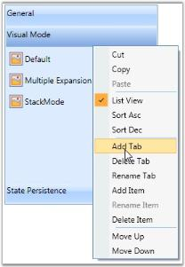

# Using Context menu in GroupBar

To enable the context menu support in the GroupBar, set IsEnabledContextMenu property to _true_. This dependency property sets the value that indicates whether the context menu is enabled. 

Here are the benefits of using context menu in GroupBar control.

Use the following code snippet to set this property.

* Cut, copy and paste the content of GroupBar
* Sort the content of groupbar
* Add the GroupBarItem
* Rename the GroupBarItem
* Delete the GroupBarItem
* Move the content of GroupBar either up or down
* Add the content of GroupBar item.
* Rename the content of GroupBar item.
* Delete the content of GroupBar item.

<table>
<tr>
<td>
[XAML]&lt;!-- Adding GroupBar that has context menu --&gt;&lt;syncfusion:GroupBar Height="250" Width="230" IsEnabledContextMenu="True" Name="groupBar"&gt;  &lt;!-- Adding GroupBarItem --&gt;  &lt;syncfusion:GroupBarItem Name="groupBarItem1" HeaderImageSource="Label.gif" Header="General"&gt;    &lt;!-- Adding content for GroupBar item using GroupView --&gt;    &lt;syncfusion:GroupView&gt;      &lt;syncfusion:GroupViewItem Text="List View"/&gt;      &lt;syncfusion:GroupViewItem Text="Show ContextMenu"/&gt;      &lt;syncfusion:GroupViewItem Text="Show ToolTip"/&gt;    &lt;/syncfusion:GroupView&gt;  &lt;/syncfusion:GroupBarItem&gt;  &lt;!-- Adding GroupBarItem --&gt;  &lt;syncfusion:GroupBarItem HeaderImageSource="Tasks.png" Name="groupBarItem2" Header="Visual Mode"&gt;    &lt;!-- Adding content for GroupBar item using GroupView --&gt;    &lt;syncfusion:GroupView&gt;      &lt;syncfusion:GroupViewItem Text="Default"/&gt;      &lt;syncfusion:GroupViewItem Text="Multiple Expansion"/&gt;      &lt;syncfusion:GroupViewItem Text="StackMode"/&gt;    &lt;/syncfusion:GroupView&gt;  &lt;/syncfusion:GroupBarItem&gt;&lt;/syncfusion:GroupBar&gt;</td></tr>
<tr>
<td>
[C#]//Enable the Context menu for GroupBargroupBar.IsEnabledContextMenu = true;</td></tr>
</table>

{  | markdownify }
{:.image }

