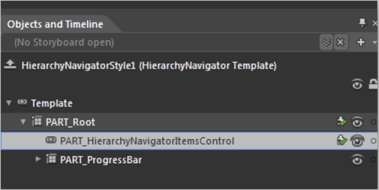
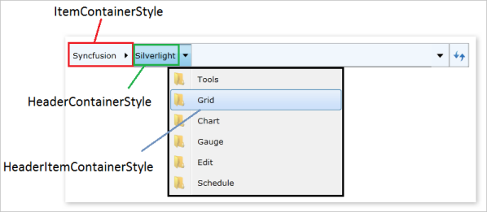
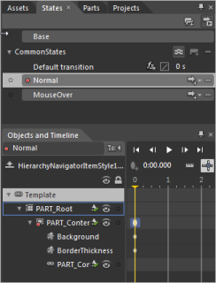
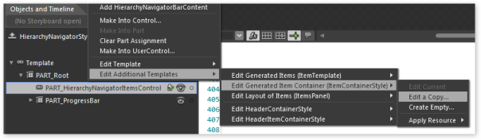
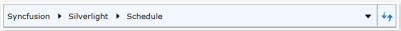
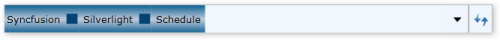

### Customizing templates with Expression Blend

The steps to customize templates by using Expression Blend are as follows:

1. Create a new application in Expression Blend. Refer Creating a HierarchyNavigator control by using Expression Blend.

The following are the default resources, which are used for HierarchyNavigator control that can be changed in Expression Blend.

{  | markdownify }
{:.image }

2. Right-click the HierarchyNavigator control and select Edit, then select Style, and type a name.

{  | markdownify }
{:.image }

3. Right-click the HierarchyNavigatorItemsControl and select Edit, then select Template, and then select Edit a Copy, to edit the Refresh button, the History button, or the overall content. Additional styles (templates) can be used to edit a template available in the HierarchyNavigatorItemsControl class.

{  | markdownify }
{:.image }

4. Right-click the Part_HierarchyNavigatorItemsControl and select Edit, and then select Additional Templates. A list of additional styles to edit will be displayed. Figure 40 displays the style names.

{  | markdownify }
{:.image }

{  | markdownify }
{:.image }

5. Storyboards used in the VisualStateManager of every control are easy to customize and manage. 
6. For example, the HierarchyNavigatorItem control has two states: Normal and MouseOver. This is available on the States window, which can be accessed by clicking the Window menu and selecting States.

{  | markdownify }
{:.image }

7. Click the Visual State name, to edit the storyboard.

{  | markdownify }
{:.image }

#### Customized sample styles

The steps to customize sample styles are as follows:

1. Add a HierarchyNavigator control to the new sample project
2. Add items. Refer Adding items to the HierarchyNavigator control.

<table>
<tr>
<td>
XAMLxmlns:syncfusion="clr-namespace:Syncfusion.Windows.Tools.Controls;assembly=Syncfusion.Tools.Silverlight"</td></tr>
<tr>
<td>
XAML&lt;syncfusion:HierarchyNavigator x:Name="hierarchyNavigator1" Width="500" VerticalAlignment="Center" Style="{DynamicResource HierarchyNavigatorStyle1}"&gt;  &lt;syncfusion:HierarchyNavigator.Items&gt;     &lt;syncfusion:HierarchyNavigatorItem Content="Syncfusion"&gt;&lt;syncfusion:HierarchyNavigatorItem.Items&gt;&lt;syncfusion:HierarchyNavigatorItem Content="Silverlight"&gt;&lt;syncfusion:HierarchyNavigatorItem.Items&gt;&lt;syncfusion:HierarchyNavigatorItem Content="Tools"/&gt;&lt;syncfusion:HierarchyNavigatorItem Content="Grid"/&gt;&lt;syncfusion:HierarchyNavigatorItem Content="Chart"/&gt;&lt;syncfusion:HierarchyNavigatorItem Content="Gauge"/&gt;&lt;syncfusion:HierarchyNavigatorItem Content="Edit"/&gt;&lt;syncfusion:HierarchyNavigatorItem Content="Schedule"/&gt;&lt;/syncfusion:HierarchyNavigatorItem.Items&gt;            &lt;/syncfusion:HierarchyNavigatorItem&gt;&lt;syncfusion:HierarchyNavigatorItem Content="WPF"/&gt;     &lt;/syncfusion:HierarchyNavigatorItem.Items&gt;   &lt;/syncfusion:HierarchyNavigatorItem&gt;   &lt;/syncfusion:HierarchyNavigator.Items&gt;&lt;/syncfusion:HierarchyNavigator&gt;</td></tr>
</table>

ItemContainerStyle has been changed for the HierarchyNavigator control.

To steps to edit the styles are as follows:

3. Right-click the HierarchyNavigator control and select Edit Template, then select Edit Copy and type specify the style name for the HierarchyNavigator control. Then, edit the template as you require. 

The following XAML is used for the HierarchyNavigator control’s main style. 

4. Right-click the PART_HierarchyNavigatorItemsControl and select Edit Additional Templates, then select Edit Generated Item Container (ItemContainerStyle), and select Edit a Copy, to edit the item-container style.

{  | markdownify }
{:.image }

5. In the Create Style Resource dialog box, type the style name.

{  | markdownify }
{:.image }

#### Sample XAML for ItemContainerStyle

The XAML displayed below is used to customize the item-container style.

XAML

&lt;Style x:Key="HierarchyNavigatorStyle1" TargetType="{x:Type syncfusion:HierarchyNavigator}"&gt;
&lt;Setter Property="BorderBrush" Value="Black"/&gt;
&lt;Setter Property="Background"&gt;
&lt;Setter.Value&gt;
&lt;SolidColorBrush Color="#FFEDF6FE" Opacity="0.5"/&gt;
&lt;/Setter.Value&gt;
&lt;/Setter&gt;
&lt;Setter Property="BorderThickness" Value="0.5"/&gt;
&lt;Setter Property="Template"&gt;

&lt;Setter.Value&gt;
&lt;ControlTemplate TargetType="{x:Type syncfusion:HierarchyNavigator}"&gt;
&lt;Grid x:Name="PART_Root" Background="{TemplateBinding Background}"&gt;
&lt;VisualStateManager.VisualStateGroups&gt;
&lt;VisualStateGroup x:Name="CommonStates"&gt;
&lt;VisualState x:Name="NormalProgress"&gt;
&lt;Storyboard&gt;
&lt;DoubleAnimationUsingKeyFrames Storyboard.TargetProperty="(UIElement.RenderTransform).(TransformGroup.Children)[0].(ScaleTransform.ScaleX)" Storyboard.TargetName="PART_ProgressBar"&gt;
&lt;SplineDoubleKeyFrame KeyTime="0" Value="0"/&gt;
&lt;/DoubleAnimationUsingKeyFrames&gt;
&lt;DoubleAnimationUsingKeyFrames Storyboard.TargetProperty="(UIElement.Opacity)" Storyboard.TargetName="PART_ProgressBar"&gt;
&lt;SplineDoubleKeyFrame KeyTime="0" Value="0"/&gt;
&lt;/DoubleAnimationUsingKeyFrames&gt;
&lt;/Storyboard&gt;
&lt;/VisualState&gt;

&lt;VisualState x:Name="ShowProgress"&gt;
&lt;Storyboard&gt;
&lt;DoubleAnimationUsingKeyFrames Storyboard.TargetProperty="(UIElement.RenderTransform).(TransformGroup.Children)[0].(ScaleTransform.ScaleX)" Storyboard.TargetName="PART_ProgressBar"&gt;
&lt;SplineDoubleKeyFrame KeyTime="0" Value="0"/&gt;
&lt;SplineDoubleKeyFrame KeyTime="0:0:0.5" Value="1"/&gt;
&lt;SplineDoubleKeyFrame KeyTime="0:0:0.6" Value="1"/&gt;
&lt;SplineDoubleKeyFrame KeyTime="0:0:0.7" Value="0"/&gt;
&lt;/DoubleAnimationUsingKeyFrames&gt;
&lt;DoubleAnimationUsingKeyFrames Storyboard.TargetProperty="(UIElement.Opacity)" Storyboard.TargetName="PART_ProgressBar"&gt;
&lt;SplineDoubleKeyFrame KeyTime="0" Value="0.8"/&gt;
&lt;SplineDoubleKeyFrame KeyTime="0:0:0.5" Value="0.8"/&gt;
&lt;SplineDoubleKeyFrame KeyTime="0:0:0.6" Value="0"/&gt;
&lt;/DoubleAnimationUsingKeyFrames&gt;
&lt;/Storyboard&gt;
&lt;/VisualState&gt;
&lt;/VisualStateGroup&gt;
&lt;/VisualStateManager.VisualStateGroups&gt;

&lt;syncfusion:HierarchyNavigatorItemsControl x:Name="PART_HierarchyNavigatorItemsControl" BorderBrush="{TemplateBinding BorderBrush}" BorderThickness="{TemplateBinding BorderThickness}" Background="{TemplateBinding Background}" CornerRadius="{TemplateBinding CornerRadius}" MinHeight="30" Opacity="{TemplateBinding Opacity}"&gt;
&lt;syncfusion:HierarchyNavigatorItemsControl.ItemContainerStyle&gt;
&lt;Style TargetType="{x:Type syncfusion:HierarchyNavigatorBarContent}"&gt;
&lt;Setter Property="Template"&gt;
&lt;Setter.Value&gt;
&lt;ControlTemplate TargetType="{x:Type syncfusion:HierarchyNavigatorBarContent}"&gt;

&lt;Grid x:Name="PART_Root" Background="Transparent" Opacity="{TemplateBinding Opacity}"&gt;

&lt;VisualStateManager.VisualStateGroups&gt;
&lt;VisualStateGroup x:Name="CommonStates"&gt;
&lt;VisualState x:Name="Normal"&gt;
&lt;Storyboard/&gt;
&lt;/VisualState&gt;
&lt;VisualState x:Name="Open"&gt;
&lt;Storyboard&gt;
&lt;DoubleAnimationUsingKeyFrames BeginTime="0" Storyboard.TargetProperty="(UIElement.RenderTransform).(TransformGroup.Children)[0].(ScaleTransform.ScaleY)" Storyboard.TargetName="PART_PopUpBorder"&gt;
&lt;SplineDoubleKeyFrame KeyTime="0:0:0.3" Value="1"/&gt;
&lt;/DoubleAnimationUsingKeyFrames&gt;
&lt;DoubleAnimationUsingKeyFrames BeginTime="0" Storyboard.TargetProperty="(UIElement.RenderTransform).(TransformGroup.Children)[0].(ScaleTransform.ScaleX)" Storyboard.TargetName="PART_PopUpBorder"&gt;
&lt;SplineDoubleKeyFrame KeyTime="0:0:0.3" Value="1"/&gt;
&lt;/DoubleAnimationUsingKeyFrames&gt;
&lt;DoubleAnimationUsingKeyFrames BeginTime="0" Storyboard.TargetProperty="(UIElement.RenderTransform).(TransformGroup.Children)[2].(RotateTransform.Angle)" Storyboard.TargetName="PART_path"&gt;
&lt;SplineDoubleKeyFrame KeyTime="0" Value="0"/&gt;
&lt;SplineDoubleKeyFrame KeyTime="0:0:0.3" Value="90"/&gt;
&lt;/DoubleAnimationUsingKeyFrames&gt;
&lt;ObjectAnimationUsingKeyFrames Storyboard.TargetProperty="BorderBrush" Storyboard.TargetName="PART_NavigationButton"&gt;
&lt;DiscreteObjectKeyFrame KeyTime="0"&gt;
&lt;DiscreteObjectKeyFrame.Value&gt;
&lt;SolidColorBrush Color="#FF31658D"/&gt;
&lt;/DiscreteObjectKeyFrame.Value&gt;
&lt;/DiscreteObjectKeyFrame&gt;
&lt;/ObjectAnimationUsingKeyFrames&gt;
&lt;ObjectAnimationUsingKeyFrames Storyboard.TargetProperty="Background" Storyboard.TargetName="PART_OuterBorder"&gt;
&lt;DiscreteObjectKeyFrame KeyTime="0"&gt;
&lt;DiscreteObjectKeyFrame.Value&gt;
&lt;LinearGradientBrush EndPoint="0.5,1" StartPoint="0.5,0"&gt;
&lt;GradientStop Color="#FF596E7A" Offset="0"/&gt;
&lt;GradientStop Color="#FF6D8D9F" Offset="0.006"/&gt;
&lt;GradientStop Color="#FF6D8D9F" Offset="0.026"/&gt;
&lt;GradientStop Color="#FFA6C7D9" Offset="0.041"/&gt;
&lt;GradientStop Color="#FFA6C7D9" Offset="0.072"/&gt;
&lt;GradientStop Color="#FFC2E4F6" Offset="0.087"/&gt;
&lt;GradientStop Color="#FFC2E4F6" Offset="0.41"/&gt;
&lt;GradientStop Color="#FFA9D9F2" Offset="0.425"/&gt;
&lt;GradientStop Color="#FF90CBEB" Offset="0.991"/&gt;
&lt;GradientStop Color="#FF7D96A7" Offset="1"/&gt;
&lt;/LinearGradientBrush&gt;
&lt;/DiscreteObjectKeyFrame.Value&gt;
&lt;/DiscreteObjectKeyFrame&gt;
&lt;/ObjectAnimationUsingKeyFrames&gt;
&lt;ObjectAnimationUsingKeyFrames Duration="0" Storyboard.TargetProperty="Visibility" Storyboard.TargetName="PART_LeftLine"&gt;
&lt;DiscreteObjectKeyFrame KeyTime="0"&gt;
&lt;DiscreteObjectKeyFrame.Value&gt;
<Visibility>Visible</Visibility>
&lt;/DiscreteObjectKeyFrame.Value&gt;
&lt;/DiscreteObjectKeyFrame&gt;
&lt;/ObjectAnimationUsingKeyFrames&gt;
&lt;ObjectAnimationUsingKeyFrames Duration="0" Storyboard.TargetProperty="Visibility" Storyboard.TargetName="PART_FirstLine"&gt;
&lt;DiscreteObjectKeyFrame KeyTime="0"&gt;
&lt;DiscreteObjectKeyFrame.Value&gt;
<Visibility>Visible</Visibility>
&lt;/DiscreteObjectKeyFrame.Value&gt;
&lt;/DiscreteObjectKeyFrame&gt;
&lt;/ObjectAnimationUsingKeyFrames&gt;
&lt;ObjectAnimationUsingKeyFrames Duration="0" Storyboard.TargetProperty="Visibility" Storyboard.TargetName="PART_RightLine"&gt;
&lt;DiscreteObjectKeyFrame KeyTime="0"&gt;
&lt;DiscreteObjectKeyFrame.Value&gt;
<Visibility>Visible</Visibility>
&lt;/DiscreteObjectKeyFrame.Value&gt;
&lt;/DiscreteObjectKeyFrame&gt;
&lt;/ObjectAnimationUsingKeyFrames&gt;
&lt;/Storyboard&gt;
&lt;/VisualState&gt;
&lt;VisualState x:Name="Close"&gt;
&lt;Storyboard&gt;
&lt;DoubleAnimationUsingKeyFrames BeginTime="0" Storyboard.TargetProperty="(UIElement.RenderTransform).(TransformGroup.Children)[0].(ScaleTransform.ScaleY)" Storyboard.TargetName="PART_PopUpBorder"&gt;
&lt;SplineDoubleKeyFrame KeyTime="0:0:0.3" Value="0"/&gt;
&lt;/DoubleAnimationUsingKeyFrames&gt;
&lt;DoubleAnimationUsingKeyFrames BeginTime="0" Storyboard.TargetProperty="(UIElement.RenderTransform).(TransformGroup.Children)[0].(ScaleTransform.ScaleX)" Storyboard.TargetName="PART_PopUpBorder"&gt;
&lt;SplineDoubleKeyFrame KeyTime="0:0:0.3" Value="0"/&gt;
&lt;/DoubleAnimationUsingKeyFrames&gt;
&lt;/Storyboard&gt;
&lt;/VisualState&gt;
&lt;VisualState x:Name="MouseOver"&gt;
&lt;Storyboard&gt;
&lt;ObjectAnimationUsingKeyFrames Storyboard.TargetProperty="Background" Storyboard.TargetName="PART_NavigationButton"&gt;
&lt;DiscreteObjectKeyFrame KeyTime="0"&gt;
&lt;DiscreteObjectKeyFrame.Value&gt;
&lt;LinearGradientBrush EndPoint="0.5,1" StartPoint="0.5,0"&gt;
&lt;GradientStop Color="#FFF8FCFD" Offset="0"/&gt;
&lt;GradientStop Color="#FFD8F0FC" Offset="0.383"/&gt;
&lt;GradientStop Color="#FFBDE6FD" Offset="0.438"/&gt;
&lt;GradientStop Color="#FFA7DAF5" Offset="0.956"/&gt;
&lt;GradientStop Color="#FFE0F2FB" Offset="1"/&gt;
&lt;/LinearGradientBrush&gt;
&lt;/DiscreteObjectKeyFrame.Value&gt;
&lt;/DiscreteObjectKeyFrame&gt;
&lt;/ObjectAnimationUsingKeyFrames&gt;
&lt;ObjectAnimationUsingKeyFrames Storyboard.TargetProperty="Background" Storyboard.TargetName="PART_OuterBorder"&gt;
&lt;DiscreteObjectKeyFrame KeyTime="0"&gt;
&lt;DiscreteObjectKeyFrame.Value&gt;
&lt;LinearGradientBrush EndPoint="0.5,1" StartPoint="0.5,0"&gt;
&lt;GradientStop Color="#FFF8FCFD" Offset="0"/&gt;
&lt;GradientStop Color="#FFD8F0FC" Offset="0.383"/&gt;
&lt;GradientStop Color="#FFBDE6FD" Offset="0.438"/&gt;
&lt;GradientStop Color="#FFA7DAF5" Offset="0.956"/&gt;
&lt;GradientStop Color="#FFE0F2FB" Offset="1"/&gt;
&lt;/LinearGradientBrush&gt;
&lt;/DiscreteObjectKeyFrame.Value&gt;
&lt;/DiscreteObjectKeyFrame&gt;
&lt;/ObjectAnimationUsingKeyFrames&gt;
&lt;ObjectAnimationUsingKeyFrames Duration="0" Storyboard.TargetProperty="Visibility" Storyboard.TargetName="PART_LeftLine"&gt;
&lt;DiscreteObjectKeyFrame KeyTime="0"&gt;
&lt;DiscreteObjectKeyFrame.Value&gt;
<Visibility>Visible</Visibility>
&lt;/DiscreteObjectKeyFrame.Value&gt;
&lt;/DiscreteObjectKeyFrame&gt;
&lt;/ObjectAnimationUsingKeyFrames&gt;
&lt;ObjectAnimationUsingKeyFrames Duration="0" Storyboard.TargetProperty="Visibility" Storyboard.TargetName="PART_FirstLine"&gt;
&lt;DiscreteObjectKeyFrame KeyTime="0"&gt;
&lt;DiscreteObjectKeyFrame.Value&gt;
<Visibility>Visible</Visibility>
&lt;/DiscreteObjectKeyFrame.Value&gt;
&lt;/DiscreteObjectKeyFrame&gt;
&lt;/ObjectAnimationUsingKeyFrames&gt;
&lt;ObjectAnimationUsingKeyFrames Duration="0" Storyboard.TargetProperty="Visibility" Storyboard.TargetName="PART_RightLine"&gt;
&lt;DiscreteObjectKeyFrame KeyTime="0"&gt;
&lt;DiscreteObjectKeyFrame.Value&gt;
<Visibility>Visible</Visibility>
&lt;/DiscreteObjectKeyFrame.Value&gt;
&lt;/DiscreteObjectKeyFrame&gt;
&lt;/ObjectAnimationUsingKeyFrames&gt;
&lt;/Storyboard&gt;
&lt;/VisualState&gt;
&lt;VisualState x:Name="NavigationButtonMouseOver"&gt;
&lt;Storyboard&gt;
&lt;DoubleAnimation Duration="0" To="1" Storyboard.TargetProperty="Opacity" Storyboard.TargetName="PART_MouseOverNavigationButton"/&gt;
&lt;ObjectAnimationUsingKeyFrames Storyboard.TargetProperty="Background" Storyboard.TargetName="PART_OuterBorder"&gt;
&lt;DiscreteObjectKeyFrame KeyTime="0"&gt;
&lt;DiscreteObjectKeyFrame.Value&gt;
&lt;LinearGradientBrush EndPoint="0.5,1" StartPoint="0.5,0"&gt;
&lt;GradientStop Color="#FFF2F2F2" Offset="0.035"/&gt;
&lt;GradientStop Color="#FFECECEC" Offset="0.392"/&gt;
&lt;GradientStop Color="#FFDEDEDE" Offset="0.399"/&gt;
&lt;GradientStop Color="#FFECECEC" Offset="0.406"/&gt;
&lt;GradientStop Color="#FFDBDBDB" Offset="0.538"/&gt;
&lt;GradientStop Color="LightGray" Offset="0.839"/&gt;
&lt;GradientStop Color="#FFC7C7C7" Offset="0.846"/&gt;
&lt;GradientStop Color="LightGray" Offset="0.853"/&gt;
&lt;GradientStop Color="#FFD1D1D1" Offset="0.986"/&gt;
&lt;GradientStop Color="#FFDADADA" Offset="1"/&gt;
&lt;/LinearGradientBrush&gt;
&lt;/DiscreteObjectKeyFrame.Value&gt;
&lt;/DiscreteObjectKeyFrame&gt;
&lt;/ObjectAnimationUsingKeyFrames&gt;
&lt;ObjectAnimationUsingKeyFrames Duration="0" Storyboard.TargetProperty="Visibility" Storyboard.TargetName="PART_LeftLine"&gt;
&lt;DiscreteObjectKeyFrame KeyTime="0"&gt;
&lt;DiscreteObjectKeyFrame.Value&gt;
<Visibility>Visible</Visibility>
&lt;/DiscreteObjectKeyFrame.Value&gt;
&lt;/DiscreteObjectKeyFrame&gt;
&lt;/ObjectAnimationUsingKeyFrames&gt;
&lt;ObjectAnimationUsingKeyFrames Duration="0" Storyboard.TargetProperty="Visibility" Storyboard.TargetName="PART_FirstLine"&gt;
&lt;DiscreteObjectKeyFrame KeyTime="0"&gt;
&lt;DiscreteObjectKeyFrame.Value&gt;
<Visibility>Visible</Visibility>
&lt;/DiscreteObjectKeyFrame.Value&gt;
&lt;/DiscreteObjectKeyFrame&gt;
&lt;/ObjectAnimationUsingKeyFrames&gt;
&lt;ObjectAnimationUsingKeyFrames Duration="0" Storyboard.TargetProperty="Visibility" Storyboard.TargetName="PART_RightLine"&gt;
&lt;DiscreteObjectKeyFrame KeyTime="0"&gt;
&lt;DiscreteObjectKeyFrame.Value&gt;
<Visibility>Visible</Visibility>
&lt;/DiscreteObjectKeyFrame.Value&gt;
&lt;/DiscreteObjectKeyFrame&gt;
&lt;/ObjectAnimationUsingKeyFrames&gt;
&lt;/Storyboard&gt;
&lt;/VisualState&gt;
&lt;VisualState x:Name="Pressed"&gt;
&lt;Storyboard&gt;
&lt;DoubleAnimationUsingKeyFrames BeginTime="0" Storyboard.TargetProperty="(UIElement.RenderTransform).(TransformGroup.Children)[2].(RotateTransform.Angle)" Storyboard.TargetName="PART_path"&gt;
&lt;SplineDoubleKeyFrame KeyTime="0" Value="0"/&gt;
&lt;SplineDoubleKeyFrame KeyTime="0:0:0.3" Value="90"/&gt;
&lt;/DoubleAnimationUsingKeyFrames&gt;
&lt;ObjectAnimationUsingKeyFrames Storyboard.TargetProperty="BorderBrush" Storyboard.TargetName="PART_NavigationButton"&gt;
&lt;DiscreteObjectKeyFrame KeyTime="0"&gt;
&lt;DiscreteObjectKeyFrame.Value&gt;
&lt;SolidColorBrush Color="#FF31658D"/&gt;
&lt;/DiscreteObjectKeyFrame.Value&gt;
&lt;/DiscreteObjectKeyFrame&gt;
&lt;/ObjectAnimationUsingKeyFrames&gt;
&lt;ObjectAnimationUsingKeyFrames Storyboard.TargetProperty="Background" Storyboard.TargetName="PART_OuterBorder"&gt;
&lt;DiscreteObjectKeyFrame KeyTime="0"&gt;
&lt;DiscreteObjectKeyFrame.Value&gt;
&lt;LinearGradientBrush EndPoint="0.5,1" StartPoint="0.5,0"&gt;
&lt;GradientStop Color="#FF596E7A" Offset="0"/&gt;
&lt;GradientStop Color="#FF6D8D9F" Offset="0.006"/&gt;
&lt;GradientStop Color="#FF6D8D9F" Offset="0.026"/&gt;
&lt;GradientStop Color="#FFA6C7D9" Offset="0.041"/&gt;
&lt;GradientStop Color="#FFA6C7D9" Offset="0.072"/&gt;
&lt;GradientStop Color="#FFC2E4F6" Offset="0.087"/&gt;
&lt;GradientStop Color="#FFC2E4F6" Offset="0.41"/&gt;
&lt;GradientStop Color="#FFA9D9F2" Offset="0.425"/&gt;
&lt;GradientStop Color="#FF90CBEB" Offset="0.991"/&gt;
&lt;GradientStop Color="#FF7D96A7" Offset="1"/&gt;
&lt;/LinearGradientBrush&gt;
&lt;/DiscreteObjectKeyFrame.Value&gt;
&lt;/DiscreteObjectKeyFrame&gt;
&lt;/ObjectAnimationUsingKeyFrames&gt;
&lt;ObjectAnimationUsingKeyFrames Duration="0" Storyboard.TargetProperty="Visibility" Storyboard.TargetName="PART_LeftLine"&gt;
&lt;DiscreteObjectKeyFrame KeyTime="0"&gt;
&lt;DiscreteObjectKeyFrame.Value&gt;
<Visibility>Visible</Visibility>
&lt;/DiscreteObjectKeyFrame.Value&gt;
&lt;/DiscreteObjectKeyFrame&gt;
&lt;/ObjectAnimationUsingKeyFrames&gt;
&lt;ObjectAnimationUsingKeyFrames Duration="0" Storyboard.TargetProperty="Visibility" Storyboard.TargetName="PART_FirstLine"&gt;
&lt;DiscreteObjectKeyFrame KeyTime="0"&gt;
&lt;DiscreteObjectKeyFrame.Value&gt;
<Visibility>Visible</Visibility>
&lt;/DiscreteObjectKeyFrame.Value&gt;
&lt;/DiscreteObjectKeyFrame&gt;
&lt;/ObjectAnimationUsingKeyFrames&gt;
&lt;ObjectAnimationUsingKeyFrames Duration="0" Storyboard.TargetProperty="Visibility" Storyboard.TargetName="PART_RightLine"&gt;
&lt;DiscreteObjectKeyFrame KeyTime="0"&gt;
&lt;DiscreteObjectKeyFrame.Value&gt;
<Visibility>Visible</Visibility>
&lt;/DiscreteObjectKeyFrame.Value&gt;
&lt;/DiscreteObjectKeyFrame&gt;
&lt;/ObjectAnimationUsingKeyFrames&gt;
&lt;/Storyboard&gt;
&lt;/VisualState&gt;
&lt;VisualState x:Name="Released"&gt;
&lt;Storyboard/&gt;
&lt;/VisualState&gt;
&lt;/VisualStateGroup&gt;
&lt;/VisualStateManager.VisualStateGroups&gt;

&lt;Border x:Name="PART_OuterBorder" BorderThickness="0" Margin="0,1,0,0" Padding="0"&gt;
&lt;Border.Background&gt;
&lt;LinearGradientBrush EndPoint="0.5,1" StartPoint="0.5,0"&gt;
&lt;GradientStop Color="#FF1C6998" Offset="0.043"/&gt;
&lt;GradientStop Color="#FFC0CCDE" Offset="0.522"/&gt;
&lt;GradientStop Color="#FF1C6998" Offset="0.989"/&gt;
&lt;/LinearGradientBrush&gt;
&lt;/Border.Background&gt;
&lt;Grid x:Name="PART_LayoutRoot"&gt;
&lt;Grid.ColumnDefinitions&gt;
&lt;ColumnDefinition/&gt;
&lt;ColumnDefinition Width="Auto"/&gt;
&lt;ColumnDefinition Width="Auto"/&gt;
&lt;/Grid.ColumnDefinitions&gt;
&lt;Grid.RowDefinitions&gt;
&lt;RowDefinition Height="*"/&gt;
&lt;RowDefinition Height="0"/&gt;
&lt;/Grid.RowDefinitions&gt;
&lt;Line x:Name="PART_FirstLine" Grid.Column="0" Fill="#FF979899" HorizontalAlignment="Left" Margin="0" Grid.RowSpan="2" Stretch="UniformToFill" Stroke="#FF979899" StrokeThickness="0.5" Visibility="Collapsed" VerticalAlignment="Stretch" Y2="1"/&gt;
&lt;ContentControl x:Name="PART_ContentControl" ContentTemplate="{TemplateBinding HeaderTemplate}" Content="{TemplateBinding Header}" FontSize="12" FontFamily="/Syncfusion.Tools.WPF;component/Fonts/Fonts.zip#Segoe UI" HorizontalAlignment="Center" HorizontalContentAlignment="Center" VerticalAlignment="Center" VerticalContentAlignment="Center"/&gt;
&lt;Border x:Name="PART_NavigationButton" BorderBrush="Transparent" Background="Transparent" Grid.Column="1" Grid.RowSpan="2" Visibility="{TemplateBinding NextButtonVisibility}" VerticalAlignment="Stretch" Width="20"&gt;
&lt;Grid&gt;
&lt;Border x:Name="PART_MouseOverNavigationButton" BorderBrush="Transparent" Opacity="0" Visibility="{TemplateBinding NextButtonVisibility}" VerticalAlignment="Stretch" Width="20"&gt;
&lt;Border.Background&gt;
&lt;LinearGradientBrush EndPoint="0.5,1" StartPoint="0.5,0"&gt;
&lt;GradientStop Color="#FFF8FCFD" Offset="0"/&gt;
&lt;GradientStop Color="#FFD8F0FC" Offset="0.383"/&gt;
&lt;GradientStop Color="#FFBDE6FD" Offset="0.438"/&gt;
&lt;GradientStop Color="#FFA7DAF5" Offset="0.956"/&gt;
&lt;GradientStop Color="#FFE0F2FB" Offset="1"/&gt;
&lt;/LinearGradientBrush&gt;
&lt;/Border.Background&gt;
&lt;/Border&gt;
&lt;Path x:Name="PART_path" Data="M-5.143136,-6.7254906 L5.9791045,-6.7152343 L5.870235,3.8053918 L-5.2263737,3.7391238 z" Fill="#FF034371" HorizontalAlignment="Center" Height="10.529" RenderTransformOrigin="0.5,0.5" Stretch="Fill" VerticalAlignment="Center" Width="11.218" UseLayoutRounding="False"&gt;
&lt;Path.RenderTransform&gt;
&lt;TransformGroup&gt;
&lt;ScaleTransform/&gt;
&lt;SkewTransform/&gt;
&lt;RotateTransform/&gt;
&lt;TranslateTransform/&gt;
&lt;/TransformGroup&gt;
&lt;/Path.RenderTransform&gt;
&lt;/Path&gt;
&lt;Line x:Name="PART_LeftLine" Fill="#FF979899" HorizontalAlignment="Left" Margin="0" Stretch="UniformToFill" Stroke="#FF979899" StrokeThickness="0.5" Visibility="Collapsed" VerticalAlignment="Stretch" Y2="1"/&gt;
&lt;/Grid&gt;
&lt;/Border&gt;
&lt;Line x:Name="PART_RightLine" Grid.Column="1" Fill="#FF979899" HorizontalAlignment="Right" Grid.RowSpan="2" Stretch="UniformToFill" Stroke="#FF979899" StrokeThickness="0.5" Visibility="Collapsed" VerticalAlignment="Stretch" Y2="1"/&gt;
&lt;Popup x:Name="PART_HierarchyNavigatorDropDownPopup" AllowsTransparency="True" Grid.Column="1" HorizontalOffset="-30" IsOpen="{TemplateBinding IsPopupOpen}" Placement="Right" Grid.Row="1" VerticalOffset="{TemplateBinding ActualHeight}"&gt;
&lt;Border x:Name="PART_PopUpBorder" BorderBrush="#FF727272" BorderThickness="1" Background="#FFF0F0F0" Margin="0,0.2,0,0" MinWidth="220" Opacity="{TemplateBinding Opacity}"&gt;
&lt;Border.RenderTransform&gt;
&lt;TransformGroup&gt;
&lt;ScaleTransform ScaleY="0" ScaleX="0"/&gt;
&lt;SkewTransform/&gt;
&lt;RotateTransform/&gt;
&lt;TranslateTransform/&gt;
&lt;/TransformGroup&gt;
&lt;/Border.RenderTransform&gt;
&lt;Grid x:Name="PART_Container"&gt;
&lt;Rectangle x:Name="PART_LeftBar" Fill="#FFF1F1F1" HorizontalAlignment="Left" RadiusY="2" RadiusX="2" Width="28"/&gt;
&lt;Rectangle x:Name="PART_ItemSeparatorFill" HorizontalAlignment="Left" Margin="27,0,0,0" Stroke="#FFE5E6E6" StrokeThickness="0.5" Width="1"/&gt;
&lt;Rectangle x:Name="PART_ItemSeparatorStroke" HorizontalAlignment="Left" Margin="28,0,0,0" Stroke="#FFFCFCFC" StrokeThickness="0.5" Width="1"/&gt;
&lt;ScrollViewer x:Name="PART_ScrollViewerRoot" BorderThickness="0" HorizontalScrollBarVisibility="Auto" MaxHeight="212" Padding="2" VerticalScrollBarVisibility="Auto"&gt;
&lt;ItemsPresenter x:Name="PART_ItemsPresenter"/&gt;
&lt;/ScrollViewer&gt;
&lt;/Grid&gt;
&lt;/Border&gt;
&lt;/Popup&gt;
&lt;/Grid&gt;
&lt;/Border&gt;

&lt;/Grid&gt;
&lt;/ControlTemplate&gt;
&lt;/Setter.Value&gt;
&lt;/Setter&gt;
&lt;/Style&gt;
&lt;/syncfusion:HierarchyNavigatorItemsControl.ItemContainerStyle&gt;
&lt;/syncfusion:HierarchyNavigatorItemsControl&gt;

&lt;Grid x:Name="PART_ProgressBar" Margin="1" Opacity="0" RenderTransformOrigin="0,0.5"&gt;
&lt;Grid.RenderTransform&gt;
&lt;TransformGroup&gt;
&lt;ScaleTransform ScaleX="0"/&gt;
&lt;SkewTransform/&gt;
&lt;RotateTransform/&gt;
&lt;TranslateTransform/&gt;
&lt;/TransformGroup&gt;
&lt;/Grid.RenderTransform&gt;
&lt;Rectangle&gt;
&lt;Rectangle.Fill&gt;
&lt;LinearGradientBrush EndPoint="0.5,1" StartPoint="0.5,0"&gt;
&lt;GradientStop Color="#FFB5C6B7" Offset="0"/&gt;
&lt;GradientStop Color="#FFDEF8DF" Offset="0.017"/&gt;
&lt;GradientStop Color="#FFC9E4CE" Offset="0.06"/&gt;
&lt;GradientStop Color="#FFB4E1C1" Offset="0.224"/&gt;
&lt;GradientStop Color="#FF68D582" Offset="0.271"/&gt;
&lt;GradientStop Color="#FF63CF7B" Offset="0.784"/&gt;
&lt;GradientStop Color="#FF77D688" Offset="0.94"/&gt;
&lt;GradientStop Color="#FF8FE89B" Offset="0.974"/&gt;
&lt;GradientStop Color="#FF8AB393" Offset="1"/&gt;
&lt;/LinearGradientBrush&gt;
&lt;/Rectangle.Fill&gt;
&lt;/Rectangle&gt;
&lt;Rectangle Opacity="0.295"&gt;
&lt;Rectangle.Fill&gt;
&lt;LinearGradientBrush EndPoint="0.982,0.53" StartPoint="0.916,0.513"&gt;
&lt;GradientStop Color="#0064CE7A" Offset="0.736"/&gt;
&lt;GradientStop Color="#FF67BE79" Offset="1"/&gt;
&lt;/LinearGradientBrush&gt;
&lt;/Rectangle.Fill&gt;
&lt;/Rectangle&gt;
&lt;/Grid&gt;

&lt;/Grid&gt;
&lt;/ControlTemplate&gt;
&lt;/Setter.Value&gt;
&lt;/Setter&gt;
&lt;/Style&gt;

Each part of a template can be edited. In the output for the above style, as shown in Figure 47 the background has been changed to a gradient and the down arrow has been changed to a square.

{  | markdownify }
{:.image }

{  | markdownify }
{:.image }

