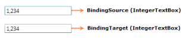

# Binding Support

Data binding is the process of establishing a connection between the application UI and business logic. Data binding can be unidirectional (source to target) or bidirectional (source to target and target to source). You can bind the data to the integer textbox through the Value property.

The following example shows a simple binding between the value of the IntegerTextBox and another IntegerTextBox value that reflects the typed value:

XAML

&lt;StackPanel&gt;

    &lt;syncfusion:IntegerTextBox x:Name="integerTextBox1" Width="150" Margin="10"/&gt;

    &lt;syncfusion:IntegerTextBox x:Name="integerTextBox2" Width="150" Margin="10" Value="{Binding ElementName=integerTextBox1,Path=Value,Mode=TwoWay}"/&gt;

&lt;/StackPanel&gt;

{  | markdownify }
{:.image }

The Data Context property provides its value to child elements. So you can set the Data Context on a superior layout container and its value is provided to all child elements. This is very useful if you want to build a form that is bound to multiple properties of the same data object. If you don't explicitly define a source of binding, it takes the data context by default.

XAML

&lt;StackPanel DataContext="{StaticResource myCustomer}"&gt;

    &lt;TextBox Text="{Binding FirstName}"/&gt;

    &lt;TextBox Text ="{Binding LastName}"/&gt;

    &lt;syncfusion:IntegerTextBox Value="{Binding Phone}"/&gt;

    &lt;syncfusion:IntegerTextBox Value="{Binding Income}"/&gt;

&lt;/StackPanel&gt;

If you want to bind types other than integer types, then you need to use the Value Converter. The following example shows a simple binding between the value of the IntegerTextBox and the Textbox text that reflects the typed value:

XAML

&lt;StackPanel&gt;

    &lt;StackPanel.Resources&gt;

        &lt;c:StringToIntConverter x:Key="stringToIntConverter"/&gt;

    &lt;/StackPanel.Resources&gt;

    &lt;syncfusion:IntegerTextBox x:Name="integerTextBox" Width="150" Margin="10"/&gt;

    <TextBox x:Name="textBox" Width="150" Margin="10" Text="{Binding 

             ElementName=integerTextBox,Path=Value,Mode=TwoWay,

             Converter={StaticResource stringToIntConverter}}"/>    

&lt;/StackPanel&gt;

{  | markdownify }
{:.image }

