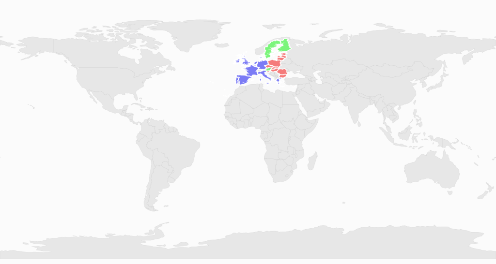

# KML Shapes Rendered in SubShapeFileLayer

[XAML]

        &lt;syncfusion:SfMap&gt;

            &lt;syncfusion:SfMap.Layers&gt;

                &lt;syncfusion:ShapeFileLayer Uri="KmlImportDemo. ShapeFiles.world1.shp"&gt;

                    &lt;syncfusion:ShapeFileLayer.SubShapeFileLayers&gt;

                        &lt;syncfusion:SubShapeFileLayer Uri="KmlImportDemo.KmlFiles.Eu.kml"/&gt;

                    &lt;/syncfusion:ShapeFileLayer.SubShapeFileLayers&gt;

                &lt;/syncfusion:ShapeFileLayer&gt;

            &lt;/syncfusion:SfMap.Layers&gt;

        &lt;/syncfusion:SfMap&gt;

{  | markdownify }
{:.image }

