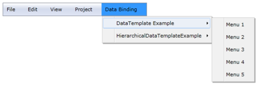

# Binding and DataTemplate Support

Data Binding is the process of establishing a connection between the application User Interface (UI) and Business logic. Data Binding can be unidirectional (source to target or target to source) or bidirectional (source to target and target to source). Users can bind a collection of Business objects by using the ItemsSource property of MenuItemAdv. The Hierarchical data template allows users to bind data that is hierarchical and self-referencing.

Use Case Scenario

MenuAdv helps users to bind a collection of business objects to MenuItemAdv and bind hierarchical levels of data to MenuItemAdv.

Adding the Binding and DataTemplate Support to an Application

The data source can be bound to MenuItemAdv by using the ItemsSource property. When binding the DataTemplate or HierarchialDataTemplate to the MenuItemAdv, the Business objects can be bound by using the ItemTemplate property of MenuItemAdv. Binding and DataTemplate support can be added to an application, as shown in the following code snippets.

<table>
<tr>
<td>
[XAML]&lt;shared:MenuAdv x:Name="Menu"&gt;                &lt;shared:MenuItemAdv Header="File"/&gt;                &lt;shared:MenuItemAdv Header="Edit"/&gt;                &lt;shared:MenuItemAdv Header="View"/&gt;                &lt;shared:MenuItemAdv Header="Project"/&gt;                &lt;shared:MenuItemAdv Header="Data Binding"&gt;                    &lt;shared:MenuItemAdv Header="DataTemplate Example"&gt;                         &lt;shared:MenuItemAdv.ItemsSource&gt;                                 &lt;local:MenuListCollection/&gt;                         &lt;/shared:MenuItemAdv.ItemsSource&gt;                        &lt;shared:MenuItemAdv.ItemTemplate&gt;                            &lt;DataTemplate&gt;                                &lt;TextBlock Text="{Binding Caption}"/&gt;                            &lt;/DataTemplate&gt;                        &lt;/shared:MenuItemAdv.ItemTemplate&gt;                    &lt;/shared:MenuItemAdv&gt;                    &lt;shared:MenuItemAdv Header="HierarchicalDataTemplateExample”&gt;                         &lt;shared:MenuItemAdv.ItemsSource&gt;                               &lt;local:CustomItemsSource/&gt;                         &lt;/shared:MenuItemAdv.ItemsSource&gt;                        &lt;shared:MenuItemAdv.ItemTemplate&gt;                            &lt;hdt:HierarchicalDataTemplate ItemsSource="{Binding Items}"&gt;                                &lt;TextBlock Text="{Binding myString}"/&gt;                            &lt;/hdt:HierarchicalDataTemplate&gt;                        &lt;/shared:MenuItemAdv.ItemTemplate&gt;                    &lt;/shared:MenuItemAdv&gt;                &lt;/shared:MenuItemAdv&gt;            &lt;/shared:MenuAdv&gt;</td></tr>
<tr>
<td>
[C#]public class MenuList{        public int MenuID { get; set; }        public string Caption { get; set; }        public MenuList() { }        public MenuList(string capt, int id)        {            Caption = capt;            MenuID = id;        }}public class MenuListCollection : ObservableCollection<MenuList>{        public MenuListCollection()        {            for (int i = 0; i < 5; i++)            {                this.Add(new MenuList() { MenuID = i, Caption = "Menu " +                 (i + 1).ToString() });            }        }}public class ObjectModel{        public ObjectModel(string myString1, params ObjectModel[] myItems)        {            myString = myString1;            ObservableCollection<ObjectModel> itemsObservableCollection =             new ObservableCollection<ObjectModel>();            foreach (var item in myItems)            {                itemsObservableCollection.Add(item);            }            Items = itemsObservableCollection;        }        public string myString { get; set; }        public ObservableCollection<ObjectModel> Items { get; set; }}public class CustomItemSource : ObservableCollection<ObjectModel>{        public CustomItemSource()        {            this.Add(new ObjectModel("User Interface Edition",            new ObjectModel("ASP.NET", new ObjectModel("Tools",             new ObjectModel("Menu"), new ObjectModel("Toolbar"),             new ObjectModel("RangeSlider")), new ObjectModel("Diagram"),             new ObjectModel("Gauge"), new ObjectModel("Chart")),            new ObjectModel("ASP.NET MVC"), new ObjectModel("Windows Forms"),            new ObjectModel("WPF", new ObjectModel("Tools", new             ObjectModel("Menu"), new ObjectModel("Toolbar"), new             ObjectModel("RangeSlider")), new ObjectModel("Diagram"), new             ObjectModel("Gauge"), new ObjectModel("Chart")), new             ObjectModel("Silverlight", new ObjectModel("Tools", new             ObjectModel("Menu"), new ObjectModel("Toolbar"), new             ObjectModel("RangeSlider")), new ObjectModel("Diagram"), new             ObjectModel("Gauge"), new ObjectModel("Chart"))));            this.Add(new ObjectModel("Reporting Edition",            new ObjectModel("Essential Reports"), new ObjectModel            ("Essential XlsIO"), new ObjectModel("Essential DocIO"),            new ObjectModel("Essential PDF"), new ObjectModel("Essential             Calculate"), new ObjectModel("Essential Grouping")));            this.Add(new ObjectModel("Business Intelligence",            new ObjectModel("Essential BI Chart"), new ObjectModel            ("Essential BI Client"), new ObjectModel("Essential BI Grid"),            new ObjectModel("Essential BI Gauge")));        }}</td></tr>
</table>

{  | markdownify }
{:.image }

{  | markdownify }
{:.image }

Sample Link

WPF Sample Browser-> Tools -> MenuAdv -> MenuAdv Demo

