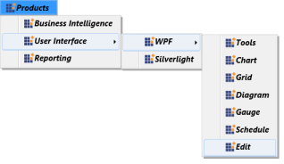

# Customizing Data Templates

Data templates can be customized for items of the MenuAdv control. The next section explains how to customize the MenuItemAdv using data templates.

## Item Template 

You can customize how a business object is displayed as MenuItemAdv using ItemTemplate of MenuAdv. The MenuAdv displays hierarchical data. HierarchicalDataTemplate is used to define the ItemTemplate. The following code example shows the usage of ItemTemplate.

[XAML]

&lt;syncfusion:MenuAdv ItemsSource="{Binding MenuItems}" &gt;

            &lt;syncfusion:MenuAdv.ItemTemplate&gt;

                &lt;HierarchicalDataTemplate ItemsSource="{Binding SubItems}"&gt;

                    &lt;StackPanel Orientation="Horizontal"&gt;

                        &lt;Image Source="App.ico"  Width="15" Height="15"/&gt;

                     &lt;TextBlock Text="{Binding Header}" FontWeight="Bold" 			FontStyle="Italic" /&gt;

                    &lt;/StackPanel&gt;

                &lt;/HierarchicalDataTemplate&gt;

            &lt;/syncfusion:MenuAdv.ItemTemplate&gt;

        &lt;/syncfusion:MenuAdv&gt;

Implementing the above code will generate the following MenuAdv control.

{  | markdownify }
{:.image }

