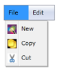

# Icon Support

MenuItemAdv allows users to display an image on the left of the control. Icon for MenuItemAdv can be set by providing the image source as a value for the Icon property of the MenuItemAdv class.

Use Case Scenarios

MenuAdv helps users to display an image on the left of the control.

Adding the Icon Support to an Application 

The Icon support can be added to an application by using the Icon property of MenuItemAdv, as shown in the following code snippet.

[XAML]

&lt;shared:MenuAdv x:Name="Menu"/&gt;

                &lt;shared:MenuItemAdv Header="File"&gt;

                    &lt;shared:MenuItemAdv Header="New"&gt;

                        &lt;shared:MenuItemAdv.Icon&gt;

                            &lt;Image Source="/MenuControlDemo;component/Images/NewIcon.jpg"/&gt;

                        &lt;/shared:MenuItemAdv.Icon&gt;

                    &lt;/shared:MenuItemAdv&gt;

                    &lt;shared:MenuItemAdv Header="Copy"&gt;

                        &lt;shared:MenuItemAdv.Icon&gt;

                            &lt;Image Source="/MenuControlDemo;component/Images/CopyIcon.jpg"/&gt;

                        &lt;/shared:MenuItemAdv.Icon&gt;

                    &lt;/shared:MenuItemAdv&gt;

                    &lt;shared:MenuItemAdv Header="Cut"&gt;

                        &lt;shared:MenuItemAdv.Icon&gt;

                            &lt;Image Source="/MenuControlDemo;component/Images/CutIcon.jpg"/&gt;

                        &lt;/shared:MenuItemAdv.Icon&gt;

                    &lt;/shared:MenuItemAdv&gt;

                &lt;/shared:MenuItemAdv&gt;

                &lt;shared:MenuItemAdv Header="Edit"/&gt;

&lt;/shared:MenuAdv&gt;

{  | markdownify }
{:.image }

Properties

The property for the Icon support is described in the following tabulation:

_Property Table_

<table>
<tr>
<td>
Property </td><td>
Description </td><td>
Type </td><td>
Data Type </td></tr>
<tr>
<td>
Icon</td><td>
Gets or sets the Icon of MenuItemAdv.</td><td>
DependencyProperty</td><td>
Object(null)</td></tr>
</table>

Sample Link

WPF Sample Browser-> Tools -> MenuAdv -> MenuAdv Demo

