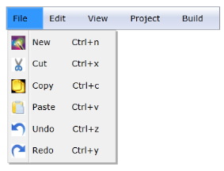

# InputGestureText Support

InputGestureText is used to set MenuItemAdv to display shortcut keys along with its Header. This support can be utilized by using the InputGestureText property. The value given by using this property will be displayed along with the Header of MenuItemAdv. Also, InputGestureText can be displayed in MenuItemAdv by using the command support. If you set the value of the Command property by using ApplicationCommands the corresponding InputGestureText will be displayed along with its header value automatically.

Use Case Scenarios

MenuAdv helps users to display the shortcut keys along with the MenuItemAdv header.

Adding the InputGestureText Support to an Application 

The value assigned by using the InputGestureText property will be displayed in MenuItemAdv along with the Header property value of MenuITemAdv. The InputGestureText support can be added to an application, as shown in the following code snippet.

[XAML]

&lt;shared:MenuAdv x:Name="Menu" Margin="10"&gt;

                &lt;shared:MenuItemAdv Header="File"&gt;

                    &lt;shared:MenuItemAdv Header="New" InputGestureText="Ctrl+n"&gt;

                        &lt;shared:MenuItemAdv.Icon&gt;

                            &lt;Image Source="/MenuControlDemo;component/Images/NewIcon.jpg"/&gt;

                        &lt;/shared:MenuItemAdv.Icon&gt;

                    &lt;/shared:MenuItemAdv&gt;

                    &lt;shared:MenuItemAdv Header="Cut" InputGestureText="Ctrl+x"&gt;

                        &lt;shared:MenuItemAdv.Icon&gt;

                            &lt;Image Source="/MenuControlDemo;component/Images/CutIcon.jpg"/&gt;

                        &lt;/shared:MenuItemAdv.Icon&gt;

                    &lt;/shared:MenuItemAdv&gt;

                    &lt;shared:MenuItemAdv Header="Copy" InputGestureText="Ctrl+c"&gt;

                        &lt;shared:MenuItemAdv.Icon&gt;

                            &lt;Image Source="/MenuControlDemo;component/Images/CopyIcon.jpg"/&gt;

                        &lt;/shared:MenuItemAdv.Icon&gt;

                    &lt;/shared:MenuItemAdv&gt;

                    &lt;shared:MenuItemAdv Header="Paste" InputGestureText="Ctrl+v"&gt;

                        &lt;shared:MenuItemAdv.Icon&gt;

                            &lt;Image Source="/MenuControlDemo;component/Images/PasteIcon.jpg"/&gt;

                        &lt;/shared:MenuItemAdv.Icon&gt;

                    &lt;/shared:MenuItemAdv&gt;

                    &lt;shared:MenuItemAdv Header="Undo" InputGestureText="Ctrl+z"&gt;

                        &lt;shared:MenuItemAdv.Icon&gt;

                            &lt;Image Source="/MenuControlDemo;component/Images/UndoIcon.jpg"/&gt;

                        &lt;/shared:MenuItemAdv.Icon&gt;

                    &lt;/shared:MenuItemAdv&gt;

                    &lt;shared:MenuItemAdv Header="Redo" InputGestureText="Ctrl+y"&gt;

                        &lt;shared:MenuItemAdv.Icon&gt;

                            &lt;Image Source="/MenuControlDemo;component/Images/RedoIcon.jpg"/&gt;

                        &lt;/shared:MenuItemAdv.Icon&gt;

                    &lt;/shared:MenuItemAdv&gt;

                    &lt;shared:MenuItemSeparator/&gt;

                &lt;/shared:MenuItemAdv&gt;

                &lt;shared:MenuItemAdv Header="Edit"/&gt;

                &lt;shared:MenuItemAdv Header="View"/&gt;

                &lt;shared:MenuItemAdv Header="Project"/&gt;

                &lt;shared:MenuItemAdv Header="Build"/&gt;

            &lt;/shared:MenuAdv&gt;

{  | markdownify }
{:.image }

Properties

The property for the InputGestureText support is described in the following tabulation:

_Property Table_

<table>
<tr>
<td>
Property </td><td>
Description </td><td>
Type </td><td>
Data Type </td></tr>
<tr>
<td>
InputGestureText</td><td>
Gets or sets the value of InputGestureText of MenuItemAdv.</td><td>
DependencyProperty</td><td>
String(string.Empty)</td></tr>
</table>

Sample Link

WPF Sample Browser-> Tools -> MenuAdv -> MenuAdv Demo

