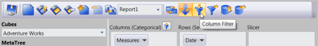
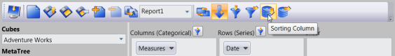
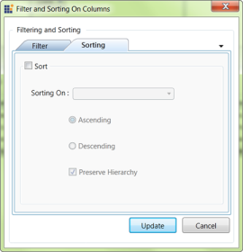
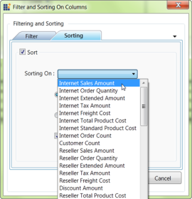

# Filtering and Sorting

## Filtering

The Filter tab in the Filter and Sorting dialog box of OLAP Client provides options to specify custom filters on the multidimensional data to be retrieved. It enables filtering rows and columns of the current (active) Measure. This dialog is invoked through the Filter toolbar item.

Column Filter

Column Filter will check each and every row of a column against the filter condition, if and only if all the rows of that column satisfy the condition, the column will be included in the result set else that column will be filtered.

Row Filter

Row Filter will check each and every column of a row against the filter condition if and only if all the columns of that row satisfy the condition, the row will be included in the result set else that row will be filtered.

### Options in Filter Dialog

Empty Results:

Filter Empty column/Rows – By this option the user can filter the appearance of empty rows/column in the result set.

Filter 1 and Filter 2:

In Client filtering option, the user can apply two filter expressions to a report at a same time.

Fields that form filter expression:

* Condition – The user can choose any one condition that he wants to appear in the filter     expression.
* Filter On – The user can choose any one measure element form the list, on which the user wishes to apply the filter.
* Value – The user will want to enter the conditional value for the expression.
### Steps to apply filtering

1. We can apply filter using the filter dialog window. By clicking the column filter or row filter button in the OLAP client toolbar the appropriate filter dialog window will be displayed.

{  | markdownify }
{:.image }

{  | markdownify }
{:.image }

2. Then by checking the Filter 1 check box, we can apply the first filter condition to the current report.

{  | markdownify }
{:.image }

3. From the condition combo box we can choose the condition we want to include in the filter expression.

{  | markdownify }
{:.image }

1. We want to choose a measure element that we have already include in our current report from the Filter on List. 
2. The filter expression will be built on this selected measure element.

{  | markdownify }
{:.image }

4. Finally by entering the Conditional value and clicking the update button the filter will get reflected in the result set.
5. In the same way we can apply the Row Filter.
### ShowColumnFilterDialog

By invoking this method the column filter Dialog will be displayed. Using the column filter dialog users can apply the column filter to the current report. 

[C#]

this.olapClient1.ShowColumnFilterDialog();

[VB]

Me.olapClient1.ShowColumnFilterDialog()

### ShowRowFilterDialog

By invoking this method the row filter Dialog will be displayed. Using the row filter dialog users can apply the row filter to the current report. 

[C#]

this.olapClient1.ShowRowFilterDialog();

[VB]

Me.olapClient1.ShowRowFilterDialog();

## Sorting

The Sorting tab in the Filter and Sorting dialog box of OLAP Client provides options to sort the results by columns (series) or rows (categories). This dialog is invoked through the Sorting toolbar item.

Column Sorting

Column sorting will sort the columns in the result set, based on the column total of each column.

Row Sorting

Row sorting will sort the rows in the result set, based on the row total of each row.

{  | markdownify }
{:.image }

### Options in Sorting Dialog

The sorting dialog will contain three options namely:

* Sorting On: Display the list of measure elements to choose one to set that as the key field.
* Ascending or Descending: Specify the sorting order.
* Preserve Hierarchy: Sort the records without changing the hierarchy order.
### Steps to apply sorting

The sorting dialog will appear when we click the row/column sorting button in the OLAP Client tool bar. By giving the proper input, we can apply Sorting.

{  | markdownify }
{:.image }

{  | markdownify }
{:.image }

By Checking the Sort check box we can set the sorting for the current report.

{  | markdownify }
{:.image }

When we want to choose a measure element form the sorting on list, the selecting measure element should exist in the current report. Then only the sorting will reflect on the result set.

By selecting the measure and specifying the sorting order and clicking update, the sort order of the recode will be reflected in the output.

### ShowColumnSortDialog

By invoking this method the column sorting Dialog will be displayed. Using the column sorting dialog users can apply the column sorting to the current report. 

[C#]

this.olapClient1.ShowColumnSortingDialog();

[VB]

Me.olapClient1.ShowColumnSortingDialog();

### ShowRowSortDialog

By invoking this method the row sorting Dialog will be displayed. Using the row sorting dialog users can apply the row sorting to the current report. 

[C#]

this.olapClient1.ShowRowSortingDialog();

[VB]

Me.olapClient1.ShowRowSortingDialog();

## ShowFilterSortButtons

Users can toggle the visibility of the Filter and Sorting buttons in the OlapClientToolBar by using this property. This property will accept a Boolean value (true/false) and based on this input the visibility will be set. 

[C#]

this.olapClient1.ShowFilterSortButtons = false;

[VB]

Me.olapClient1.ShowFilterSortButtons = False

