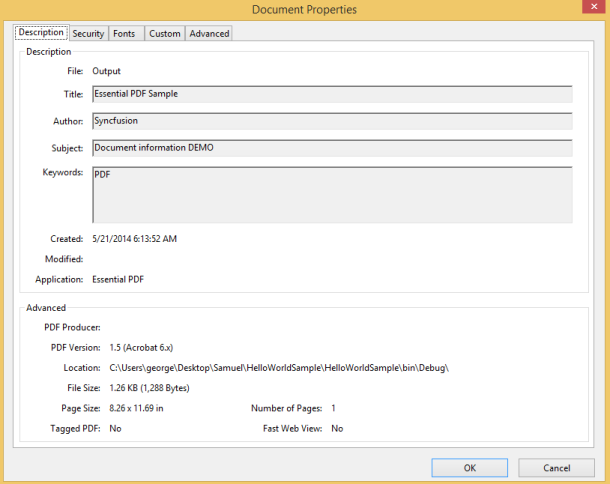

# Document Settings

## Document information

Essential PDF allows you to set and read a file or document information of a PDF like Author, CreationDate, Subject, Title, etc. The document information property of the PdfDocument or PdfLoadedDocument provides access to this information. 

The following are the list of attributes available under PdfDocumentInformation class.

* Author
* Creator
* Keywords
* Producer
* Subject
* Title and so on

 The following code example illustrates how to read the document information.

[C#]

PdfLoadedDocument document = new PdfLoadedDocument("input.pdf");

//Accesses document information.        

Console.WriteLine(document.DocumentInformation.Author);

Console.WriteLine(document.DocumentInformation.Title);

Console.WriteLine(document.DocumentInformation.Subject);

Console.WriteLine(document.DocumentInformation.Keywords);

Console.WriteLine(document.DocumentInformation.Creator);

Console.WriteLine(document.DocumentInformation.Producer);

[VB]

Dim document As New PdfLoadedDocument("input.pdf")

'Accesses document information.      

Console.WriteLine(document.DocumentInformation.Author)

Console.WriteLine(document.DocumentInformation.Title)

Console.WriteLine(document.DocumentInformation.Subject)

Console.WriteLine(document.DocumentInformation.Keywords)

Console.WriteLine(document.DocumentInformation.Creator)

Console.WriteLine(document.DocumentInformation.Producer)

> 

> _Note: You can write the document information with the newly created document._

The following code example illustrates how to write the document information.

[C#]

//Creates a new PDF document.

PdfDocument document = new PdfDocument();

//Sets document information.

document.DocumentInformation.Author = "Syncfusion";

document.DocumentInformation.CreationDate = DateTime.Now;

document.DocumentInformation.Creator = "Essential PDF";

document.DocumentInformation.Keywords = "PDF";

document.DocumentInformation.Subject = "Document information DEMO";

document.DocumentInformation.Title = "Essential PDF Sample";       

//Adds a page to the document.

PdfPage page = document.Pages.Add();

//Creates PDF graphics for the page.

PdfGraphics graphics = page.Graphics;

//Sets the font.

PdfFont font = new PdfStandardFont(PdfFontFamily.Helvetica, 20);

//Draws the text.

graphics.DrawString("Hello World!!!", font, PdfBrushes.Black, new PointF(0, 0));

//Saves the document.

document.Save("Output.pdf");

//Closes the document.

document.Close(true);

[VB]

'Creates a new PDF document.

Dim document As New PdfDocument()

'Sets the document information.

document.DocumentInformation.Author = "Syncfusion"

document.DocumentInformation.CreationDate = DateTime.Now

document.DocumentInformation.Creator = "Essential PDF"

document.DocumentInformation.Keywords = "PDF"

document.DocumentInformation.Subject = "Document information DEMO"

document.DocumentInformation.Title = "Essential PDF Sample"

'Adds a page to the document.

Dim page As PdfPage = document.Pages.Add()

'Creates PDF graphics for the page.

Dim graphics As PdfGraphics = page.Graphics

'Sets the font.

Dim font As PdfFont = New PdfStandardFont(PdfFontFamily.Helvetica, 20)

'Draws the text.

graphics.DrawString("Hello World!!!", font, PdfBrushes.Black, New PointF(0, 0))

'Saves the document.

document.Save("Output.pdf")

'Closes the document.

document.Close(True)

The Document settings help in storing information about the document. It can also control the way they are displayed when they are open in the viewer.

{  | markdownify }
{:.image }

> _Note: You cannot overwrite the existing metadata information._

## Viewer Preference

A PDF file can control the way the document is presented on the screen when it is opened in the viewer. Essential PDF allows you to set these preferences using the PdfViewerPreferences class. You can perform the following customizations of the viewer when the document is open.

_List of customizations_

<table>
<tr>
<td>
HideToolbar  </td><td>
A flag specifying whether to hide the viewer application's toolbar when the document is active.</td></tr>
<tr>
<td>
HideMenubar </td><td>
A flag specifying whether to hide the viewer application's menu bar when the document is active.</td></tr>
<tr>
<td>
HideWindowUI </td><td>
A flag specifying whether to hide user interface elements in the document's window (such as scroll bar and navigation controls), leaving only the document's contents to be displayed.</td></tr>
<tr>
<td>
FitWindow </td><td>
A flag specifying whether to resize the document's window to fit the size of the first displayed page.</td></tr>
<tr>
<td>
CenterWindow </td><td>
A flag specifying whether to position the document's window in the center of the screen.</td></tr>
<tr>
<td>
DisplayTitle </td><td>
A flag specifying whether to display the document's title in the top bar.</td></tr>
<tr>
<td>
PageLayout </td><td>
The page layout to be used when the document is opened.* OneColumn - Displays the pages in one column.* SinglePage - Displays one page at a time.* TwoColumnLeft - Displays the pages in two columns with odd-numbered pages on the left.* TwoColumnRight - Displays the pages in two columns with odd-numbered pages on the right.* TwoPageLeft - Displays the pages two at a time with odd-numbered pages on the left.* TwoPageRight - Displays the pages two at a time with odd-numbered pages on the right.</td></tr>
<tr>
<td>
 PageMode </td><td>
The page mode specifies how the document should be displayed when opened.* UseNone - Neither document outline nor thumbnail images visible. * UseOutlines - Document outline visible.* UseThumbs - Thumbnail images visible.* FullScreen - Full-screen mode, without menu bar, window controls, or any other window visible.* UseOC - Optional content group panel visible.* UseAttachments - Attachments panel visible. </td></tr>
<tr>
<td>
PageScaling </td><td>
An option to be selected when a print dialog is displayed for this document* AppDefault – Indicates the conforming reader’s default print scaling* None – Indicates no page scaling.</td></tr>
</table>

[C#]

//Creates a new PDF document.

PdfDocument document = new PdfDocument();

//Adds a page to the document.

PdfPage page = document.Pages.Add();

//Creates PDF graphics for the page.

PdfGraphics graphics = page.Graphics;

//Sets the font.

PdfFont font = new PdfStandardFont(PdfFontFamily.Helvetica, 20);

//Draws the text.

graphics.DrawString("Hello World!!!", font, PdfBrushes.Black, new PointF(0, 0));

//Hides viewer application's menu bar.

document.ViewerPreferences.HideMenubar = true;

//Hides viewer application's toolbar.

document.ViewerPreferences.HideToolbar = true;

//Shows user interface elements in the document's window (such as scroll bars and navigation controls).

document.ViewerPreferences.HideWindowUI = false;

//Displays one page at a time.

document.ViewerPreferences.PageLayout = PdfPageLayout.SinglePage;

//Uses default viewer application page mode.

document.ViewerPreferences.PageMode = PdfPageMode.UseNone;

//Saves the document.

document.Save("Sample.pdf");

//Closes the document.

document.Close(true);

[VB]

'Creates a new PDF document.

Dim document As New PdfDocument()

'Adds a page to the document.

Dim page As PdfPage = document.Pages.Add()

'Creates PDF graphics for the page

Dim graphics As PdfGraphics = page.Graphics

'Sets the font.

Dim font As PdfFont = New PdfStandardFont(PdfFontFamily.Helvetica, 20)

'Draws the text.

graphics.DrawString("Hello World!!!", font, PdfBrushes.Black, New PointF(0, 0))

'Hides the viewer application's menu bar.

document.ViewerPreferences.HideMenubar = True

'Hides the viewer application's toolbar. 

document.ViewerPreferences.HideToolbar = True

'Shows user interface elements in the document's window (such as scroll bars and navigation controls).

document.ViewerPreferences.HideWindowUI = False

'Displays one page at a time.

document.ViewerPreferences.PageLayout = PdfPageLayout.SinglePage

'Uses default viewer application page mode.

 document.ViewerPreferences.PageMode = PdfPageMode.UseNone

'Saves the document.

document.Save("Sample.pdf")

'Closes the document.

document.Close(True)

{  | markdownify }
{:.image }

