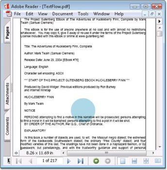
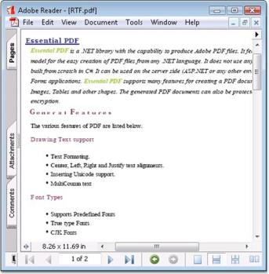

# TextElement

TextElement is used to render texts using custom fonts, size and style in the page of the PDF document. You can also modify it to include hyperlinks, ordered and unordered list, html styled text, and so on. These are explained in the following topics.

{  | markdownify }
{:.image }

## Draw Right-To-Left Text

Essential PDF provides support for drawing RTL languages into the PDF document.

Middle Eastern languages such as Hebrew and Arabic are written from right to left. Numbers are written with the most significant digit left-most, just as in European or other left-to-right text. Languages written in left-to-right scripts are often mixed; hence, the complete document is bidirectional in nature; a mix of both right-to-left (RTL) and left-to-right (LTR) writing. Text written in the Hebrew and Arabic languages are often referred to as bidirectional or "bidi" in short.

The StringFormat class encapsulates text layout information (such as alignment, subsuperscript, and clipping). You can pass the StringFormat object to the DrawString Methods to format a string.

To draw right-to-left text

* Set the PdfStringFormat’s RightToLeft property to true
* Set the PdfStringFormat’s Aligment property to Right

[C#]

//Creates a new PDF document.

PdfDocument doc = new PdfDocument();

//Adds a page to the document.

PdfPage page = doc.Pages.Add();

//Creates PDF graphics for the page

PdfGraphics graphics = page.Graphics;

//Sets the font with Unicode option.

Font f = new Font("Arial", 14);

PdfFont font = new PdfTrueTypeFont(f, true);

//Sets the format for string.

PdfStringFormat format = new PdfStringFormat();

//Sets the format as RTL type.

format.RightToLeft = true;

//Sets the alignment.

format.Alignment = PdfTextAlignment.Right;

string hebrewText = "שלום עולם";

graphics.DrawString(hebrewText, font, PdfBrushes.Black, new RectangleF(0, 0, page.GetClientSize().Width, page.GetClientSize().Height), format);

//Saves the document.

doc.Save("Output.pdf");

//Closes the document.

doc.Close(true);

[VB]

'Creates a new PDF document.

Dim doc As New PdfDocument()

'Adds a page to the document.

Dim page As PdfPage = doc.Pages.Add()

'Creates PDF graphics for the page.

Dim g As PdfGraphics = page.Graphics

'Sets the font with Unicode option.

Dim f As New Font("Arial", 14)

Dim font As PdfFont = New PdfTrueTypeFont(f, True)

'Sets the format for string.

Dim format As New PdfStringFormat()

'Sets the format as RTL type.

format.RightToLeft = True

'Sets the alignment.

format.Alignment = PdfTextAlignment.Right

Dim hebrewText As String = "שלום עולם"

g.DrawString(hebrewText, font, PdfBrushes.Black, New RectangleF(0, 0, page.GetClientSize().Width, page.GetClientSize().Height), format)

'Saves the document.

doc.Save("Output.pdf")

'Closes the document.

doc.Close(True)

## HTML STYLED TEXT

Essential PDF provides you support to render the HTML string in a PDF document that can flow to multiple pages by using the PdfHTMLTextElement class. The PdfHTMLTextElement class provides you support for a limited set of HTML tags that are sufficient to render format text in the PDF document. It draws the HTML string at the specified location with the selected size, brush and font. You can also align the text by using the TextAlign property.

The PdfMetafileLayoutFormat class enables to break the HTML text into multiple pages.

Supported Tags (Should be XHTML-compliant)

* Font
* B
* I
* U
* St
* sub
* sup
* BR

The following code example illustrates how to render the HTML string in a PDF document.

[C#]

//Creates a new PDF document.

PdfDocument doc = new PdfDocument();

doc.PageSettings.Margins.All = 0;

//Adds a page to the document.

PdfPage page = doc.Pages.Add();

//Creates PDF graphics for the page.

PdfGraphics graphics = page.Graphics;

//Sets the font.

PdfFont font = new PdfStandardFont(PdfFontFamily.Courier, 14);

//HtmlString.

string longText = "Essential PDF is a &lt;u&gt;&lt;i&gt;.NET</i>&lt;/u&gt; " +

"library with the capability to produce Adobe PDF files ";

//Renders HtmlText.

PdfHTMLTextElement richTextElement = new PdfHTMLTextElement(longText, font, PdfBrushes.Black);

richTextElement.TextAlign = TextAlign.Justify;

//Formats Layout.

PdfMetafileLayoutFormat format = new PdfMetafileLayoutFormat();

format.Layout = PdfLayoutType.OnePage;

format.Break = PdfLayoutBreakType.FitPage;

//Draws htmlString.

richTextElement.Draw(page, new RectangleF(30, 30, page.GetClientSize().Width, page.GetClientSize().Height), format);

//Saves the document.

doc.Save("Output.pdf");

//Closes the document.

doc.Close(true);

[VB]

'Creates a new PDF document.

Dim doc As New PdfDocument()

doc.PageSettings.Margins.All = 0

'Adds a page to the document.

Dim page As PdfPage = doc.Pages.Add()

'Creates PDF graphics for the page.

Dim graphics As PdfGraphics = page.Graphics

'Sets the font.

Dim font As PdfFont = New PdfStandardFont(PdfFontFamily.Courier, 14)

'HtmlString.

Dim longText As String = "Essential PDF is a &lt;u&gt;&lt;i&gt;.NET</i>&lt;/u&gt; " & "library with the capability to produce Adobe PDF files "

'Renders HtmlText.

richTextElement.TextAlign = TextAlign.Justify

'Formats Layout.

Dim format As New PdfMetafileLayoutFormat()

format.Layout = PdfLayoutType.OnePage

format.Break = PdfLayoutBreakType.FitPage

'Draws htmlString.

richTextElement.Draw(page, New RectangleF(30, 30, page.GetClientSize().Width, page.GetClientSize().Height), format)

'Saves the document.

doc.Save("Output.pdf")

'Closes the document.

doc.Close(True)

## Automatic Fields

Automatic Fields are special objects that display information calculated automatically just before the document is saved. The automatic fields are usually used to display information like page number, page count, etc., when you are not sure about the value while laying out objects across multiple pages.

The following are the fields displayed:

* Page number
* Count of pages
* Author of the document
* Creation and current date
* Other document information
> 

> _Note: These fields are not always evaluated at the moment of constructing the document._

Numeric fields have an additional NumberingStyle property. There are five possible numbering styles supported by the automatic fields. They are as follows.

* Arabic (1, 2, 3, 4, ...)
* Upper Roman (I, II, III, IV, ...)
* Roman (i, ii, iii, iv, ...)
* Upper Latin (A, B, C, D, ..., Z, AA, AB, ...)
* Latin (a, b, c, d, ..., z, aa, ab, ...)

Brief descriptions on the various numbering fields are given as follows.

_List of Numbering fields with description_

<table>
<tr>
<td>
PdfPageNumberField </td><td>
Specifies the page number on which the field is drawn.</td></tr>
<tr>
<td>
PdfPageCountField </td><td>
Specifies the total number of pages in the document.</td></tr>
<tr>
<td>
PdfSectionPageNumberField </td><td>
Specifies the number of pages within a section.</td></tr>
<tr>
<td>
PdfSectionPageCountField </td><td>
Specifies the number of sections in a document.</td></tr>
<tr>
<td>
PdfSectionNumberField </td><td>
Specifies the number of sections within a document.</td></tr>
<tr>
<td>
PdfCreationDateField </td><td>
Specifies the creation date of the document.</td></tr>
</table>
### Page number field

The Essential PDF has the ability to number document's pages in an automated way. Page number field defines a common numbering system for a set of consecutive pages and the visual aspect of the printed page number.

The following code example illustrates how to display page numbers. 

[C#]

//Creates a new PDF document.

PdfDocument document = new PdfDocument();

//Sets the font.

PdfFont font = new PdfStandardFont(PdfFontFamily.Helvetica, 12f);

//Creates a brush.

PdfBrush brush = PdfBrushes.Black;

//Creates a page number field.

PdfPageNumberField pageNumber = new PdfPageNumberField(font, brush);

for (int i = 0; i < 50; i++)

{

//Adds a page to the document.

PdfPage page = document.Pages.Add();

//Draws the page number in the document.

pageNumber.Draw(page.Graphics);

}

//Saves the document.

document.Save("Output.pdf");

//Closes the document.

document.Close(true);

[VB]

'Creates a new PDF document.

Dim document As New PdfDocument()

'Sets the font.

Dim font As PdfFont = New PdfStandardFont(PdfFontFamily.Helvetica, 12.0F)

'Creates a brush.

Dim brush As PdfBrush = PdfBrushes.Black

'Creates a page number field.

Dim pageNumber As New PdfPageNumberField(font, brush)

For i As Integer = 0 To 49

'Adds a page to the document.

Dim page As PdfPage = document.Pages.Add()

'Draws the page number in the document.

pageNumber.Draw(page.Graphics)

Next

'Saves the document.

document.Save("Output.pdf")

'Closes the document.

document.Close(True)

Page count field

The Essential PDF provides the ability to display document's page count in an automated way.  Page count field displays the actual number of pages added to the document.

The following code example illustrates how to display page count.

[C#]

//Creates a new PDF document.

PdfDocument document = new PdfDocument();

//Sets the font.

PdfFont font = new PdfStandardFont(PdfFontFamily.Helvetica, 12f);

//Creates a brush.

PdfBrush brush = PdfBrushes.Black;

//Creates a page count field.

PdfPageCountField count = new PdfPageCountField(font, brush);

for (int i = 0; i < 50; i++)

{

//Adds a page to the document.

PdfPage page = document.Pages.Add();

//Draws page count in the document.

count.Draw(page.Graphics);

}

//Saves the document.

document.Save("Output.pdf");

//Closes the document.

document.Close(true);          

[VB]

'Creates a new PDF document.

Dim document As New PdfDocument()

'Sets the font.

Dim font As PdfFont = New PdfStandardFont(PdfFontFamily.Helvetica, 12.0F)

'Creates a brush.

Dim brush As PdfBrush = PdfBrushes.Black

'Creates a page count field.

Dim count As New PdfPageCountField(font, brush)

For i As Integer = 0 To 49

'Adds a page to the document.

Dim page As PdfPage = document.Pages.Add()

'Draws page count in the document.

count.Draw(page.Graphics)

Next

'Saves the document.

document.Save("Output.pdf")

'Closes the document.

document.Close(True)

Creation Date Time field

The Essential PDF provides the ability to display creation date time in an automated way. You can draw the Automatic Fields on the PdfTemplate and set them as the document template or manually draw them on the necessary pages. The values of the fields are automatically populated on each copy of the template.

The following code example illustrates how to use datetime field in template.

[C#]

//Creates a new PDF document.

PdfDocument document = new PdfDocument();

//Sets the font.

PdfFont font = new PdfStandardFont(PdfFontFamily.Helvetica, 12f);

//Creates a brush.

PdfBrush brush = PdfBrushes.Black;

PdfTemplate template = new PdfTemplate(15, 15);

//Creates an automatic date time field.

PdfDateTimeField dateField = new PdfDateTimeField(font, brush);

dateField.DateFormatString = "dd'/'MMMM'/'yyyy";

//Draws the date time field in template.

dateField.Draw(template.Graphics);

for (int i = 0; i < 50; i++)

{

//Adds a page to the document.

PdfPage page = document.Pages.Add();

//Draws the template field in the page.

page.Graphics.DrawPdfTemplate(template, new Point(50, 50));

}

//Saves the document.

document.Save("Output.pdf");

//Closes the document.

document.Close(true);

[VB]

'Creates a new PDF document.

Dim document As New PdfDocument()

'Sets the font.

Dim font As PdfFont = New PdfStandardFont(PdfFontFamily.Helvetica, 12.0F)

'Creates a brush.

Dim brush As PdfBrush = PdfBrushes.Black

Dim template As New PdfTemplate(15, 15)

'Creates an automatic date time field.

Dim dateField As New PdfDateTimeField(font, brush)

dateField.DateFormatString = "dd'/'MMMM'/'yyyy"

'Draws the date time field in template.

dateField.Draw(template.Graphics)

For i As Integer = 0 To 49

'Adds a page to the document.

Dim page As PdfPage = document.Pages.Add()

'Draws the template field in the page.

page.Graphics.DrawPdfTemplate(template, New Point(50, 50))

Next

'Saves the document.

document.Save("Output.pdf")

'Closes the document.

document.Close(True)

Composite field

Composite field comprises any number of automatic fields. You can add many number of automatic fields in the composite field.

The following code example illustrates how to use composite fields

[C#]

//Creates a new PDF document.

PdfDocument document = new PdfDocument();

//Sets the font.

PdfFont font = new PdfStandardFont(PdfFontFamily.Helvetica, 12f);

//Creates a brush.

PdfBrush brush = PdfBrushes.Black;

//Creates page number field.

PdfPageNumberField pageNumber = new PdfPageNumberField(font, brush);

//Creates page count field.

PdfPageCountField count = new PdfPageCountField(font, brush);

//Adds the fields in composite fields.

PdfCompositeField compositeField = new PdfCompositeField(font, brush, "Page {0} of {1}", pageNumber, count);

for (int i = 0; i < 50; i++)

{

//Adds a page to the document.

PdfPage page = document.Pages.Add();

//Draws the composite field.

compositeField.Draw(page.Graphics);

}

//Saves the document.

document.Save("Output.pdf");

//Closes the document.

document.Close(true);

[VB]

'Creates a new PDF document.

Dim document As New PdfDocument()

'Sets the font.

Dim font As PdfFont = New PdfStandardFont(PdfFontFamily.Helvetica, 12.0F)

'Creates a brush.

Dim brush As PdfBrush = PdfBrushes.Black

'Creates page number field.

Dim pageNumber As New PdfPageNumberField(font, brush)

'Creates page count field.

Dim count As New PdfPageCountField(font, brush)

'Adds the fields in composite fields.

Dim compositeField As New PdfCompositeField(font, brush, "Page {0} of {1}", pageNumber, count)

For i As Integer = 0 To 49

'Adds a page to the document.

Dim page As PdfPage = document.Pages.Add()

'Draw the composite field.

compositeField.Draw(page.Graphics)

Next

'Saves the document.

document.Save("Output.pdf")

'Closes the document.

document.Close(True)

## Hyperlinks

In PDF, a hyperlink in a document can open webpages using the default browser, activated by clicking on the text. 

You can create hyperlinks in a PDF document by using the PdfTextWebLink class. The DrawTextWebLink method is used to draw hyperlinks in PDF pages.

The following code example illustrates how to draw hyperlinks.

[C#]

//Creates a new PDF document.

PdfDocument document = new PdfDocument();

//Adds a page to the document.

PdfPage page = document.Pages.Add();

//Sets the font.

PdfFont font = new PdfStandardFont(PdfFontFamily.Helvetica, 12f);

//Creates a brush.

PdfBrush brush = PdfBrushes.Black;

//Creates the Text Web Link.

PdfTextWebLink textLink = new PdfTextWebLink();

textLink.Url = "http://www.syncfusion.com";

textLink.Text = "Syncfusion .Net components and controls";

textLink.Brush = brush;

textLink.Font = font;

textLink.Pen = PdfPens.Blue;

textLink.DrawTextWebLink(page, new PointF(10, 40));

//Saves the document.

document.Save("Output.pdf");

//Closes the document.

document.Close(true);

[VB]

'Creates a new PDF document.

Dim document As New PdfDocument()

'Adds a page to the document.

Dim page As PdfPage = document.Pages.Add()

'Sets the font.

Dim font As PdfFont = New PdfStandardFont(PdfFontFamily.Helvetica, 12.0F)

'Creates a brush.

Dim brush As PdfBrush = PdfBrushes.Black

'Creates the Text Web Link.

Dim textLink As New PdfTextWebLink()

textLink.Url = "http://www.syncfusion.com"

textLink.Text = "Syncfusion .Net components and controls"

textLink.Brush = brush

textLink.Font = font

textLink.Pen = PdfPens.Blue

textLink.DrawTextWebLink(page, New PointF(10, 40))

'Saves the document.

document.Save("Output.pdf")

'Closes the document.

document.Close(True)

## Pagination

Text in a PDF document can flow through multiple pages. Layout format plays an important role in drawing or adding very large contents to the Pdf document. You may or may not need the text to flow across pages. Also, you might want to specify a location where the contents should start to paginate. In such cases, the layout format plays an important role. . The PdfLayoutFormat class helps you in specifying the layout type (paginate or fit page) and the paginate bounds. 

[C#]

//Creates a new PDF document.

PdfDocument doc = new PdfDocument();

//Adds a page to the document.

PdfPage page = doc.Pages.Add();

//Sets the font.

PdfFont font = new PdfStandardFont(PdfFontFamily.Helvetica, 12f);

RectangleF bounds = new RectangleF(0, 0, page.GetClientSize().Width, page.GetClientSize().Height); 

//Reads text from the text file.

string path = "Input.txt";

StreamReader reader = new StreamReader(path, Encoding.ASCII);

string text = reader.ReadToEnd();

reader.Close();

//Sets the formats for the text.

PdfStringFormat format = new PdfStringFormat();

format.Alignment = PdfTextAlignment.Justify;

format.LineAlignment = PdfVerticalAlignment.Top;

format.ParagraphIndent = 15f;

//Creates a text element.

PdfTextElement element = new PdfTextElement(text, font);

element.Brush = new PdfSolidBrush(Color.Black);

element.StringFormat = format;

element.Font = new PdfStandardFont(PdfFontFamily.Helvetica, 12);

//Sets properties to paginate the text.

PdfLayoutFormat layoutFormat = new PdfLayoutFormat();

layoutFormat.Break = PdfLayoutBreakType.FitPage;

layoutFormat.Layout = PdfLayoutType.Paginate;

//Draws the text element with the properties and formats set.

PdfTextLayoutResult result = element.Draw(page, bounds, layoutFormat);

//Saves the document.

doc.Save("Output.pdf");

[VB]

'Creates a new PDF document.

Dim doc As New PdfDocument()

'Adds a page to the document.

Dim page As PdfPage = doc.Pages.Add()

'Sets the font.

Dim font As PdfFont = New PdfStandardFont(PdfFontFamily.Helvetica, 12.0F)

Dim bounds As New RectangleF(0, 0, page.GetClientSize().Width, page.GetClientSize().Height)

'Reads text from the text file.

Dim path As String = "Input.txt"

Dim reader As New StreamReader(path, Encoding.ASCII)

Dim text As String = reader.ReadToEnd()

reader.Close()

'Sets formats for the text.

Dim format As New PdfStringFormat()

format.Alignment = PdfTextAlignment.Justify

format.LineAlignment = PdfVerticalAlignment.Top

format.ParagraphIndent = 15.0F

'Creates a text element.

Dim element As New PdfTextElement(text, font)

element.Brush = New PdfSolidBrush(Color.Black)

element.StringFormat = format

element.Font = New PdfStandardFont(PdfFontFamily.Helvetica, 12)

'Sets properties to paginate the text.

Dim layoutFormat As New PdfLayoutFormat()

layoutFormat.Break = PdfLayoutBreakType.FitPage

layoutFormat.Layout = PdfLayoutType.Paginate

'Draws the text element with the properties and formats set.

Dim result As PdfTextLayoutResult = element.Draw(page, bounds, layoutFormat)

'Saves the document.

doc.Save("Output.pdf")

{  | markdownify }
{:.image }

## Ordered Lists

Essential PDF allows you to create an ordered list in the document. Ordered List isrepresented by the PdfOrderedList class and can be numerical or alphabetical.

The PdfOrdered class is derived from the PdfList class that contains an item collection represented by the PdfListItemCollection class. The items from the collection are represented by the PdfListItem class.

Initialize Lists 

You can create new instances of the PdfOrderedList class by using the following constructors.

_List of constructors_

<table>
<tr>
<td>
PdfOrderedList(): </td><td>
Creates list with default settings.</td></tr>
<tr>
<td>
PdfOrderedList(PdfListItemCollection items): </td><td>
Creates list with the specified collection of items.</td></tr>
<tr>
<td>
PdfOrderedList(PdfOrderedMarker marker): </td><td>
Creates list with the specified marker.</td></tr>
<tr>
<td>
PdfOrderedList(PdfListItemCollection items, PdfOrderedMarker marker): </td><td>
Creates list with the specified items collection and marker.</td></tr>
<tr>
<td>
PdfOrderedList(string text):</td><td>
Creates list from the specified text. It splits text by using the "\n" symbol and creates a collection of items.</td></tr>
<tr>
<td>
PdfOrderedList(string text, PdfOrderedMarker marker):</td><td>
Creates list from the specified text and with specified marker. It splits text by using the "\n" symbol and creates a collection of items.</td></tr>
</table>

List Marker

Ordered list has ordered markers that are represented by the PdfOrderedMarker class. To create a new instance of the ordered marker, you can use the following constructors.

_List of constructors_

<table>
<tr>
<td>
PdfOrderedMarker(PdfNumberStyle style, PdfFont font):</td><td>
Creates marker by using the PdfNumberStyle and specified font.</td></tr>
<tr>
<td>
PdfOrderedMarker (PdfNumberStyle style, string finalizer, PdfFont font): </td><td>
Creates marker with number style, font, finalizer, and the specified symbol that follows a number.  Default value for finalizer is '.'.</td></tr>
<tr>
<td>
PdfOrderedMarker (PdfNumberStyle style, string delimiter, string finalizer, PdfFont font):</td><td>
Creates marker with the number style, font, finalizer, delimiter, and the specified symbol located between numbers. It is used when the MarkerHierarchy property of the PdfOrderedList class is set {{ '_True_' | markdownify }}. Default value for delimiter is '.'.</td></tr>
</table>

Default list marker contains Number style.

## UnOrdered List 

Essential Pdf also provides support to render unordered List that isrepresented by the PdfUnorderedList class. An Unordered list can be bullets, circle or an image. 

Initialize Lists

You can create a new instance of the PdfUnorderedList class by using the following constructors.

_List of constructors_

<table>
<tr>
<td>
PdfUnorderedList():</td><td>
Creates list with default settings.</td></tr>
<tr>
<td>
PdfUnorderedList(PdfListItemCollection items):</td><td>
Creates list with the specified collection of items.</td></tr>
<tr>
<td>
PdfUnorderedList(PdfUnorderedMarker marker):</td><td>
Creates list with the specified marker.</td></tr>
<tr>
<td>
PdfUnorderedList(PdfListItemCollection items, PdfUnorderedMarker marker):</td><td>
Creates list with the specified items collection and marker.</td></tr>
<tr>
<td>
PdfUnorderedList (string text):</td><td>
Creates list from the specified text. It splits the text by using the "\n" symbol and creates a collection of items.</td></tr>
<tr>
<td>
PdfUnorderedList (string text, PdfUnorderedMarker marker):</td><td>
Creates list from the specified text and with the specified marker. It splits text by using the "\n" symbol and creates a collection of items.</td></tr>
</table>

List Marker

Unordered list has an unordered marker that is represented by the PdfUnorderedMarker class. Unordered marker has the marker style represented by thePdfUnorderedMarkerStyle class. The following marker styles are supported. 

* None
* Disk
* Square
* Asterisk
* Circle
* CustomString
* CustomImage
* CustomTemplate

Default list marker contains Disk style.

To use the CustomString, CustomImage or CustomTemplate style, you need to set the Text, Image or Template property of the PdfUnorderedMarker class respectively.

[C#]

//Creates a new instance of PdfDocument class.

PdfDocument document = new PdfDocument();

//Adds a new page to the document.

PdfPage page = document.Pages.Add();

PdfGraphics graphics = page.Graphics;

SizeF sizef = page.Graphics.ClientSize;

//Creates an unordered list.

PdfUnorderedList list = new PdfUnorderedList();

//Sets the marker style.

list.Marker.Style = PdfUnorderedMarkerStyle.Disk;

//Creates font and writes title.

PdfFont font = new PdfStandardFont(PdfFontFamily.Helvetica, 14, PdfFontStyle.Bold);

graphics.DrawString("List Features", font, PdfBrushes.DarkBlue, new PointF(225, 10));

string[] products = { "Tools", "Grid", "Chart", "Edit", "Diagram", "XlsIO", "Grouping", "Calculate", "PDF", "HTMLUI", "DocIO" };

font = new PdfStandardFont(PdfFontFamily.Helvetica, 12, PdfFontStyle.Regular);

graphics.DrawString("This sample demonstrates various features of bullets and lists. A list can be ordered and Unordered. Essential PDF provides support for creating and formatting ordered and unordered lists.", font, PdfBrushes.Black, new RectangleF(0, 50, sizef.Width, sizef.Height));

//Creates string format.

PdfStringFormat format = new PdfStringFormat();

format.LineSpacing = 20f;

font = new PdfStandardFont(PdfFontFamily.TimesRoman, 10, PdfFontStyle.Bold);

// Formats list.

list.Font = font;

list.StringFormat = format;

//Sets list indent.

list.Indent = 10;

//Adds items to the list.

list.Items.Add("List of Essential Studio products");

//Sets text indent.

list.TextIndent = 10;

//Creates Ordered list as sublist of parent list.

PdfOrderedList subList = new PdfOrderedList();

subList.Marker.Brush = PdfBrushes.Black;

subList.Indent = 20;

list.Items[0].SubList = subList;

//Sets format for sub list.

font = new PdfStandardFont(PdfFontFamily.TimesRoman, 10, PdfFontStyle.Italic);

subList.Font = font;

subList.StringFormat = format;

foreach (string s in products)

{

//Adds items.

subList.Items.Add(string.Concat("Essential ", s));

}

//Draws list.

list.Draw(page, new RectangleF(0, 130, sizef.Width, sizef.Height));

//Saves and closes the document.

document.Save("Sample.pdf");

document.Close(true);

[VB]

'Creates a new instance of PdfDocument class.

Dim document As New PdfDocument()

'Adds a new page to the document.

Dim page As PdfPage = document.Pages.Add()

Dim graphics As PdfGraphics = page.Graphics

Dim sizef As SizeF = page.Graphics.ClientSize

'Creates an unordered list.

Dim list As New PdfUnorderedList()

'Sets the marker style.

list.Marker.Style = PdfUnorderedMarkerStyle.Disk

'Creates font and writes title.

Dim font As PdfFont = New PdfStandardFont(PdfFontFamily.Helvetica, 14, PdfFontStyle.Bold)

graphics.DrawString("List Features", font, PdfBrushes.DarkBlue, New PointF(225, 10))

Dim products As String() = {"Tools", "Grid", "Chart", "Edit", "Diagram", "XlsIO", _

"Grouping", "Calculate", "PDF", "HTMLUI", "DocIO"}

font = New PdfStandardFont(PdfFontFamily.Helvetica, 12, PdfFontStyle.Regular)

graphics.DrawString("This sample demonstrates various features of bullets and lists. A list can be ordered and Unordered. Essential PDF provides support for creating and formatting ordered and unordered lists.", font, PdfBrushes.Black, New RectangleF(0, 50, sizef.Width, sizef.Height))

'Creates string format.

Dim format As New PdfStringFormat()

format.LineSpacing = 20.0F

font = New PdfStandardFont(PdfFontFamily.TimesRoman, 10, PdfFontStyle.Bold)

'Formats list.

list.Font = font

list.StringFormat = format

'Sets list indent.

list.Indent = 10

'Adds items to the list.

list.Items.Add("List of Essential Studio products")

'Sets text indent

list.TextIndent = 10

'Creates Ordered list as sublist of parent list.

Dim subList As New PdfOrderedList()

subList.Marker.Brush = PdfBrushes.Black

subList.Indent = 20

list.Items(0).SubList = subList

'Sets format for sub list.

font = New PdfStandardFont(PdfFontFamily.TimesRoman, 10, PdfFontStyle.Italic)

subList.Font = font

subList.StringFormat = format

For Each s As String In products

'Adds items.

subList.Items.Add(String.Concat("Essential ", s))

Next

'Draws list.

list.Draw(page, New RectangleF(0, 130, sizef.Width, sizef.Height))

'Saves and closes the document.

document.Save("Sample.pdf")

document.Close(True)

## Rich Text 

The Rich Text Format (RTF) specification provides you a format for text and graphics interchange that can be used with different output devices, operating environments, and operating systems.

Essential PDF supports drawing an RTF text into a PDF document by converting it into a bitmap or metafile image.

* Converting RTF text into a bitmap file provides improved performance
* Converting RTF text into a metafile image provides high resolution and searchable text.

The following code illustrates how to draw an RTF text into bitmap and metafile formats.

[C#]

//Creates a new PDF document.

PdfDocument doc = new PdfDocument();

//Adds a page.

PdfPage page = doc.Pages.Add();

string text;

SizeF bounds = page.GetClientSize();

//Reads RTF document.

StreamReader reader = new StreamReader(@"input.rtf", Encoding.ASCII);

text = reader.ReadToEnd();

reader.Close();

//Converts it to metafile.

PdfMetafile metafile = (PdfMetafile)PdfImage.FromRtf(text, bounds.Width, PdfImageType.Metafile);

PdfMetafileLayoutFormat format = new PdfMetafileLayoutFormat();

//Allows text to flow multiple pages without any break.

format.SplitTextLines = true;

//Draws image.

metafile.Draw(page, 0, 0, format);

//Saves the document.

doc.Save("Output.pdf");

doc.Close(true);

[VB]

'Creates a new PDF document.

Dim doc As New PdfDocument()

'Adds a page.

Dim page As PdfPage = doc.Pages.Add()

Dim text As String

Dim bounds As SizeF = page.GetClientSize()

'Reads RTF document.

Dim reader As New StreamReader("input.rtf", Encoding.ASCII)

text = reader.ReadToEnd()

reader.Close()

'Converts it to metafile.

Dim metafile As PdfMetafile = DirectCast(PdfImage.FromRtf(text, bounds.Width, PdfImageType.Metafile), PdfMetafile)

Dim format As New PdfMetafileLayoutFormat()

'Allows text to flow multiple pages without any break.

format.SplitTextLines = True

'Draws the image.

metafile.Draw(page, 0, 0, format)

'Saves the document.

doc.Save("Output.pdf")

doc.Close(True)

{  | markdownify }
{:.image }

