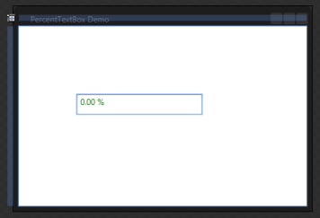
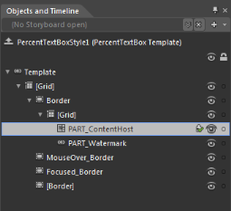
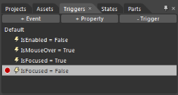

# Appearance 

## Setting VisualStyle for PercentTextBox

The appearance of the ParcentTextBox control can be customized by using the VisualStyle property. The following are the various built-in visual styles for PaercentTextBox control.

* Blend
* Office2003
* Office2007Blue
* Office2007Black
* Office2007Silver
* ShinyBlue
* ShinyRed
* SyncOrange
* VS2010
* Metro
* Transparent
## Blendability

You can edit the PercentTextBox Template to give a nice look and feel by using Expression Blend.

The steps to edit the PercentTextBox Template by using Expression Blend are as follows:

1. Create a simple WPF application in Expression Blend.
2. Drag and drop the PercentTextBox into the application from the Assets tab.

{  | markdownify }
{:.image }

3. After creating the PercentTextBox, select the PercentTextBox and navigate to Object -> Edit Style -> Edit a Copy, to edit the Template of the PercentTextBox.

{  | markdownify }
{:.image }

Another way to edit the Template is as follows:

4. In Object and Timeline, right-click the PercentTextBox control and select the Edit Template option, as displayed below.

{  | markdownify }
{:.image }

This will open a dialog (below) where you can give your style a name and define exactly where you’d like to store it.

{  | markdownify }
{:.image }

The result of these steps is an XAML, which is placed within your application. This XAML represents the default style for the PercentTextBox.

<syncfusion:PercentTextBox x:Name="percentTextBox" Height="25" Width="150" 

                            CornerRadius="2" Style="{StaticResource 

                            PercentTextBoxStyle1}"/>

All template items can now be found in the Objects and Timeline window.

{  | markdownify }
{:.image }

Now you can replace the existing Template setter and Triggers with your own creation. In the Triggers tab you can select the Trigger and customize it as you want.

{  | markdownify }
{:.image }

Here is a simple example to customize the UnFocused state of the PercentTextBox: 

&lt;Trigger Property="IsFocused" Value="False"&gt;

    &lt;Setter Property="Background" TargetName="Border" Value="LightGray"/&gt;

&lt;/Trigger&gt;

When the control loses its focus, the Background color is set to LightGray. Similarly, you can customize every state and property in Expression Blend.

{  | markdownify }
{:.image }

{  | markdownify }
{:.image }

