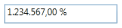

# Culture and Number Formats

## Culture

PercentTextBox provides globalization support through the Culture property. 

<table>
<tr>
<td>
XAML<syncfusion:PercentTextBox x:Name="percentTextBox" Height="25" Width="150"                          Culture="en-US" PercentValue="1234567"/></td></tr>
<tr>
<td>
C# PercentTextBox percentTextBox = new PercentTextBox();percentTextBox.Width = 150;percentTextBox.Height = 25;percentTextBox.PercentValue = 1234567;percentTextBox.Culture = new CultureInfo("en-US");</td></tr>
</table>

{  | markdownify }
{:.image }

<table>
<tr>
<td>
XAML<syncfusion:PercentTextBox x:Name="percentTextBox" Height="25" Width="150"                          Culture="bs-Latn" PercentValue="1234567"/></td></tr>
<tr>
<td>
C# PercentTextBox percentTextBox = new PercentTextBox();percentTextBox.Width = 150;percentTextBox.Height = 25;percentTextBox.PercentValue = 1234567;percentTextBox.Culture = new CultureInfo("bs-Latn");</td></tr>
</table>

{  | markdownify }
{:.image }

As you have seen in these samples whenever you change the Culture property the PercentValue is formatted based on the Culture.

## Number Format

You can customize the Number Format either by using the Number Format property or the PercentGroupSeparator, PercentGroupSizes, PercentDecimalDigits, PercentDecimalSeparator, PercentNegativePattern, PercentPositivePattern, and PercentageSymbol properties.

<table>
<tr>
<td>
XAML<syncfusion:PercentTextBox x:Name="percentTextBox" Height="25" Width="150"             PercentValue="1234567">    &lt;syncfusion:PercentTextBox.NumberFormat&gt;        <numberformat:NumberFormatInfo PercentGroupSeparator="/"        PercentDecimalDigits="4" PercentDecimalSeparator="*"         PercentSymbol="%"/>    &lt;/syncfusion:PercentTextBox.NumberFormat&gt;&lt;/syncfusion:PercentTextBox&gt;</td></tr>
<tr>
<td>
C# PercentTextBox percentTextBox = new PercentTextBox();percentTextBox.Width = 150;percentTextBox.Height = 25;percentTextBox.PercentValue = 1234567;percentTextBox.NumberFormat = new NumberFormatInfo(){    PercentGroupSeparator = "/",    PercentDecimalDigits = 4,    PercentDecimalSeparator = "*",    PercentSymbol = "%"};</td></tr>
</table>

<table>
<tr>
<td>
XAML<syncfusion:PercentTextBox x:Name="percentTextBox" Height="25" Width="150"                            PercentValue="1234567"                            PercentageSymbol="%" PercentDecimalDigits="4"                           PercentDecimalSeparator="*" PercentGroupSeparator="/"/></td></tr>
<tr>
<td>
C# PercentTextBox percentTextBox = new PercentTextBox();percentTextBox.Width = 150;percentTextBox.Height = 25;percentTextBox.PercentValue = 1234567;percentTextBox.PercentageSymbol = "%";percentTextBox.PercentDecimalDigits = 4;percentTextBox.PercentDecimalSeparator = "/";percentTextBox.PercentGroupSeparator = "*";</td></tr>
</table>

{  | markdownify }
{:.image }

### PercentPositivePattern

Gets or sets the format pattern for the positive percent values. In the table displayed below “%” denotes the Percent symbol and n denotes the number.

_PercentPositivePattern table_

<table>
<tr>
<td>
Value </td><td>
Associated Pattern </td></tr>
<tr>
<td>
0</td><td>
n %</td></tr>
<tr>
<td>
1</td><td>
n%</td></tr>
<tr>
<td>
2</td><td>
%n</td></tr>
<tr>
<td>
3</td><td>
% n</td></tr>
</table>

XAML

<syncfusion:PercentTextBox x:Name="percentTextBox" Height="25" Width="150" 

            PercentValue="1234" PercentPositivePattern="3"/>

{  | markdownify }
{:.image }

### PercentNegativePattern

Gets or sets the format pattern for the negative percent values. In the table displayed below “%” denotes the Percent symbol and n denotes the number.

_PercentNegativePattern table_

<table>
<tr>
<td>
Value </td><td>
Associated Pattern </td></tr>
<tr>
<td>
0</td><td>
-n %</td></tr>
<tr>
<td>
1</td><td>
-n%</td></tr>
<tr>
<td>
2</td><td>
-%n</td></tr>
<tr>
<td>
3</td><td>
%-n</td></tr>
<tr>
<td>
4</td><td>
%n-</td></tr>
<tr>
<td>
5</td><td>
n-%</td></tr>
<tr>
<td>
6</td><td>
n%-</td></tr>
<tr>
<td>
7</td><td>
-% n</td></tr>
<tr>
<td>
8</td><td>
n %-</td></tr>
<tr>
<td>
9</td><td>
% n-</td></tr>
<tr>
<td>
10</td><td>
% -n</td></tr>
<tr>
<td>
11</td><td>
n- %</td></tr>
</table>

XAML

<syncfusion:PercentTextBox x:Name="percentTextBox" Height="25" Width="150" 

            PercentValue="1234" PercentNegativePattern="7"/>

{  | markdownify }
{:.image }

