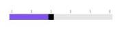

# Ticks 

You can place tick marks along the track in a uniform manner and you can also customize the position of tick marks can be customized. 

Tick Frequency 

The Tick Frequency property is used to define the number of ticks along the track, based on Minimum and Maximum values. 

[XAML]

&lt;editors:SfRangeSlider Width="200"  Minimum="0"  Maximum="100" TickFrequency="20" Value="40" /&gt;

{  | markdownify }
{:.image }

> _Note: When the SnapsTo property is set to Ticks, the TickFrequency is used to specify the interval between snap points._ 

Step Frequency  

When the SnapsTo property is set to StepValues, the StepFrequency property is used to specify the interval between snap points. 

[XAML]

&lt;editors:SfRangeSlider Width="200" VerticalAlignment="Center" Minimum="0"  Maximum="100" StepFrequency="20" Value="40"/&gt;

Snaps To 

The SnapsTo property determines whether the SfRangeSlider snaps to steps or ticks. Available options for this property are 

1. StepValues 
2. Ticks 

Default option is StepValues and StepFrequency property is used to specify the interval between snap points in this case. When the SnapsTo property is set to Ticks, the TickFrequency property is used to specify the interval between snap points.  

Tick Placement 

The TickPlacement property is used to determine where to draw tick marks in relation to the track. Available options for this property are 

1. BottomRight 
2. Inline 
3. None 
4. Outside 
5. TopLeft  

The default option is Inline.  

BottomRight  

Tick marks are placed either below the track in horizontal orientation or right of the track in vertical orientation. 

[XAML]

<editors:SfRangeSlider Width="200" Minimum="0"   Maximum="100"                                                      

TickFrequency="20" TickPlacement="BottomRight" Value="40"   />

{  | markdownify }
{:.image }

> _Note: In Vertical Orientation, this option places the ticks to right side._ 

TopLeft  

Tick marks are placed either above the track in horizontal orientation or left of the track in vertical orientation. 

[XAML]

&lt;editors:SfRangeSlider Width="200"  Minimum="0"   Maximum="100" TickFrequency="20" TickPlacement="TopLeft"  Value="40"   /&gt;

{  | markdownify }
{:.image }

> _Note: In Vertical Orientation, this option places the ticks to left side._ 

Outside 

Tick marks are placed on both sides of the track either in horizontal or vertical orientation.  

[XAML]

&lt;editors:SfRangeSlider Width="200" Minimum="0" Maximum="100" TickFrequency="20"  TickPlacement="Outside" Value="40"/&gt;

{  | markdownify }
{:.image }

Inline 

Ticks are placed inside the track.  

[XAML]

&lt;editors:SfRangeSlider Width="200" Minimum="0" Maximum="100" TickFrequency="20" TickPlacement="Inline" Value="40" /&gt;

{  | markdownify }
{:.image }

None 

No Tick mark appears.  

[XAML]

&lt;editors:SfRangeSlider Width="200" Minimum="0" Maximum="100" TickFrequency="20" TickPlacement="None" Value="40" /&gt;

{  | markdownify }
{:.image }

