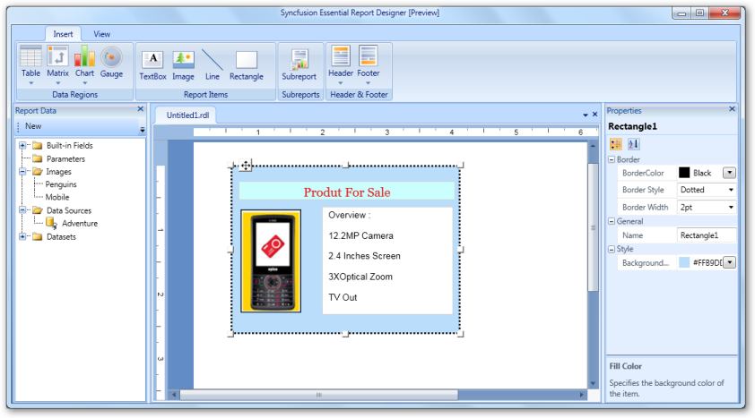

# Add a Rectangle to the Report Designer

To add a rectangle to the Syncfusion Report Designer, select Rectangle from the Insert tab and drag it to the Report Designer. A rectangle appears on the Report Designer.

{  | markdownify }
{:.image }

Applying Styles to the Rectangle

To apply styles to the rectangle:

1. Right click the added rectangle and click Rectangle Properties. It displays the Control Properties Dialog.

{  | markdownify }
{:.image }

2. Select Style to set the style, color, and width of the rectangle border.
3. To set the background color of the rectangle, select Fill.
4. Click OK.

> _Note: You can also apply styles to the rectangle through the Properties grid. To open this grid, click the added rectangle._

The following illustration shows the rectangle styled by the properties grid.

{  | markdownify }
{:.image }

Adding Report Items to the Rectangle

To add report items such as text boxes, lines, and images, to the rectangle, drag the selected report items to the rectangle.

{  | markdownify }
{:.image }

