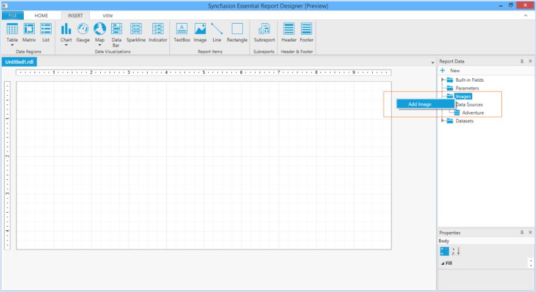
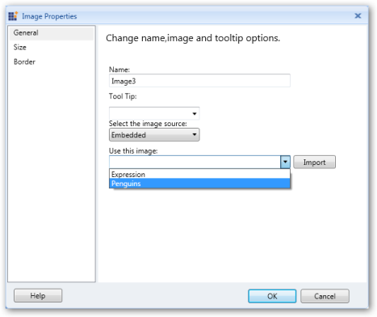
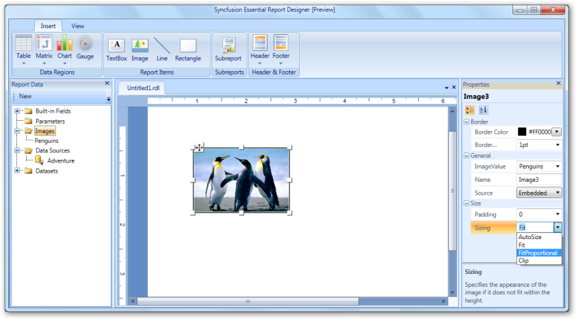

# Add an Image to the Report Designer

You can add an image to the Syncfusion Essential Report Designer by using the following steps.

1. In Report Data, right click the Images, and then click Add image.

{  | markdownify }
{:.image }

> _Note: You can also insert an image by dragging the image from the Report Data to the Report Designer._

> __

2. To change properties of the added image, right click the image and select the Image Properties.

{  | markdownify }
{:.image }

3. In the ImageProperties dialog, select an image you want to add in the Report Designer from the Use this image drop-down ComboBox, and then click Import.

{  | markdownify }
{:.image }

> _Note: You can also use the following properties to apply the desired settings to the image:_

* _General - To set the ToolTip of the image or image source, select an embedded image and import an image from the local disk._
* _Size - To set the size and padding of the image._
* _Border - To set the border color and border width of the image._

4. Click OK to update the image with the selected values.

{  | markdownify }
{:.image }

Setting Image Properties by using the Properties Grid

1. Click the image. The Properties grid appears at the right of Report Designer. 
2. Apply the required settings to the image by using the Editors in the Properties grid.

{  | markdownify }
{:.image }

Deleting Image

To delete the image from the Report Designer, right click the image and click Delete.

{  | markdownify }
{:.image }

