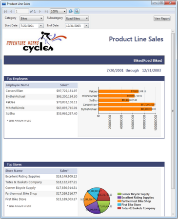

# Load SSRS Reports in Report Viewer

You can also show SSRS reports in the Report Viewer by using the following steps.

1. To load SSRS reports from SQL Reporting Server, initialize Report Viewer control and set the ReportPath and SQL ReportingService URL.

// ReportViewer control initialization.

Syncfusion.Windows.Reports.Viewer.ReportViewer reportViewer1 = new Syncfusion.Windows.Reports.Viewer.ReportViewer();

// SQL ReportingService url.

reportViewer1.ReportServerUrl = @"http://&lt;&lt;SERVER NAME&gt;>/ReportServer";

// SQL ReportingService hosted Reportpath.

reportViewer1.ReportPath=@"/MSFT Reports/Product Line Sales";

// Set ReportServer credential to access ReportingServer.

reportViewer1.ReportServerCredential = new System.Net.NetworkCredential("username","passowrd","domain");            

// Add ReportViewer in MainWindow grid

this.grid1.Children.Add(reportViewer1);

this.Loaded += (sender, arg) =>

{

  // To Render the Report in ReportViewer.

   reportViewer1.RefreshReport();

};

2. Run the application. The following output displays.

{  | markdownify }
{:.image }

