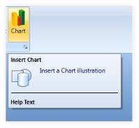

# Run-time Features

This section illustrates the following run-time feature of Ribbon control. 

## Setting the ToolTip for the Split Button of the Ribbon Instance

Ribbon instance now provides support to set the ToolTip for the Split Button. It provides the following ToolTip options.

* Setting the ToolTip for the Entire Split Button
* Setting the ToolTip for the Upper and Lower Half of the Split Button

Setting the ToolTip for the Entire Split Button

You can set the tooltip for the entire Split Button by using the ToolTip property of the Split Button. Use the following code for setting the tooltip feature.

<table>
<tr>
<td>
[XAML]&lt;syncfusion:SplitButton Label="Paste" SizeForm="Large" &gt;&lt;syncfusion:SplitButton.ToolTip&gt;&lt;syncfusion:ScreenTip Description="Split Button Tooltip" VerticalOffset="32"&gt;&lt;TextBlock Text="I am a Tool Tip" /&gt;&lt;/syncfusion:ScreenTip&gt;&lt;/syncfusion:SplitButton.ToolTip&gt;&lt;/syncfusion:SplitButton&gt;</td></tr>
<tr>
<td>
[C#]ScreenTip screentip = new ScreenTip();TextBlock text = new TextBlock();text.Text = "I am a Tool Tip";screentip.Content = text;splitbutton.ToolTip = screentip; splitbutton = new SplitButton();splitbutton.Label = "Split 1";SplitButton splitbutton 1= new SplitButton();splitbutton1.Label = "Split 2";</td></tr>
</table>

{  | markdownify }
{:.image }

Setting the ToolTip for the Upper and Lower Half of the Split Button

You can set the tooltip for the upper and lower half of the Split Button.

The ToolTip property is used to set the tooltip for the upper half of the Split Button, while the ToggleButtonToolTip property is used to set the tooltip for the drop-down in the lower half of the split button. Here is the code snippet for setting these properties.

<table>
<tr>
<td>
[XAML]&lt;syncfusion:SplitButton Label="Paste" SizeForm="Large" &gt;&lt;syncfusion:SplitButton.ToolTip&gt;&lt;syncfusion:ScreenTip Description="Split Button Tooltip" VerticalOffset="32"&gt;&lt;TextBlock Text="Top Tool Tip" /&gt;&lt;/syncfusion:ScreenTip&gt;&lt;/syncfusion:SplitButton.ToolTip&gt;&lt;syncfusion:SplitButton.ToggleButtonToolTip&gt;&lt;syncfusion:ScreenTip Description="Toggle Button Tooltip" VerticalOffset="29"&gt;&lt;TextBlock Text="Bottom Tool Tip" /&gt;&lt;/syncfusion:ScreenTip&gt;&lt;/syncfusion:SplitButton.ToggleButtonToolTip&gt;&lt;/syncfusion:SplitButton&gt;</td></tr>
<tr>
<td>
[C#]ScreenTip screentip = new ScreenTip();TextBlock text = new TextBlock();text.Text = "Top Tool Tip";screentip.Content = text;// Setting the tooltip for the upper half of the split button.splitbutton.ToolTip = screentip;ScreenTip screentip1 = new ScreenTip();TextBlock text1 = new TextBlock();text1.Text = "Bottom Tool Tip";screentip1.Content = text;// Setting the tooltip for the drop-down in the lower half of the split button.splitbutton.ToggleButtonToolTip = screentip1; screentip = new ScreenTip();TextBlock text = new TextBlock();text.Text = "I am a Tool Tip";screentip.Content = text;splitbutton.ToolTip = screentip; splitbutton = new SplitButton();splitbutton.Label = "Split 1";SplitButton splitbutton 1= new SplitButton();splitbutton1.Label = "Split 2";</td></tr>
</table>

{  | markdownify }
{:.image }

{  | markdownify }
{:.image }

## Options for Inserting Help Text in ScreenTip

Essential Tool WPF is enhanced with HelpText option. Users can add help text in ScreenTip. A line separator separates the Screen tip information from help text. 

> _Note: When no HelpText is set the HelpText area and line separator get automatically hidden._ 

Inserting Help Text in ScreenTip

Insert HelpText in ScreenTip, by using the following code.

<table>
<tr>
<td>
[Xaml] &lt;syncfusion:ScreenTip Name="screenTip" HelpText="Help Text" Description="Insert Chart" ImageSource="{StaticResource Shapes}"&gt;    &lt;TextBlock Width="150" TextWrapping="Wrap" Text="Insert a Chart illustration" /&gt;&lt;/syncfusion:ScreenTip&gt;</td></tr>
<tr>
<td colspan = "2">
[C#]screenTip.HelpText = "Display Help Text";</td></tr>
</table>

{  | markdownify }
{:.image }

