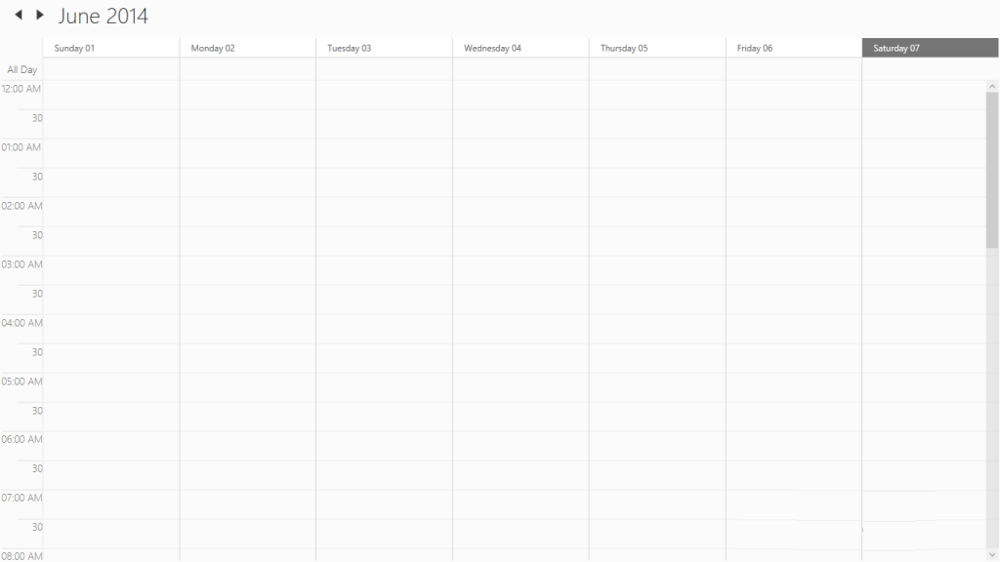

# CurrentTimeIndicator Template Customization

CurrentTimeIndicatorVisibility :

The visibility of current time indicator enabled by using the CurrentTimeIndicatorVisibility property of SfSchedule Control.

[XAML]

  &lt;Grid Background="White" Name="grid"&gt;

     &lt;Schedule:SfSchedule ScheduleType="Week"   CurrentTimeIndicatorVisibility="Visible"&gt;     

        &lt;/Schedule:SfSchedule&gt;

    &lt;/Grid&gt;

[C#]

            SfSchedule schedule = new SfSchedule();

            schedule.ScheduleType = ScheduleType.Week;

            schedule.CurrentTimeIndicatorVisibility = Visibility.Visible;

            this.grid.Children.Add(schedule);

{  | markdownify }
{:.image }

{  | markdownify }
{:.image }

CurrentTimeIndicatorTemplate:

The CurrentTimeIndicator can be customized by using the__CurrentTimeIndicatorTemplate of SfScheduleControl.

[XAML]

      &lt;Grid Background="White" Name="grid"&gt;

        &lt;Schedule:SfSchedule x:Name="schedule" ScheduleType="Week" CurrentTimeIndicatorVisibility="Visible"&gt;

            &lt;Schedule:SfSchedule.CurrentTimeIndicatorTemplate&gt;

                &lt;DataTemplate&gt;

                    &lt;Border Background="DarkGreen" Height="10" Width="100"&gt;&lt;/Border&gt;

                &lt;/DataTemplate&gt;

            &lt;/Schedule:SfSchedule.CurrentTimeIndicatorTemplate&gt;

        &lt;/Schedule:SfSchedule&gt;        

    &lt;/Grid&gt;

[C#]

            SfSchedule schedule = new SfSchedule();

            schedule.ScheduleType = ScheduleType.Week;

            schedule.CurrentTimeIndicatorVisibility = Visibility.Visible;

            schedule.CurrentTimeIndicatorTemplate = (DataTemplate)this.Resources["CurrentTimeIndicatorTemplate"];

            this.grid.Children.Add(schedule);

{  | markdownify }
{:.image }

