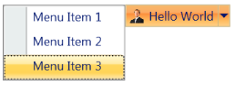

# Drop Direction

The DropDown Direction can be changed by using the DropDirection property. The Enum takes the following values:

* Left
* Right
* BottomLeft
* BottomRight
* TopLeft
* TopRight

The default value is BottomLeft.

The DropDirection property can be set as follows:

To set BottomLeft DropDirection

[XAML]

&lt;sync:SplitButtonAdv  DropDirection="BottomLeft"/&gt;

{  | markdownify }
{:.image }

To set BottomRight Drop Direction

[XAML]

&lt;sync:SplitButtonAdv  DropDirection="BottomRight"/&gt;

{  | markdownify }
{:.image }

To set Right Drop Direction

[XAML]

&lt;sync:SplitButtonAdv  DropDirection="Right"/&gt;

{  | markdownify }
{:.image }

To set Left Drop Direction

[XAML]

&lt;sync:SplitButtonAdv  DropDirection="Left"/&gt;

{  | markdownify }
{:.image }

