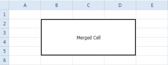
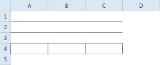

# Appearance

## Fonts

You can customize the font setting of Spreadsheet cells using this feature. You can apply various font family, font color and font size.

Font Settings in Spreadsheet Control

Spreadsheet control provides API support for specifying the font style for the cells text. You can apply various font settings using the _CellStyle_ property. Use the _CurrentExcelRangeStyle_ property, to apply style for the current selected cells. You can also specify the worksheet range for applying style. The following code illustrates this:

<table>
<tr>
<td>
[C#]//Applying font settings to a worksheet rangespreadControl.ExcelProperties.WorkBook.Worksheets[0]["A1"].CellStyle.Font.FontName = " Arial Black";spreadControl.ExcelProperties.WorkBook.Worksheets[0]["A2"].CellStyle.Font.Size = 15;spreadControl.ExcelProperties.WorkBook.Worksheets[0]["A3"].CellStyle.Font.Color = ExcelKnownColors.Blue;spreadControl.ExcelProperties.WorkBook.Worksheets[0]["A4"].CellStyle.Font.Bold = true;spreadControl.ExcelProperties.WorkBook.Worksheets[0]["A5"].CellStyle.Font.Italic = true;//Applying font setting to the selected cell spreadControl.ExcelProperties.CurrentExcelRangeStyle.CellStyle.Font.FontName = "Arial Black";spreadControl.ExcelProperties.CurrentExcelRangeStyle.CellStyle.Font.Size = 18;spreadControl.ExcelProperties.CurrentExcelRangeStyle.CellStyle.Font.Color = ExcelKnownColors.Red;spreadControl.ExcelProperties.CurrentExcelRangeStyle.CellStyle.Font.Bold = true;spreadControl.ExcelProperties.CurrentExcelRangeStyle.CellStyle.Font.Italic = true;</td></tr>
<tr>
<td>
[VB]' Applying font settings to a worksheet range spreadControl.ExcelProperties.WorkBook.Worksheets(0)("A1").CellStyle.Font.FontName = " Arial Black"spreadControl.ExcelProperties.WorkBook.Worksheets(0)("A2").CellStyle.Font.Size = 15spreadControl.ExcelProperties.WorkBook.Worksheets(0)("A3").CellStyle.Font.Color = ExcelKnownColors.BluespreadControl.ExcelProperties.WorkBook.Worksheets(0)("A4").CellStyle.Font.Bold = TruespreadControl.ExcelProperties.WorkBook.Worksheets(0)("A5").CellStyle.Font.Italic = True' Applying font setting to the selected cell spreadControl.ExcelProperties.CurrentExcelRangeStyle.CellStyle.Font.FontName = "Arial Black"spreadControl.ExcelProperties.CurrentExcelRangeStyle.CellStyle.Font.Size = 18spreadControl.ExcelProperties.CurrentExcelRangeStyle.CellStyle.Font.Color = ExcelKnownColors.RedspreadControl.ExcelProperties.CurrentExcelRangeStyle.CellStyle.Font.Bold = TruespreadControl.ExcelProperties.CurrentExcelRangeStyle.CellStyle.Font.Italic = True</td></tr>
</table>

{  | markdownify }
{:.image }

Using Command 

You can set the font family to the spreadsheet cells using the _FontFamilyCommand_. To set the font family, specify the font name as command parameter. The following code illustrates this:

[XAML]

&lt;Button Command="{Binding Path= FontFamilyCommand}" CommandParameter =" Arial Black"&gt;

&lt;/Button&gt;

## Merge cells

Spreadsheet control provides support to merge two or more cells. When a group of cells is merged, the contents of the upper-left cell will be taken as the content of the merged cell, rest will be deleted.

You can merge/unmerge the group of cell using the MergeCommand. To merge the cell, pass the command parameter as MergeAndCenter. To unmerge the cells pass the command parameter as UnMerge_._

The following code illustrates how to merge the selected cells in Spreadsheet:

[XAML]

&lt;Button Command="{Binding Path= MergeCommand}" CommandParameter ="MergeAndCenter"&gt;

&lt;/Button&gt;

The following code illustrates how to unmerge the selected cells in Spreadsheet:

[XAML]

&lt;Button Command="{Binding Path= MergeCommand}" CommandParameter =" UnMerge"&gt;

&lt;/Button&gt;

{  | markdownify }
{:.image }

## Borders

This feature enables you to add or remove cell borders as required.

To add border to an individual cell use the BorderCommand. You can also specify the border type through the command parameter.

The following code illustrates, how to add and remove the cell border in Spreadsheet Control

[XAML]

&lt;!--To draw the Bottom Border--&gt;

&lt;Button Command="{Binding Path= BorderCommand}" CommandParameter ="BottomBorder"&gt;

&lt;/Button&gt;

&lt;!--To draw the Top Border--&gt;

&lt;Button Command="{Binding Path= BorderCommand}" CommandParameter ="TopBorder"&gt;

&lt;/Button&gt;

&lt;!--To draw all Border--&gt;

&lt;Button Command="{Binding Path= BorderCommand}" CommandParameter ="AllBorder"&gt;

&lt;/Button&gt;

{  | markdownify }
{:.image }

## Freeze Panes

This feature enables you to freeze rows or columns of the spreadsheet, while scrolling.  Freezing the   header row or column makes it easier to read the data in the spreadsheet.

To apply the freeze panes, use the FreezePaneCommand. You can pass one of the following command parameter.

* FreezePanes—To freeze the particular row and column
* FreezeTopRow—To freeze top row only
* FreezeFirstColumn—To freeze the first column only

The following code illustrates this:

[XAML]

&lt;Button Command="{Binding Path= FreezePaneCommand}" Grid.Row="2"&gt;

&lt;Button.CommandParameter&gt;                                                        <Syncfusion:Freeze>FreezePanes</Syncfusion:Freeze>

&lt;/Button.CommandParameter&gt;

&lt;/Button&gt;

{  | markdownify }
{:.image }

## Wrap Text Support

### Overview

You can manually wrap text and resize cells when the text or cell value exceeds the column width, by calling the SetWrapText method or WrapTextCommand in Spreadsheet control.

### Use Case Scenario

Users can wrap text for a selected range of cells by just calling a method.

{  | markdownify }
{:.image }

### Properties, Methods and Events 

Methods

<table>
<tr>
<th>
Method </th><th>
Description </th><th>
Parameters </th><th>
Type </th><th>
Return Type </th></tr>
<tr>
<th>
SetWrapText()</th><th>
This Method is called to set wrapText on selected cells.This method is called when we manually invoke the method or when we call wrapText command.This method changes the float cell to WrapText cell and calls the method AutoSizeToFit().</th><th>
Overloads: nil </th><th>
Nil</th><th>
void</th></tr>
</table>

