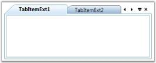

# Setting Tab Scroll Button

Tab Scroll button visibility is controlled by using the TabScrollButtonVisibility property of the TabControlExt control. This is a dependency property which provides the following options to control the visibility of the Scroll button.

* Hidden–Scroll button is hidden
* Visible–Scroll button is displayed
* Auto–Scroll button is displayed automatically, if needed

Here is the code snippet to set the Tab Scroll Button Visibility as "Visible".

[XAML]

&lt;!-- Adding TabcontrolExt --&gt;

&lt;syncfusion:TabControlExt Name="tabControlExt" TabScrollButtonVisibility="Visible"&gt;

    &lt;!-- Adding TabItemExt --&gt;

    &lt;syncfusion:TabItemExt Name="tabItemExt1" Header="TabItemExt1"&gt;

    &lt;/syncfusion:TabItemExt&gt;

    &lt;!-- Adding TabItemExt --&gt;

    &lt;syncfusion:TabItemExt Name="tabItemExt2" Header="TabItemExt2" &gt;

    &lt;/syncfusion:TabItemExt&gt;

&lt;/syncfusion:TabControlExt&gt;

[C#]

// Creating instance of the TabControlExt control

TabControlExt tabControlExt = new TabControlExt();

//Creating the instance of StackPanel

StackPanel stackPanel = new StackPanel();

//Creating instance of the TabItemExt 

TabItemExt tabItemExt1 = new TabItemExt();

// Setting header of the TabItemExt

tabItemExt1.Header = "TabItemExt1";

//Adding TabItemExt to TabControlExt

tabControlExt.Items.Add(tabItemExt1);            

// Changing the Visibility of Scroll button 

tabControlExt.TabScrollButtonVisibility = TabScrollButtonVisibility.Visible;

//Adding control to the StackPanel

stackPanel.Children.Add(tabControlExt);

{  | markdownify }
{:.image }

See Also

Tab Scroll Style, Tab Scrolling Time

