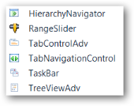
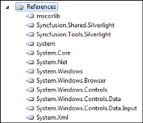
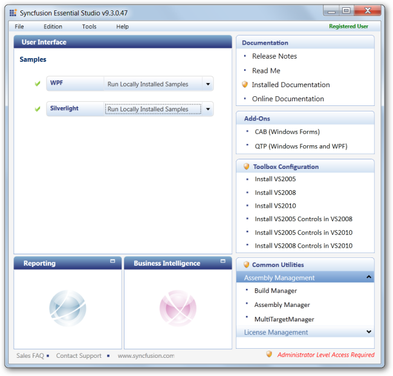
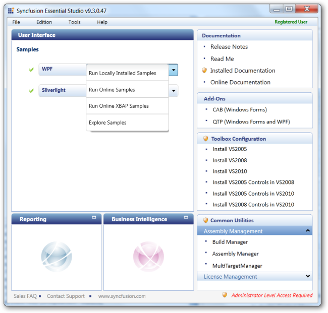

# Getting Started

## Appearance and Structure of the Control

{  | markdownify }
{:.image }

> _Note: Support for Skins is provided only in Silverlight and not in WPF._

## Adding Tab Navigation Control to an Application 

To add Tab navigation control to a Visual Studio.NET project:

1. Open a VS2010 project. The Syncfusion controls are listed in the toolbox.

{  | markdownify }
{:.image }

2. Click and drag the Tab Navigation control from the toolbox and drop it in the designer.

{  | markdownify }
{:.image }

3. Syncfusion.Tools.WPF and Syncfusion.Shared.WPF assemblies will be added automatically to the application reference.

{  | markdownify }
{:.image }

4. Press F4 or open the properties window to customize the control by setting the required properties.

{  | markdownify }
{:.image }

5. Add Items to the control manually or through Items Source property.
6. Press F5 to run the application.

{  | markdownify }
{:.image }

To enable transition effects, items should be added to the control. The following sections explain the methods through which you can add items.

## Properties, Methods, and Events Tables 

### Properties

Tab Navigation Control

_Property table_

<table>
<tr>
<th>
Properties</th><th>
Description</th><th>
Type Of Property</th><th>
Acceptable Value</th></tr>
<tr>
<td>
HeaderVisibility</td><td>
Gets or sets a value, which represents the visibility of the Header.</td><td>
Visibility</td><td>
Visible/Collapsed</td></tr>
<tr>
<td>
NavigationButtonVisibility</td><td>
Gets or sets a value, which represents the visibility of the Navigation Buttons.</td><td>
Visibility</td><td>
Visible/Collapsed</td></tr>
<tr>
<td>
TabStripButtonVisibility</td><td>
Gets or sets a value, which represents the visibility of the Tab Strip Buttons.</td><td>
Visibility</td><td>
Visible/Collapsed</td></tr>
<tr>
<td>
TransitionEffect</td><td>
Gets or sets a value indicating the Transition effect of the control.</td><td>
TransitionEffects (Enum)</td><td>
* Slide* Blur* Fade* Wipe* Push* PushIn* Zoom</td></tr>
</table>

Tab Navigation Item

_Property Table_

<table>
<tr>
<td>
Properties</td><td>
Description</td><td>
Type Of Property</td><td>
Acceptable Value</td></tr>
<tr>
<td>
Header</td><td>
Gets or sets a value, which represents the header of Tab Navigation Item.</td><td>
Object</td><td>
-</td></tr>
<tr>
<td>
Content</td><td>
Gets or sets a value, which represents the content of the Tab Navigation Item.</td><td>
Object</td><td>
-</td></tr>
</table>

### Events

_Event Table_

<table>
<tr>
<td>
Name</td><td>
Description</td></tr>
<tr>
<td>
SelectionChanging</td><td>
Occurs whenever the selected item is changing</td></tr>
<tr>
<td>
SelectionChanged</td><td>
Occurs whenever the selected item is changed</td></tr>
</table>

## Samples Link

To view samples:

1. Click Start-->All Programs-->Syncfusion-->Essential Studio &lt;version number&gt; -->Dashboard.
2. The Essential Studio Enterprise Edition window is displayed. 

{  | markdownify }
{:.image }

The User Interface edition panel is displayed by default. 

1. Select WPF from the samples listed. The following options will be displayed. You can view the samples in the following three ways:
1. Run Locally Installed Samples-View the locally installed Tools samples for  WPF using the sample browser
2. Run Online Samples-View the online samples for  WPF
3. Run Online XBAP Samples – View the online XBAP samples  for WPF
4. Explore Samples-Locate the  WPF samples on the disk

{  | markdownify }
{:.image }

2. Click Run Locally Installed Samples. The WPF Sample Browser displays.

{  | markdownify }
{:.image }

3. On the left pane, go to Tab Navigation ->Tab Navigation Demo.
