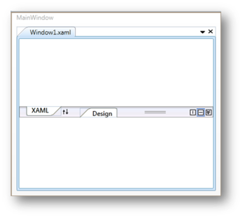

# Selected Page

You can set the selected page by using the IsSelectedPage property. If this property is set to _true_, the page is selected, else it is not selected.

[XAML]

 &lt;!-- Adding TabSplitter --&gt;

&lt;syncfusion:TabSplitter Name="tabsplitter"&gt;

    &lt;!-- Adding TabSplitterItem --&gt;

&lt;syncfusion:TabSplitterItem Header="Window1.xaml"  Name="tabSplitterItem1"&gt;

        &lt;!-- Adding TopPanelItems --&gt;

        &lt;syncfusion:TabSplitterItem.TopPanelItems&gt; 

            &lt;!-- Adding SplitterPage --&gt;

&lt;syncfusion:SplitterPage IsSelectedPage="True" Name="splitterPage1" Header="XAML"&gt;

            &lt;/syncfusion:SplitterPage&gt;

        &lt;/syncfusion:TabSplitterItem.TopPanelItems&gt;

        &lt;!-- Adding BottomPanelItems --&gt;

        &lt;syncfusion:TabSplitterItem.BottomPanelItems&gt; 

            &lt;!-- Adding SplitterPage --&gt;

            &lt;syncfusion:SplitterPage Name="splitterPage2" Header="Design"&gt;

            &lt;/syncfusion:SplitterPage&gt;

        &lt;/syncfusion:TabSplitterItem.BottomPanelItems&gt;

    &lt;/syncfusion:TabSplitterItem&gt;

&lt;/syncfusion:TabSplitter&gt;

 [C#]

// Enable the IsSelectedPage property.

splitterPage1.IsSelectedPage = true;

{  | markdownify }
{:.image }

