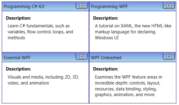
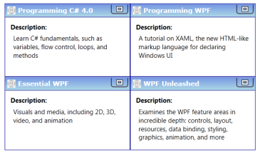

# Customizing Data Templates

Data template can be customized for items and headers of the control. This section illustrates how to customize the data templates.

## Item Template 

You can customize how a business object is displayed as Tileview using the _ItemTemplate_ of _TileViewControl_. The following code example shows the usage of _ItemTemplate_.

[XAML]

   &lt;syncfusion:TileViewControl ItemsSource="{Binding Source={StaticResource xmlSource}, XPath=Book}"   &gt;

            &lt;syncfusion:TileViewControl.ItemContainerStyle&gt;

                &lt;Style TargetType="syncfusion:TileViewItem"&gt;

                    &lt;Setter Property="Header" Value="{Binding XPath=@Name}"/&gt;

                &lt;/Style&gt;

            &lt;/syncfusion:TileViewControl.ItemContainerStyle&gt;

            &lt;syncfusion:TileViewControl.ItemTemplate&gt;

                &lt;DataTemplate&gt;

                    &lt;Grid Margin="10"&gt;

                        &lt;Grid.RowDefinitions&gt;

                            &lt;RowDefinition Height="Auto"/&gt;

                            &lt;RowDefinition Height="Auto"/&gt;

                        &lt;/Grid.RowDefinitions&gt;

                        &lt;TextBlock Text="Description: " FontWeight="Bold"/&gt;

                        &lt;TextBlock Text="{Binding XPath=@Description}" TextWrapping="Wrap" Margin="5,5,0,0" Grid.Row="1"/&gt;

                    &lt;/Grid&gt;

                &lt;/DataTemplate&gt;

            &lt;/syncfusion:TileViewControl.ItemTemplate&gt;

        &lt;/syncfusion:TileViewControl&gt;

Implementing the above code will generate the following TileViewControl.

{  | markdownify }
{:.image }

## Item Template Selector

Using _ItemTemplateSelector_ feature, you can use different templates for the items depending on specific constraints. The following example illustrates this.

1. Create a template selector in the code.

[C#]

public class TileViewItemTemplateSelector : DataTemplateSelector

    {

        public override DataTemplate SelectTemplate(object item, DependencyObject container)

        {

            Window window = Application.Current.MainWindow;

            string bookname = (item as System.Xml.XmlElement).GetAttribute("Name").ToString().ToLower();

            if (bookname.Contains("wpf"))

            {

                return ((DataTemplate)window.Resources["WpfBookTemplate"]);

            }

            else 

            {

                return ((DataTemplate)window.Resources["CsBookTemplate"]);

            }

        }

    }

1. Define data templates in the Window’s resources.

[XAML]

&lt;DataTemplate x:Key="CsBookTemplate"&gt;

            &lt;Grid Margin="10"&gt;

                &lt;Grid.RowDefinitions&gt;

                    &lt;RowDefinition Height="Auto"/&gt;

                    &lt;RowDefinition Height="Auto"/&gt;

                &lt;/Grid.RowDefinitions&gt;

                &lt;TextBlock Text="Description: " FontWeight="Bold"/&gt;

                &lt;TextBlock Text="{Binding XPath=@Description}" TextWrapping="Wrap" FontFamily="Courier New" Foreground="Green" Margin="5,5,0,0" Grid.Row="1"/&gt;

            &lt;/Grid&gt;

        &lt;/DataTemplate&gt;

        &lt;DataTemplate x:Key="WpfBookTemplate"&gt;

            &lt;Grid Margin="10"&gt;

                &lt;Grid.RowDefinitions&gt;

                    &lt;RowDefinition Height="Auto"/&gt;

                    &lt;RowDefinition Height="Auto"/&gt;

                &lt;/Grid.RowDefinitions&gt;

                &lt;TextBlock Text="Description: " FontWeight="Bold"/&gt;

                &lt;TextBlock Text="{Binding XPath=@Description}" FontFamily="Verdana" TextWrapping="Wrap" Margin="5,5,0,0" Foreground="Blue" Grid.Row="1"/&gt;

            &lt;/Grid&gt;

        &lt;/DataTemplate&gt;

2.  Create the instance for the template selector in the Window’s resources.

[XAML]

&lt;local:TileViewItemTemplateSelector x:Key="tileViewItemTemplateSelector"/&gt;

3. Use this template selector to choose a template for the TileViewControl.

[XAML]

&lt;syncfusion:TileViewControl ItemTemplateSelector="{StaticResource tileViewItemTemplateSelector}" ItemsSource="{Binding Source={StaticResource xmlSource}, XPath=Book}"  Margin="20" &gt;

            &lt;syncfusion:TileViewControl.ItemContainerStyle&gt;

                &lt;Style TargetType="syncfusion:TileViewItem"&gt;

                    &lt;Setter Property="Header" Value="{Binding XPath=@Name}"/&gt;

                &lt;/Style&gt;

            &lt;/syncfusion:TileViewControl.ItemContainerStyle&gt;

        &lt;/syncfusion:TileViewControl&gt;

This will generate the TileViewControl as follows.

{  | markdownify }
{:.image }

## Header Template

You can customize the header of the TileViewItem using the _HeaderTemplate_. The following code example explains this.

1. Define _DataTemplate_ for _HeaderTemplate_.

[XAML]

&lt;DataTemplate x:Key="headerTemplate"&gt;

            &lt;Grid &gt;

                &lt;Grid.ColumnDefinitions&gt;

                    &lt;ColumnDefinition Width="Auto"/&gt;

                    &lt;ColumnDefinition Width="Auto"/&gt;

                &lt;/Grid.ColumnDefinitions&gt;

                &lt;Image Source="bookicon.png" Stretch="Fill" Width="15" Height="15" Margin="0,0,5,0"/&gt;

                &lt;TextBlock Text="{Binding XPath=@Name}" Grid.Column="1" FontFamily="Verdana" FontWeight="Bold" Foreground="White"/&gt;

            &lt;/Grid&gt;

        &lt;/DataTemplate&gt;

2. Set the _HeaderTemplate_ for the _TileViewControl_ to the above template.

[XAML]

&lt;syncfusion:TileViewControl  HeaderTemplate="{StaticResource headerTemplate}" ItemTemplate="{StaticResource itemTemplate}" ItemsSource="{Binding Source={StaticResource xmlSource}, XPath=Book}"   &gt;

        &lt;/syncfusion:TileViewControl&gt;

This will generate the following TileViewControl.

{  | markdownify }
{:.image }

