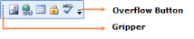

# Getting Started

## Adding ToolBarAdv to a WPF Application

Follow the below steps to add ToolBarAdv Control to WPF Application:

1. Create a new WPF project.
2. ToolBarAdv Control will be listed in the Tool Box.

{  | markdownify }
{:.image }

3. Drag and drop the control to the designer.

> _Note: Following XAML code will be automatically added in the XAML Viewer. You can also manually add this code instead of dragging the control from ToolBox._

[XAML]

&lt;syncfusion:ToolBarAdv Height="100" HorizontalAlignment="Left" Margin="92,90,0,0" Name="toolBarAdv1" VerticalAlignment="Top" Width="200" /&gt;

4. ToolBarAdv Control is added.
## Appearance and Structure of the Control

{  | markdownify }
{:.image }

* The Overflow Button is the ToggleButton, when you click this OverflowPanel will be displayed.
* The Gripper is used to drag the ToolBarAdv to change its Band.,You can float and dock the ToolBarAdv by clicking the gripper and dragging the ToolBarAdv, When the ToolBarAdv is hosted in ToolBarManager. 

## Properties

_Properties of ToolBarAdv_

<table>
<tr>
<td>
Property </td><td>
Description </td><td>
Type </td><td>
Data Type </td><td>
Reference links </td></tr>
<tr>
<td>
Band</td><td>
Gets or sets a value indicating where the ToolBarAdv should be placed in the ToolBarTrayAdv. </td><td>
Dependency Property</td><td>
Int</td><td>
NA</td></tr>
<tr>
<td>
BandIndex</td><td>
Gets or sets the band index number indicating the position of the ToolBarAdv on the band. </td><td>
Dependency Property</td><td>
Int</td><td>
NA</td></tr>
<tr>
<td>
ToolBarName</td><td>
Gets or sets the name of the ToolBarAdv.</td><td>
Dependency Property</td><td>
String</td><td>
NA</td></tr>
<tr>
<td>
GripperVisibility</td><td>
Gets or sets a value indicating whether gripper can be visible. </td><td>
Dependency Property</td><td>
Bool</td><td>
NA</td></tr>
<tr>
<td>
FloatingBarLocation</td><td>
Gets or sets the location for the floating ToolBarAdv.</td><td>
Dependency Property</td><td>
Point</td><td>
NA</td></tr>
<tr>
<td>
ControlsResourceDictionary</td><td>
Gets or sets resource dictionary in which ToolBarAdv will look up for framework element’s styles. </td><td>
Dependency Property</td><td>
Resource Dictionary</td><td>
NA</td></tr>
<tr>
<td>
IsOverflowOpen</td><td>
Gets or sets a value indicating whether overflow popup is open.</td><td>
Dependency Property</td><td>
Bool</td><td>
NA</td></tr>
<tr>
<td>
ToolBarItemInfoCollection</td><td>
Gets or sets the items to be displayed in the Add or Remove Buttons popup.</td><td>
Dependency Property</td><td>
ObservableCollection<ToolBarIteminfo></td><td>
NA</td></tr>
<tr>
<td>
IsoverflowItem</td><td>
Gets or sets a value indicating whether an item can be displayed in overflow panel.</td><td>
Attached Property</td><td>
Bool</td><td>
NA</td></tr>
<tr>
<td>
OverflowMode</td><td>
Gets or sets an overflow mode for a specified item. </td><td>
Attached Property</td><td>
OverflowMode</td><td>
NA</td></tr>
<tr>
<td>
Icon</td><td>
Gets or sets an icon for specified item to be displayed in the Add or Remove Buttons menu. </td><td>
Attached Property</td><td>
ImageSource</td><td>
NA</td></tr>
<tr>
<td>
Label</td><td>
Gets or sets a label for specified item to be displayed in the Add or Remove Buttons menu.</td><td>
Attached Property</td><td>
String</td><td>
NA</td></tr>
<tr>
<td>
IsAvailable</td><td>
Gets or sets a value indicating whether a specified item should be hidden.</td><td>
Attached Property</td><td>
 Boolean </td><td>
NA </td></tr>
</table>

_ToolBarTrayAdv_

<table>
<tr>
<td>
Property </td><td>
Description </td><td>
Type </td><td>
Data Type </td><td>
Reference links </td></tr>
<tr>
<td>
IsLocked</td><td>
Gets or Sets a value indicating whether ToolBarTrayAdv is locked.</td><td>
Dependency property      </td><td>
bool</td><td>
NA</td></tr>
<tr>
<td>
Orientation</td><td>
Gets or Sets the orientation of the ToolBarAdv.</td><td>
Dependency property      </td><td>
Orientation</td><td>
NA</td></tr>
<tr>
<td>
ToolBars</td><td>
Gets or sets toolbars.</td><td>
Dependency property      </td><td>
ObservableCollection<ToolBarAdv></td><td>
NA</td></tr>
</table>

_ToolBarManager_

<table>
<tr>
<td>
Property</td><td>
Description</td><td>
Type</td><td>
Data Type</td><td>
Reference links</td></tr>
<tr>
<td>
TopToolBarTray</td><td>
Gets or sets ToolBarTrayAdv which has to be displayed at the Top of ToolBarManager. </td><td>
Dependency Property</td><td>
ToolBarTrayAdv </td><td>
NA</td></tr>
<tr>
<td>
BottomToolBarTray</td><td>
Gets or sets ToolBarTrayAdv which has to be displayed at the bottom of ToolBarManager.</td><td>
Dependency Property</td><td>
ToolBarTrayAdv </td><td>
NA</td></tr>
<tr>
<td>
LeftToolBarTray</td><td>
Gets or sets ToolBarTrayAdv which has to be displayed at the left of ToolBarManager.</td><td>
Dependency Property</td><td>
ToolBarTrayAdv </td><td>
NA</td></tr>
<tr>
<td>
RightToolBarTray</td><td>
Gets or sets ToolBarTrayAdv which has to be displayed at the right of ToolBarManager.</td><td>
Dependency Property </td><td>
ToolBarTrayAdv </td><td>
NA</td></tr>
<tr>
<td>
CanDockAtTop</td><td>
Gets or sets a value indicating whether toolbar can be docked at the top.</td><td>
Dependency Property</td><td>
bool</td><td>
NA</td></tr>
<tr>
<td>
CanDockAtBottom</td><td>
Gets or sets a value indicating whether toolbar can be docked at the bottom.</td><td>
Dependency Property</td><td>
bool</td><td>
NA</td></tr>
<tr>
<td>
CanDockAtLeft</td><td>
Gets or sets a value indicating whether toolbar can be docked at the left.</td><td>
Dependency Property</td><td>
bool</td><td>
NA</td></tr>
<tr>
<td>
CanDockAtRight</td><td>
Gets or sets a value indicating whether toolbar can be docked at the right.</td><td>
Dependency Property</td><td>
bool</td><td>
NA</td></tr>
<tr>
<td>
Content</td><td>
Gets or sets the content of the ToolBarManager.</td><td>
Dependency Property</td><td>
UIElement</td><td>
NA</td></tr>
<tr>
<td>
FloatingToolBarStyle</td><td>
Gets or sets a style of floating tool bar</td><td>
Dependency Property</td><td>
Style</td><td>
NA</td></tr>
<tr>
<td>
ToolBarState</td><td>
Gets or sets the state of the toolbar. </td><td>
Attached Property</td><td>
ToolBarState</td><td>
NA</td></tr>
</table>

