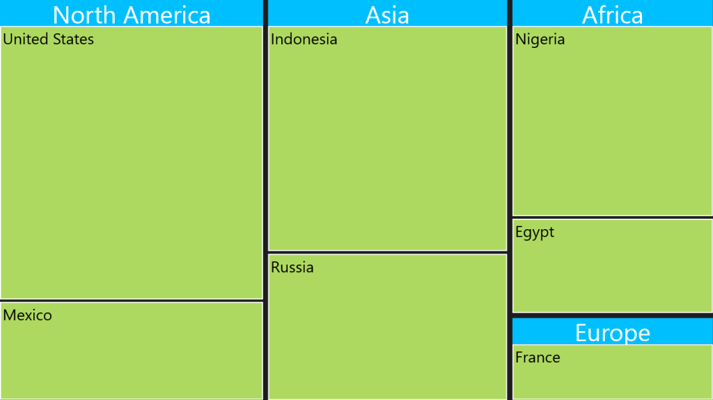
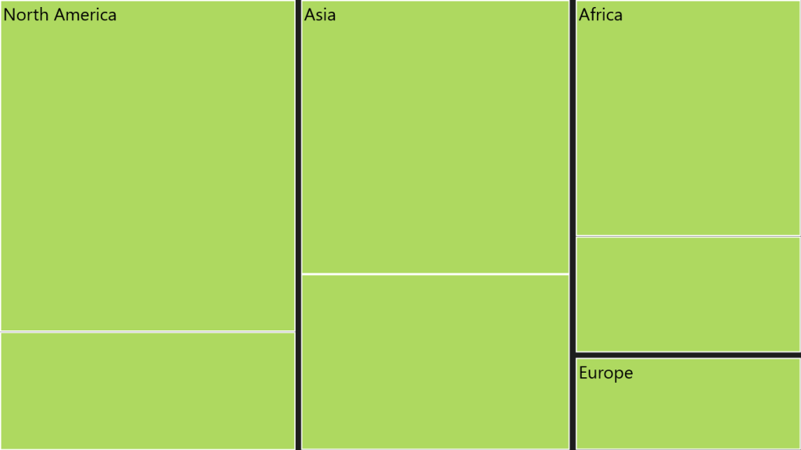

# Headers and Labels

## Headers

To show headers in TreeMap, you can set the HeaderHeight property of TreeMapLevel. For customizing default Header appearance, you can specify the HeaderTemplate.

TreeMap with Flat Collection:

If HeaderTemplate is specified for TreeMapLevel, then the header can be bound by referring Header object to the datatemplate.

[XAML]

&lt;Grid Background="Black"&gt;

    &lt;Grid.DataContext&gt;

        &lt;local:PopulationViewModel/&gt;

    &lt;/Grid.DataContext&gt;

    <syncfusion:SfTreeMap ItemsSource="{Binding PopulationDetails}" 

                        WeightValuePath="Population" ColorValuePath="Growth">

        &lt;syncfusion:SfTreeMap.Levels&gt;

            &lt;syncfusion:TreeMapFlatLevel GroupPath="Continent" GroupGap="10" HeaderHeight="50"/&gt;

            &lt;syncfusion:TreeMapFlatLevel GroupPath="Country" GroupGap="5"/&gt;

        &lt;/syncfusion:SfTreeMap.Levels&gt;

    &lt;/syncfusion:SfTreeMap&gt;

&lt;/Grid&gt;

{  | markdownify }
{:.image }

TreeMap with Hierarchical Collection:

For TreeMap with Hierarchical Collection, HeaderPath must be specified. The header can be bound by referring Data.&lt;FieldName&gt; to the datatemplate where FieldName refers to the field of object specified in the particular treemap level.

[XAML]

&lt;Grid Background="Black"&gt;

    &lt;Grid.Resources&gt;

        &lt;local:CountrySalesCollection x:Key="countrySalesCollection"/&gt;

    &lt;/Grid.Resources&gt;

    &lt;syncfusion:SfTreeMap ItemsSource="{Binding Source={StaticResource countrySalesCollection}}" WeightValuePath="Sales" ColorValuePath="Expense"&gt;

        &lt;syncfusion:SfTreeMap.Levels&gt;

            &lt;syncfusion:TreeMapHierarchicalLevel ChildPath="RegionalSalesCollection" ChildGap="10" HeaderHeight="25" HeaderPath="Name"&gt;

            &lt;/syncfusion:TreeMapHierarchicalLevel&gt;

        &lt;/syncfusion:SfTreeMap.Levels&gt;

    &lt;/syncfusion:SfTreeMap&gt;

&lt;/Grid&gt;

## Labels

To show labels in TreeMap, ShowLabels of TreeMapLevel should be enabled to True. For customizing default label appearance, you can specify LabelTemplate.

TreeMap with Flat Collection:

If LabelTemplate is specified for TreeMapLevel, then the label can be bound by referring Label object to the datatemplate.

[XAML]

&lt;Grid Background="Black"&gt;

    &lt;Grid.DataContext&gt;

        &lt;local:PopulationViewModel/&gt;

    &lt;/Grid.DataContext&gt;

    <syncfusion:SfTreeMap ItemsSource="{Binding PopulationDetails}"

                          WeightValuePath="Population" 

                          ColorValuePath="Growth">

        &lt;syncfusion:SfTreeMap.Levels&gt;

            &lt;syncfusion:TreeMapFlatLevel GroupPath="Continent" GroupGap="10" ShowLabels="True"/&gt;

        &lt;/syncfusion:SfTreeMap.Levels&gt;

    &lt;/syncfusion:SfTreeMap&gt;

&lt;/Grid&gt;

{  | markdownify }
{:.image }

TreeMap with Hierarchical Collection:

For TreeMap with Hierarchical Collection, LabelPath must be specified. The label can be bound by referring Data. &lt;FieldName&gt; to the datatemplate where FieldName refers to the field of object specified in the particular treemap level.

[XAML]

&lt;Grid Background="Black"&gt;

    &lt;Grid.Resources&gt;

        &lt;local:CountrySalesCollection x:Key="countrySalesCollection"/&gt;

    &lt;/Grid.Resources&gt;

    <syncfusion:SfTreeMap ItemsSource="{Binding Source={StaticResource countrySalesCollection}}"

                      WeightValuePath="Sales" ColorValuePath="Expense">

        &lt;syncfusion:SfTreeMap.Levels&gt;

            &lt;syncfusion:TreeMapHierarchicalLevel ChildPath="RegionalSalesCollection" ChildGap="10" ShowLabels="True" LabelPath="Name"&gt;

            &lt;/syncfusion:TreeMapHierarchicalLevel&gt;

        &lt;/syncfusion:SfTreeMap.Levels&gt;

    &lt;/syncfusion:SfTreeMap&gt;

&lt;/Grid&gt;

