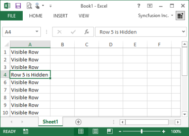
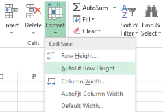

# Worksheet Rows and Columns Manipulation

Essential XlsIO provides rows and columns manipulation equivalent to MS Excel such as insertion, deletion, hiding, adjusting dimensions, grouping, etc. The following sections illustrate in detail on this.

## Insert Rows and Columns 

XlsIO has support for dynamically inserting rows and columns into a new/existing worksheet. Inserting rows/columns allows the other rows/columns to move down/right by one step and accommodate the new rows/columns. The following code example illustrates inserting rows/columns.

[C#]

// Step 1: Instantiates the spreadsheet creation engine.

ExcelEngine excelEngine = new ExcelEngine();

// Step 2: Instantiates the excel application object.

IApplication application = excelEngine.Excel;

// A new workbook is created. [Equivalent to creating a new workbook in MS Excel).

// The new workbook will have 2 worksheets.

IWorkbook workbook = application.Workbooks.Create(2);

IWorksheet sheet = workbook.Worksheets[0];

// Inserts Rows.

sheet.InsertRow(3);

// Inserts Columns.

sheet.InsertColumn(2);

string fileName = "Output.xlsx";

workbook.Version = ExcelVersion.Excel2010;

workbook.SaveAs(fileName);

// Closes the workbook.

workbook.Close();

excelEngine.Dispose();

[VB.NET]

' Step 1: Instantiates the spreadsheet creation engine.

Dim excelEngine As ExcelEngine = New ExcelEngine

' Step 2: Instantiates the excel application object.

Dim application As IApplication = excelEngine.Excel

' A new workbook is created. [Equivalent to creating a new workbook in MS Excel].

'The new workbook will have 2 worksheets.

Dim workbook As IWorkbook = application.Workbooks.Create(2)

' Accesses via index.

Dim sheet As IWorkbook = workbook.Worksheets(0)

' Inserts Rows.

sheet.InsertRow(3)

' Inserts Columns.

sheet.InsertColumn(2)

Dim fileName As String = "Output.xlsx"

workbook.Version = ExcelVersion.Excel2010

workbook.SaveAs(fileName)

' Closes the workbook.

workbook.Close()

excelEngine.Dispose()

XlsIO also allows you to insert multiple rows and columns. The following code example illustrates this.

[C#]

// Step 1: Instantiates the spreadsheet creation engine.

ExcelEngine excelEngine = new ExcelEngine();

// Step 2: Instantiates the excel application object.

IApplication application = excelEngine.Excel;

// A new workbook is created. [Equivalent to creating a new workbook in MS Excel).

// The new workbook will have 2 worksheets.

IWorkbook workbook = application.Workbooks.Create(2);

IWorksheet sheet = workbook.Worksheets[0];

// Inserts multiple columns.

sheet.InsertColumn(colIndex,colCount);

' Inserts multiple rows.

sheet.InsertRow(rowIndex,rowCount);

string fileName = "Output.xlsx";

workbook.Version = ExcelVersion.Excel2010;

workbook.SaveAs(fileName);

// Closes the workbook.

workbook.Close();

excelEngine.Dispose();

[VB.NET]

' Step 1: Instantiates the spreadsheet creation engine.

Dim excelEngine As ExcelEngine = New ExcelEngine

' Step 2: Instantiates the excel application object.

Dim application As IApplication = excelEngine.Excel

' A new workbook is created. [Equivalent to creating a new workbook in MS Excel].

'The new workbook will have 2 worksheets.

Dim workbook As IWorkbook = application.Workbooks.Create(2)

' Accesses via index.

Dim sheet As IWorkbook = workbook.Worksheets(0)

' Inserts multiple columns.

sheet.InsertColumn(colIndex,colCount)

' Inserts multiple rows.

sheet.InsertRow(rowIndex,rowCount)

Dim fileName As String = "Output.xlsx"

workbook.Version = ExcelVersion.Excel2010

workbook.SaveAs(fileName)

' Closes the workbook.

workbook.Close()

excelEngine.Dispose()

You can also preserve the previous or next row/column formats by using XlsIO. The following code example illustrates this.

[C#]

// Step 1: Instantiates the spreadsheet creation engine.

ExcelEngine excelEngine = new ExcelEngine();

// Step 2: Instantiates the excel application object.

IApplication application = excelEngine.Excel;

// A new workbook is created. [Equivalent to creating a new workbook in MS Excel).

// The new workbook will have 2 worksheets.

IWorkbook workbook = application.Workbooks.Create(2);

IWorksheet sheet = workbook.Worksheets[0];

sheet.InsertRow(rowIndex, count, ExcelInsertOptions.FormatAsBefore);

string fileName = "Output.xlsx";

workbook.Version = ExcelVersion.Excel2010;

workbook.SaveAs(fileName);

// Closes the workbook.

workbook.Close();

excelEngine.Dispose();

[VB.NET]

' Step 1: Instantiates the spreadsheet creation engine.

Dim excelEngine As ExcelEngine = New ExcelEngine

' Step 2: Instantiates the excel application object.

Dim application As IApplication = excelEngine.Excel

' A new workbook is created. [Equivalent to creating a new workbook in MS Excel].

'The new workbook will have 2 worksheets.

Dim workbook As IWorkbook = application.Workbooks.Create(2)

' Accesses via index.

Dim sheet As IWorkbook = workbook.Worksheets(0)

sheet.InsertRow(rowIndex, count, ExcelInsertOptions.FormatAsBefore)

Dim fileName As String = "Output.xlsx"

workbook.Version = ExcelVersion.Excel2010

workbook.SaveAs(fileName)

'Closes the workbook.

workbook.Close()

excelEngine.Dispose()

> _Note: Here, row and column index of Insert methods are "one based"_

_Options provided by the ExcelInsertOptions enumerator_

<table>
<tr>
<td>
Members </td><td>
Description</td></tr>
<tr>
<td>
FormatAsBefore</td><td>
Indicates that after insert operation, inserted rows/columns must be formatted as row above or column left. </td></tr>
<tr>
<td>
FormatAsAfter</td><td>
Indicates that after insert operation, inserted rows/columns must be formatted as row below or column right. </td></tr>
<tr>
<td>
FormatDefault</td><td>
Indicates that after insert operation, inserted rows/columns must have default format. </td></tr>
</table>
## Delete Rows and Columns 

It is often necessary to delete unwanted cells, rows, and columns in a spreadsheet when you want to manipulate cells. MS Excel provides various options to delete cells, rows, and columns. You can delete cells by right-clicking on it, and selecting the Delete option from the context menu. On selecting the Delete option, the Delete dialog box prompts for an option to be selected as shown in the following screenshot.

To delete cells in XlsIO, you can make use of the Clear method. The following code example demonstrates this.

[C#]

// Step 1: Instantiates the spreadsheet creation engine.

ExcelEngine excelEngine = new ExcelEngine();

// Step 2: Instantiates the excel application object.

IApplication application = excelEngine.Excel;

// A new workbook is created. [Equivalent to creating a new workbook in MS Excel).

// The new workbook will have 2 worksheets.

IWorkbook workbook = application.Workbooks.Create(2);

IWorksheet sheet = workbook.Worksheets[0];

// Shifts cell left after deletion.

sheet.Range["A1:E1"].Clear(ExcelMoveDirection.MoveLeft);

// Shifts cell up after deletion.

sheet.Range["A1:A6"].Clear(ExcelMoveDirection.MoveUp);

string fileName = "Output.xlsx";

workbook.Version = ExcelVersion.Excel2010;

workbook.SaveAs(fileName);

// Closes the workbook.

workbook.Close();

excelEngine.Dispose();

[VB.NET]

' Step 1: Instantiates the spreadsheet creation engine.

Dim excelEngine As ExcelEngine = New ExcelEngine

' Step 2: Instantiates the excel application object.

Dim application As IApplication = excelEngine.Excel

' A new workbook is created. [Equivalent to creating a new workbook in MS Excel].

'The new workbook will have 2 worksheets.

Dim workbook As IWorkbook = application.Workbooks.Create(2)

' Accesses via index.

Dim sheet As IWorkbook = workbook.Worksheets(0)

' Shifts cell left after deletion.

sheet.Range("A1:E1").Clear(ExcelMoveDirection.MoveLeft)

' Shifts cell up after deletion.

sheet.Range("A1:A6").Clear(ExcelMoveDirection.MoveUp)

Dim fileName As String = "Output.xlsx"

workbook.Version = ExcelVersion.Excel2010

workbook.SaveAs(fileName)

' Closes the workbook.

workbook.Close()

excelEngine.Dispose()

Delete Rows and Columns

MS Excel allows you to delete rows and columns in a spreadsheet by selecting and deleting the rows through the context menu that appears on right-clicking.

{  | markdownify }
{:.image }

_Context menu on right-clicking the cell_

Deleting a row moves the following rows one step up and deleting a column moves the columns to the right one step to the left, respectively.

XlsIO allows deleting rows and columns by using the IWorksheet.DeleteRow and IWorksheet.DeleteColumn methods. The following code example illustrates how to delete rows and columns.

[C#]

// Step 1: Instantiates the spreadsheet creation engine.

ExcelEngine excelEngine = new ExcelEngine();

// Step 2: Instantiates the excel application object.

IApplication application = excelEngine.Excel;

// A new workbook is created. [Equivalent to creating a new workbook in MS Excel).

// The new workbook will have 2 worksheets.

IWorkbook workbook = application.Workbooks.Create(2);

IWorksheet sheet = workbook.Worksheets[0];

// Deletes Row.

sheet.DeleteRow(3);

// Deletes Column.

sheet.DeleteColumn(2);

string fileName = "Output.xlsx";

workbook.Version = ExcelVersion.Excel2010;

workbook.SaveAs(fileName);

// Closes the workbook.

workbook.Close();

excelEngine.Dispose();

[VB.NET]

' Step 1: Instantiates the spreadsheet creation engine.

Dim excelEngine As ExcelEngine = New ExcelEngine

' Step 2: Instantiates the excel application object.

Dim application As IApplication = excelEngine.Excel

' A new workbook is created. [Equivalent to creating a new workbook in MS Excel].

'The new workbook will have 2 worksheets.

Dim workbook As IWorkbook = application.Workbooks.Create(2)

' Accesses via index.

Dim sheet As IWorkbook = workbook.Worksheets(0)

' Deletes Rows.

sheet.DeleteRow(3)

' Deletes Columns.

sheet.DeleteColumn(2)

Dim fileName As String = "Output.xlsx"

workbook.Version = ExcelVersion.Excel2010

workbook.SaveAs(fileName)

' Closes the workbook.

workbook.Close()

excelEngine.Dispose()

You can also delete multiple rows as follows.

[C#]

// Step 1: Instantiates the spreadsheet creation engine.

ExcelEngine excelEngine = new ExcelEngine();

// Step 2: Instantiates the excel application object.

IApplication application = excelEngine.Excel;

// A new workbook is created. [Equivalent to creating a new workbook in MS Excel).

// The new workbook will have 2 worksheets.

IWorkbook workbook = application.Workbooks.Create(2);

IWorksheet sheet=workbook.Worksheets[0];

// Deletes Rows.

sheet.DeleteRow(startRow, NoOfRows);

// Deletes Columns.

sheet.DeleteColumn(startColumn, NoOfColumn);

string fileName = "Output.xlsx";

workbook.Version = ExcelVersion.Excel2010;

workbook.SaveAs(fileName);

// Closes the workbook.

workbook.Close();

excelEngine.Dispose();

[VB.NET]

' Step 1: Instantiates the spreadsheet creation engine.

Dim excelEngine As ExcelEngine = New ExcelEngine

' Step 2: Instantiates the excel application object.

Dim application As IApplication = excelEngine.Excel

' A new workbook is created. [Equivalent to creating a new workbook in MS Excel].

'The new workbook will have 2 worksheets.

Dim workbook As IWorkbook = application.Workbooks.Create(2)

'Accesses via index.

Dim sheet As IWorkbook = workbook.Worksheets(0)

'Deletes Rows.

sheet.DeleteRow(startRow, NoOfRows)

'Deletes Columns.

sheet.DeleteColumn(startColumn, NoOfColumn)

Dim fileName As String = "Output.xlsx"

workbook.Version = ExcelVersion.Excel2010

workbook.SaveAs(fileName)

'Closes the workbook.

workbook.Close()

excelEngine.Dispose()

_Note:_

* _Deletion by using the above method is more efficient than looping._
* _Row/Column index of these methods are "one based"._
## Show or Hide Rows and Columns 

Excel allows you to hide a row/column by using the Hide command, but a row or column also becomes hidden when you change its row height or column width to zero. You can also show a hidden row/column by using the Unhide command.

{  | markdownify }
{:.image }

_Hiding a row_

Hiding and Unhiding Rows in XlsIO

XlsIO provides support to hide/unhide rows and columns. This can be done by using ShowRow and ShowColumn methods.

[C#]

// Step 1: Instantiates the spreadsheet creation engine.

ExcelEngine excelEngine = new ExcelEngine();

// Step 2: Instantiates the excel application object.

IApplication application = excelEngine.Excel;

// A new workbook is created. [Equivalent to creating a new workbook in MS Excel).

// The new workbook will have 2 worksheets.

IWorkbook workbook = application.Workbooks.Create(2);

IWorksheet sheet = workbook.Worksheets[0];

// Hides the First Column and Second Row.

sheet.ShowColumn( 1, false );

sheet.ShowRow( 2, false );

// Hides the Fifth Column and Fifth Row.

sheet.ShowColumn( 5, false );

sheet.ShowRow( 5, false );

// Unhides the Fifth Column and Second Row.

sheet.ShowColumn( 5, true );

sheet.ShowRow( 2, true );

string fileName = "Output.xlsx";

workbook.Version = ExcelVersion.Excel2010;

workbook.SaveAs(fileName);

// Closes the workbook.

workbook.Close();

excelEngine.Dispose();

[VB.NET]

' Step 1: Instantiates the spreadsheet creation engine.

Dim excelEngine As ExcelEngine = New ExcelEngine

' Step 2: Instantiates the excel application object.

Dim application As IApplication = excelEngine.Excel

' A new workbook is created. [Equivalent to creating a new workbook in MS Excel].

'The new workbook will have 2 worksheets.

Dim workbook As IWorkbook = application.Workbooks.Create(2)

' Accesses via index.

Dim sheet As IWorkbook = workbook.Worksheets(0)

' Hides the First Column and Second Row.

sheet.ShowColumn(1, False)

sheet.ShowRow(2, False)

' Hides the Fifth Column and Fifth Row.

sheet.ShowColumn(5, False)

sheet.ShowRow(5, False)

' Unhides the Fifth Column and Second Row.

sheet.ShowColumn(5, True)

sheet.ShowRow(2, True)

Dim fileName As String = "Output.xlsx"

workbook.Version = ExcelVersion.Excel2010

workbook.SaveAs(fileName)

' Closes the workbook.

workbook.Close()

excelEngine.Dispose()

{  | markdownify }
{:.image }

_Worksheet with a hidden row_

XlsIO also provides options to focus a particular row/column when it is opened by using the TopVisibleRow and LeftVisibleColumn properties, respectively.

[C#]

// Step 1: Instantiates the spreadsheet creation engine.

ExcelEngine excelEngine = new ExcelEngine();

// Step 2: Instantiates the excel application object.

IApplication application = excelEngine.Excel;

// A new workbook is created. [Equivalent to creating a new workbook in MS Excel).

// The new workbook will have 2 worksheets.

IWorkbook workbook = application.Workbooks.Create(2);

IWorksheet sheet = workbook.Worksheets[0];

//Scrolls to the 40th row.

sheet.TopVisibleRow = 40;

//Scrolls to the 7th column when opening.

sheet.LeftVisibleColumn = 7;  

string fileName = "Output.xlsx";

workbook.Version = ExcelVersion.Excel2010;

workbook.SaveAs(fileName);

// Closes the workbook.

workbook.Close();

excelEngine.Dispose();

[VB.NET]

' Step 1: Instantiates the spreadsheet creation engine.

Dim excelEngine As ExcelEngine = New ExcelEngine

' Step 2: Instantiates the excel application object.

Dim application As IApplication = excelEngine.Excel

' A new workbook is created. [Equivalent to creating a new workbook in MS Excel].

'The new workbook will have 2 worksheets.

Dim workbook As IWorkbook = application.Workbooks.Create(2)

'Accesses via index.

Dim sheet As IWorkbook = workbook.Worksheets(0)

'Scrolls to the 40th row.

sheet.TopVisibleRow = 40

'Scrolls to the 7th column when opening.

sheet.LeftVisibleColumn = 7

Dim fileName As String = "Output.xlsx"

workbook.Version = ExcelVersion.Excel2010

workbook.SaveAs(fileName)

'Closes the workbook.

workbook.Close()

excelEngine.Dispose()

This is especially useful when the spreadsheet has large number of records and you want to view a particular row/column that has some details without scrolling to that row/column after opening it. Note that these row and column indexes are one based.

## Show or Hide Particular Range

XlsIO provides support to hide/unhide rows and columns. This can be done by using ShowRow, ShowColumn, and ShowRange methods as shown in the following code example.

[C#]

// Step 1: Instantiates the spreadsheet creation engine.

ExcelEngine excelEngine = new ExcelEngine();

// Step 2: Instantiates the excel application object.

IApplication application = excelEngine.Excel;

// A new workbook is created. [Equivalent to creating a new workbook in MS Excel).

// The new workbook will have 2 worksheets.

IWorkbook workbook = application.Workbooks.Create(2);

IWorksheet sheet = workbook.Worksheets[0];

 IRange range = sheet[1, 4];

//Hides the first to third row and first to third column.
sheet.ShowRange(range, false);

IRange firstRange = sheet [1, 1,3,3];
IRange secondRange = sheet [5, 5, 7, 7];
RangesCollection rangeCollection = new RangesCollection(application, sheet);
rangCollection.Add(firstRange);
rangeCollection.Add(secondRange);

// Hides the collection of ranges.
sheet.ShowRange(rangeCollection, false);

string fileName = "Output.xlsx";

workbook.Version = ExcelVersion.Excel2010;

workbook.SaveAs(fileName);

// Closes the workbook.

workbook.Close();

excelEngine.Dispose();

[VB.NET]

' Step 1: Instantiates the spreadsheet creation engine.

Dim excelEngine As ExcelEngine = New ExcelEngine

' Step 2: Instantiates the excel application object.

Dim application As IApplication = excelEngine.Excel

' A new workbook is created. [Equivalent to creating a new workbook in MS Excel].

'The new workbook will have 2 worksheets.

Dim workbook As IWorkbook = application.Workbooks.Create(2)

'Accesses via index.

Dim sheet As IWorkbook = workbook.Worksheets(0)

Dim range As IRange = sheet(1, 4)

'Hides the first to third row and first to third column.

sheet.ShowRange(range, False)

Dim firstRange As IRange = sheet (1, 1, 3, 3)

Dim secondRange As IRange = sheet (5, 5, 7, 7)

Dim rangeCollection As RangesCollection = New RangesCollection(app, sheet)

rangCollection.Add(firstRange)

rangeCollection.Add(secondRange)

'Hides the collection of ranges.

sheet.ShowRange(rangeCollection, False)

Dim fileName As String = "Output.xlsx"

workbook.Version = ExcelVersion.Excel2010

workbook.SaveAs(fileName)

'Closes the workbook.

workbook.Close()

excelEngine.Dispose()

Methods

_Show or Hide Particular Range_

<table>
<tr>
<td>
Prototype</td><td>
Description</td></tr>
<tr>
<td>
ShowRange (IRange, bool) </td><td>
Shows or hides a particular range.</td></tr>
<tr>
<td>
ShowRange(IRange[], bool)</td><td>
Shows or hides a particular array of ranges.</td></tr>
<tr>
<td>
ShowRange( RasngesCollection, bool)</td><td>
Shows or hides a particular collection of ranges.</td></tr>
</table>
## Adjust Row Height and Column Width 

MS Excel allows you to set the row height and column width by using the Format menu option. Go to the Format menu, click Row/Column and then click Height/Width option.

{  | markdownify }
{:.image }
{  | markdownify }
{:.image }

_Row Height and Column Width dialog boxes in Excel_

Specifying Row Height and Column Width in XlsIO

XlsIO allows you to specify a column width of 0 to 255 in a spreadsheet. This value represents the number of characters that can be displayed in a cell that is formatted with the standard font. The default column width is 8.43 characters that is the default value of MS Excel. If a column has a width of 0, the column is hidden. Similarly, you can specify a row height of 0 to 409. Note that this is the restriction of MS Excel. This value represents the height measurement in points (1 point equals approximately 1/72 inch or 0.035 cm). The default row height is 12.75 points. If a row has a height of 0, the row is hidden.

XlsIO provides support for setting the RowHeight and ColumnWidth properties in a worksheet. You can also set the column width and row height in pixels by using the IWorksheet.SetColumnWidthInPixel and IWorksheet.SetRowHeightInPixel methods, respectively.

[C#]

// Step 1: Instantiates the spreadsheet creation engine.

ExcelEngine excelEngine = new ExcelEngine();

// Step 2: Instantiates the excel application object.

IApplication application = excelEngine.Excel;

// A new workbook is created. [Equivalent to creating a new workbook in MS Excel).

// The new workbook will have 2 worksheets.

IWorkbook workbook = application.Workbooks.Create(2);

IWorksheet sheet = workbook.Worksheets[0];

// Changes the Column Width.

sheet.Range["A1"].ColumnWidth = 20;

sheet.Range["B1"].ColumnWidth = 30;

sheet.Range["C1"].ColumnWidth = 40;

sheet.Range["D1"].ColumnWidth = 50;

// Changes the Row Height.

sheet.Range["A2"].RowHeight = 20;

sheet.Range["A4"].RowHeight = 35;

sheet.Range["A5"].RowHeight = 50;

sheet.Range["A7"].RowHeight = 60;  

string fileName = "Output.xlsx";

workbook.Version = ExcelVersion.Excel2010;

workbook.SaveAs(fileName);

// Closes the workbook.

workbook.Close();

excelEngine.Dispose();

[VB.NET]

' Step 1: Instantiates the spreadsheet creation engine.

Dim excelEngine As ExcelEngine = New ExcelEngine

' Step 2: Instantiates the excel application object.

Dim application As IApplication = excelEngine.Excel

' A new workbook is created. [Equivalent to creating a new workbook in MS Excel].

'The new workbook will have 2 worksheets.

Dim workbook As IWorkbook = application.Workbooks.Create(2)

'Accesses via index.

Dim sheet As IWorkbook = workbook.Worksheets(0)

'Changes the Column Width.

sheet.Range("A1").ColumnWidth = 20

sheet.Range("B1").ColumnWidth = 30

sheet.Range("C1").ColumnWidth = 40

sheet.Range("D1").ColumnWidth = 50

'Changes the Row Height.

sheet.Range("A2").RowHeight = 20

sheet.Range("A4").RowHeight = 35

sheet.Range("A5").RowHeight = 50

sheet.Range("A7").RowHeight = 60 

Dim fileName As String = "Output.xlsx"

workbook.Version = ExcelVersion.Excel2010

workbook.SaveAs(fileName)

'Closes the workbook.

workbook.Close()

excelEngine.Dispose()

## Autofit Rows and Columns

AutoFit is the option in MS Excel that can be enabled or disabled through the Format menu. AutoFit is the name given to the automatic width (or height) adjustment to fit the contents of a cell, row, or column.

{  | markdownify }
{:.image }

_AutoFit in Excel_

XlsIO also provides support to AutoFit the contents in a worksheet. You can AutoFit a range of cells, a single column/row, or AutoFit within the given range.

This section demonstrates various AutoFit techniques supported by XlsIO.

1. AutoFit Single Row/Column

XlsIO allows you to resize the cells in a column or row based on the row/column index given. The following code example illustrates autofitting a single row/column.

[C#]

// Step 1: Instantiates the spreadsheet creation engine.

ExcelEngine excelEngine = new ExcelEngine();

// Step 2: Instantiates the excel application object.

IApplication application = excelEngine.Excel;

// A new workbook is created. [Equivalent to creating a new workbook in MS Excel).

// The new workbook will have 2 worksheets.

IWorkbook workbook = application.Workbooks.Create(2);

IWorksheet sheet = workbook.Worksheets[0];

sheet.Range["E1"].Text = "This is the Long Text";

// AutoFit applied to a Single Column.

sheet.AutofitColumn(5);

// AutoFit applied to a Single Row.

sheet.AutofitRow(1); 

string fileName = "Output.xlsx";

workbook.Version = ExcelVersion.Excel2010;

workbook.SaveAs(fileName);

// Closes the workbook.

workbook.Close();

excelEngine.Dispose();

[VB.NET]

' Step 1: Instantiates the spreadsheet creation engine.

Dim excelEngine As ExcelEngine = New ExcelEngine

' Step 2: Instantiates the excel application object.

Dim application As IApplication = excelEngine.Excel

' A new workbook is created. [Equivalent to creating a new workbook in MS Excel].

'The new workbook will have 2 worksheets.

Dim workbook As IWorkbook = application.Workbooks.Create(2)

'Accesses via index.

Dim sheet As IWorkbook = workbook.Worksheets(0)

sheet.Range("E1").Text = "This is the Long Text"

'AutoFit applied to a Single Column.

sheet.AutofitColumn(5)

'AutoFit applied to a Single Row.

sheet.AutofitRow(1) 

Dim fileName As String = "Output.xlsx"

workbook.Version = ExcelVersion.Excel2010

workbook.SaveAs(fileName)

'Closes the workbook.

workbook.Close()

excelEngine.Dispose()

> _Note: These indexes are "one based"._

> 

> 

You can also AutoFit single row/column as follows.

[C#]

// Step 1: Instantiates the spreadsheet creation engine.

ExcelEngine excelEngine = new ExcelEngine();

// Step 2: Instantiates the excel application object.

IApplication application = excelEngine.Excel;

// A new workbook is created. [Equivalent to creating a new workbook in MS Excel).

// The new workbook will have 2 worksheets.

IWorkbook workbook = application.Workbooks.Create(2);

IWorksheet sheet = workbook.Worksheets[0];

sheet.Rows[0].AutofitRows();

sheet.Columns[0].AutofitColumns();

string fileName = "Output.xlsx";

workbook.Version = ExcelVersion.Excel2010;

workbook.SaveAs(fileName);

// Closes the workbook.

workbook.Close();

excelEngine.Dispose();

[VB.NET]

' Step 1: Instantiates the spreadsheet creation engine.

Dim excelEngine As ExcelEngine = New ExcelEngine

' Step 2: Instantiates the excel application object.

Dim application As IApplication = excelEngine.Excel

' A new workbook is created. [Equivalent to creating a new workbook in MS Excel].

'The new workbook will have 2 worksheets.

Dim workbook As IWorkbook = application.Workbooks.Create(2)

'Accesses via index.

Dim sheet As IWorkbook = workbook.Worksheets(0)

sheet.Rows[0].AutofitRows()

sheet.Columns[0].AutofitColumns()

Dim fileName As String = "Output.xlsx"

workbook.Version = ExcelVersion.Excel2010

workbook.SaveAs(fileName)

'Closes the workbook.

workbook.Close()

excelEngine.Dispose()

> _Note: Here column and row indexes are "zero based"._

2.  AutoFit Multiple Rows/Columns

It is also possible to AutoFit multiple rows/column based on the range specified as follows.

[C#]

// Step 1: Instantiates the spreadsheet creation engine.

ExcelEngine excelEngine = new ExcelEngine();

// Step 2: Instantiates the excel application object.

IApplication application = excelEngine.Excel;

// A new workbook is created. [Equivalent to creating a new workbook in MS Excel).

// The new workbook will have 2 worksheets.

IWorkbook workbook = application.Workbooks.Create(2);

IWorksheet sheet = workbook.Worksheets[0];

// Enters text inside the Cells.

sheet.Range["A1:D1"].Text = "This is the Long Text";

sheet.Range["E1"].Text = "This is the Long Text";

sheet.Range["A2:A5"].Text = "This is the Long Text using Autofit Columns and Rows";

// AutoFit Applied to a Range.

sheet.Range["A1:D1"].AutofitColumns();

sheet.Range["A2:A5"].AutofitRows();

//Autofits all the columns used in the worksheet.

sheet.UsedRange.AutofitColumns();

string fileName = "Output.xlsx";

workbook.Version = ExcelVersion.Excel2010;

workbook.SaveAs(fileName);

// Closes the workbook.

workbook.Close();

excelEngine.Dispose();

[VB.NET]

' Step 1: Instantiates the spreadsheet creation engine.

Dim excelEngine As ExcelEngine = New ExcelEngine

' Step 2: Instantiates the excel application object.

Dim application As IApplication = excelEngine.Excel

' A new workbook is created. [Equivalent to creating a new workbook in MS Excel].

'The new workbook will have 2 worksheets.

Dim workbook As IWorkbook = application.Workbooks.Create(2)

' Accesses via index.

Dim sheet As IWorkbook = workbook.Worksheets(0)

' Enters text inside the Cells.

sheet.Range("A1:D1").Text = "This is the Long Text"

sheet.Range("E1").Text = "This is the Long Text"

sheet.Range("A2:A5").Text = "This is the Long Text using Autofit Columns and Rows"

' AutoFit Applied to a Range .

sheet.Range("A1:D1").AutofitColumns()

sheet.Range("A2:A5").AutofitRows()

'AutoFits all the columns used in the worksheet.

sheet.UsedRange.AutofitColumns()

Dim fileName As String = "Output.xlsx"

workbook.Version = ExcelVersion.Excel2010

workbook.SaveAs(fileName)

'Closes the workbook.

workbook.Close()

excelEngine.Dispose()

3. AutoFit within a Range of Cells

XlsIO also allows to AutoFit a row/column based on the content in a range of cells within the cells. The following code example illustrates AutoFit within a range of cells.

[C#]

// Step 1: Instantiates the spreadsheet creation engine.

ExcelEngine excelEngine = new ExcelEngine();

// Step 2: Instantiates the excel application object.

IApplication application = excelEngine.Excel;

// A new workbook is created. [Equivalent to creating a new workbook in MS Excel).

// The new workbook will have 2 worksheets.

IWorkbook workbook = application.Workbooks.Create(2);

IWorksheet sheet = workbook.Worksheets[0];

// Enters text inside the Cells.

sheet.Range["B2:I20"].Text = "Autofit";

sheet.Range[1, 2].Value = "A very long text, This should be ignored by mySheet.Range[5, 2, 19, 2].AutofitColumns()B2:I20";

sheet.Rows[4].RowHeight = 90;

sheet.Rows[15].RowHeight = 90;

// AutoFit columns applied within a Range.

sheet.Range[5, 2, 19, 2].AutofitColumns();

// AutoFit rows applied within a Range.

sheet.Range[5, 2, 13, 4].AutofitRows();

string fileName = "Output.xlsx";

workbook.Version = ExcelVersion.Excel2010;

workbook.SaveAs(fileName);

// Closes the workbook.

workbook.Close();

excelEngine.Dispose();

[VB.NET]

' Step 1: Instantiates the spreadsheet creation engine.

Dim excelEngine As ExcelEngine = New ExcelEngine

' Step 2: Instantiates the excel application object.

Dim application As IApplication = excelEngine.Excel

' A new workbook is created. [Equivalent to creating a new workbook in MS Excel].

'The new workbook will have 2 worksheets.

Dim workbook As IWorkbook = application.Workbooks.Create(2)

' Accesses via index.

Dim sheet As IWorkbook = workbook.Worksheets(0)

' Enters text inside the Cells.

sheet.Range["B2:I20"].Text = "Autofit"

sheet.Range[1, 2].Value = "A very long text, This should be ignored by mySheet.Range[5, 2, 19, 2].AutofitColumns()"

sheet.Rows[4].RowHeight = 90

sheet.Rows[15].RowHeight = 90

' AutoFit columns applied within a Range.

sheet.Range[5, 2, 19, 2].AutofitColumns()

' AutoFit rows applied within a Range.

sheet.Range[5, 2, 13, 4].AutofitRows()

Dim fileName As String = "Output.xlsx"

workbook.SaveAs(fileName)

' Closes the workbook.

workbook.Close()

excelEngine.Dispose()

Here, though the cell B2 has long text, AutoFit will not be applied to this column as the cell inside the range[5, 2, 19, 2] has text smaller than that. Similarly, row height for Row 15 will not be affected with AutoFit rows as the range [5, 2, 13, 4] has row height smaller than Row 15.  

> _Note:_

1. _If a Range is text wrapped, AutoFitColumn method will not be applied on it._
2. _If a Range is merged, AutoFit methods will not be applied on it. Note that this is the behavior of MS Word._
3. _Implementation of AutoFit methods are more time consuming. Use these methods in minimal for better performance._
> 

## Group or Ungroup Rows and Columns 

Microsoft Excel has grouping and outlining features that allows you to group large quantities of data. You can group/ungroup a range of rows and columns. To do this, go to the Data tab, point to Outline section, and select Group/Ungroup in Excel.

{  | markdownify }
{:.image }

_Grouping from Data Tab_

Grouping and Ungrouping in Essential XlsIO

Essential XlsIO provides support to group and ungroup rows and columns by using the Group and UnGroup methods of IRange. You can also collapse or expand groups through one of its overload.

[C#]

// Step 1: Instantiates the spreadsheet creation engine.

ExcelEngine excelEngine = new ExcelEngine();

// Step 2: Instantiates the excel application object.

IApplication application = excelEngine.Excel;

// A new workbook is created. [Equivalent to creating a new workbook in MS Excel).

// The new workbook will have 2 worksheets.

IWorkbook workbook = application.Workbooks.Create(2);

IWorksheet sheet = workbook.Worksheets[0];

// Groups by Rows.

sheet.Range["A1:A3"].Group(ExcelGroupBy.ByRows, true);

sheet.Range["A4:A6"].Group(ExcelGroupBy.ByRows);

// Groups by Columns.

sheet.Range["A1:B1"].Group(ExcelGroupBy.ByColumns, true);

sheet.Range["C1:F1"].Group(ExcelGroupBy.ByColumns);

//UnGroups by Rows

sheet.Range["A1:A3"].UnGroup(ExcelGroupBy.ByRows);

//Ungroups by columns

sheet.Range["C1:F1"].UnGroup(ExcelGroupBy.ByColumns);

string fileName = "Output.xlsx";

workbook.Version = ExcelVersion.Excel2010;

workbook.SaveAs(fileName);

// Closes the workbook.

workbook.Close();

excelEngine.Dispose();

[VB.NET]

' Step 1: Instantiates the spreadsheet creation engine.

Dim excelEngine As ExcelEngine = New ExcelEngine

' Step 2: Instantiates the excel application object.

Dim application As IApplication = excelEngine.Excel

' A new workbook is created. [Equivalent to creating a new workbook in MS Excel].

'The new workbook will have 2 worksheets.

Dim workbook As IWorkbook = application.Workbooks.Create(2)

' Accesses via index.

Dim sheet As IWorkbook = workbook.Worksheets(0)

' Groups by Rows.

sheet.Range( "A1:A3" ).Group(ExcelGroupBy.ByRows, True)        

sheet.Range( "A4:A6" ).Group(ExcelGroupBy.ByRows)

' Groups by Columns.

sheet.Range( "A1:B1" ).Group(ExcelGroupBy.ByColumns, True)       

sheet.Range( "C1:F1" ).Group(ExcelGroupBy.ByColumns)

' UnGroups by Rows.

sheet.Range( "A1:A3" ).UnGroup(ExcelGroupBy.ByRows)       

' Ungroups by columns.

sheet.Range( "C1:F1" ).UnGroup(ExcelGroupBy.ByColumns)

Dim fileName As String = "Output.xlsx"

workbook.Version = ExcelVersion.Excel2010

workbook.SaveAs(fileName)

' Closes the workbook.

workbook.Close()

excelEngine.Dispose()

{  | markdownify }
{:.image }

_Grouping in XlsIO_

Excel has options to customize the Grouping settings through the Settings dialog box. You can show the Summary details row below or right of the column by using the options provided in the Settings dialog box.

{  | markdownify }
{:.image }

_Grouping Settings Dialog in MS Excel_

In XlsIO,this is set by using the IsSummaryRowBelow and IsSummaryColumnRight properties of IPageSetup class.

XlsIO also has options to check the existence of a group and the level at that exists. This can be done through the IsGroupedByColumn/IsGroupedByRow and RowGroupLevel/ColumnGroupLevel propertiesofIRange.

Expand/Collapse Groups

Essential XlsIO supports Expand and Collapse features for the existing groups. Expand group comes with overloads that allow to expand the entire parent including child groups. The Expand and Collapse features are available for both Column and Row groups.

[C#]

// Step 1: Instantiates the spreadsheet creation engine.

ExcelEngine excelEngine = new ExcelEngine();

// Step 2: Instantiates the excel application object.

IApplication application = excelEngine.Excel;

// A new workbook is created. [Equivalent to creating a new workbook in MS Excel).

// The new workbook will have 2 worksheets.

IWorkbook workbook = application.Workbooks.Create(2);

IWorksheet sheet = workbook.Worksheets[0];

// Expands group with flag set to expand parent.

sheet.Range["A11:A19"].ExpandGroup(ExcelGroupBy.ByRows, ExpandCollapseFlags.ExpandParent);

// Collapses group.

sheet.Range["A61:A114"].CollapseGroup(ExcelGroupBy.ByRows);

string fileName = "Output.xlsx";

workbook.Version = ExcelVersion.Excel2010;

workbook.SaveAs(fileName);

// Closes the workbook.

workbook.Close();

excelEngine.Dispose();

[VB.NET]

' Step 1: Instantiates the spreadsheet creation engine.

Dim excelEngine As ExcelEngine = New ExcelEngine

' Step 2: Instantiates the excel application object.

Dim application As IApplication = excelEngine.Excel

' A new workbook is created. [Equivalent to creating a new workbook in MS Excel].

'The new workbook will have 2 worksheets.

Dim workbook As IWorkbook = application.Workbooks.Create(2)

' Accesses via index.

Dim sheet As IWorkbook = workbook.Worksheets(0)

' Expands group with flag set to expand parent.

sheet.Range("A11:A19").ExpandGroup(ExcelGroupBy.ByRows, ExpandCollapseFlags.ExpandParent)

' Collapses group.

sheet.Range("A61:A114").CollapseGroup(ExcelGroupBy.ByRows)

Dim fileName As String = "Output.xlsx"

workbook.Version = ExcelVersion.Excel2010

workbook.SaveAs(fileName)

' Closes the workbook.

workbook.Close()

excelEngine.Dispose()

