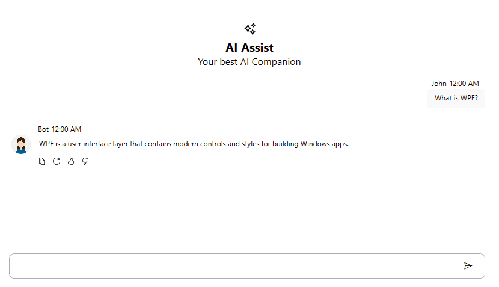
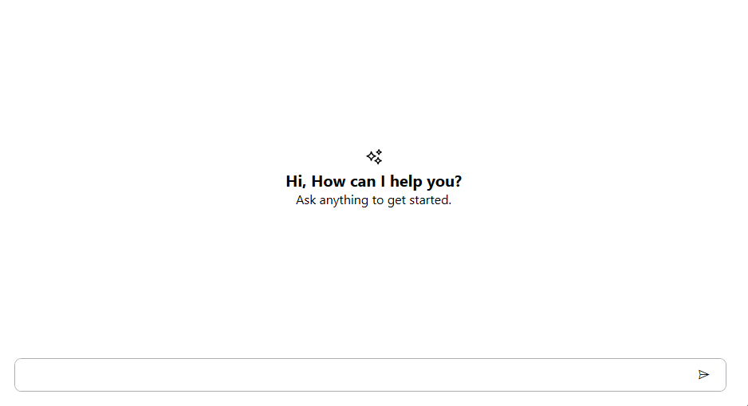
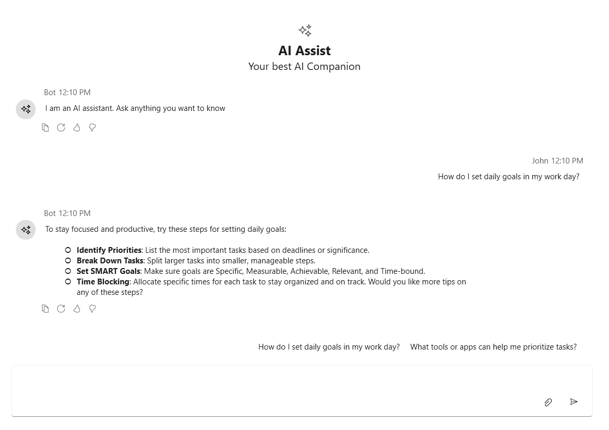

# Customization in WPF AI AssistView

This section covers the ways the [SfAIAssistView](https://help.syncfusion.com/cr/wpf/Syncfusion.UI.Xaml.Chat.SfAIAssistView.html) control can be customized to meet application requirements. Use the options below to define a banner that appears above the chat list, render rich content before a chat begins, and switch the look of each AI response using a template selector.

## BannerTemplate

The `BannerTemplate` property of [SfAIAssistView](https://help.syncfusion.com/cr/wpf/Syncfusion.UI.Xaml.Chat.SfAIAssistView.html) lets you define the UI shown above the chat list. It is useful for displaying a welcome message, brand identity, or any custom header content. The banner area can host any WPF element through a `DataTemplate`.




<Window
    x:Class="GettingStarted.MainWindow"
    xmlns="http://schemas.microsoft.com/winfx/2006/xaml/presentation"
    xmlns:x="http://schemas.microsoft.com/winfx/2006/xaml"
    xmlns:local="clr-namespace:GettingStarted"
    xmlns:d="http://schemas.microsoft.com/expression/blend/2008"
    xmlns:mc="http://schemas.openxmlformats.org/markup-compatibility/2006"
    xmlns:syncfusion="clr-namespace:Syncfusion.UI.Xaml.Chat;assembly=Syncfusion.SfChat.Wpf"
    mc:Ignorable="d">
    <Grid>
        <syncfusion:SfAIAssistView x:Name="aiAssistView"
                                   CurrentUser="{Binding CurrentUser}"
                                   Messages="{Binding Chats}">
            <syncfusion:SfAIAssistView.BannerTemplate>
                <DataTemplate>
                    <StackPanel Orientation="Vertical"
                                VerticalAlignment="Bottom"
                                HorizontalAlignment="Center"
                                Margin="0,10,0,0">
                        <Viewbox Height="32" Width="32">
                            <Path Margin="4"
                                  Data="M12.7393 0.396994C12.6915 0.170186 12.4942 0.00592917 12.2625 0.000156701C12.0307 -0.00561577 11.8255 0.14861 11.7665 0.372759L11.6317 0.88471C11.4712 1.49477 10.9948 1.97121 10.3847 2.13174L9.87276 2.26646C9.66167 2.32201 9.51101 2.50807 9.50058 2.72609C9.49014 2.94412 9.62234 3.14371 9.82715 3.21917L10.5469 3.48434C11.0663 3.67572 11.4646 4.10158 11.6208 4.63266L11.7703 5.14108C11.8343 5.35877 12.0369 5.50605 12.2637 5.49981C12.4906 5.49358 12.6847 5.3354 12.7367 5.11453L12.8292 4.72158C12.9661 4.1398 13.3904 3.66811 13.9545 3.47067L14.6652 3.22193C14.8737 3.14895 15.0096 2.94777 14.9995 2.72708C14.9894 2.50639 14.8356 2.31851 14.6213 2.26493L14.1122 2.13768C13.4624 1.97521 12.9622 1.45598 12.8242 0.800453L12.7393 0.396994Z"
                                  Fill="Black"/>
                        </Viewbox>
                        <TextBlock Text="AI Assist"
                                   FontSize="20"
                                   HorizontalAlignment="Center"
                                   FontWeight="Bold"/>
                        <TextBlock Text="Your best AI Companion"
                                   HorizontalAlignment="Center"
                                   FontSize="16"/>
                    </StackPanel>
                </DataTemplate>
            </syncfusion:SfAIAssistView.BannerTemplate>
        </syncfusion:SfAIAssistView>
    </Grid>
</Window>




## EmptyView and EmptyViewTemplate

By using the `EmptyView` and `EmptyViewTemplate` properties, the [SfAIAssistView](https://help.syncfusion.com/cr/wpf/Syncfusion.UI.Xaml.Chat.SfAIAssistView.html) displays custom content (such as a welcome message, an image, or a call-to-action) when the conversation has no messages. This is useful for guiding the user before a chat begins.

The empty view is automatically shown when the `Messages` collection is empty and either `EmptyView` or `EmptyViewTemplate` is set. When a `BannerTemplate` is provided, the empty view is hidden and the banner is displayed instead.

### EmptyView

The `EmptyView` property accepts any object as its content, which is then displayed in the center of the AI AssistView when there are no messages.




<Window
    x:Class="GettingStarted.MainWindow"
    xmlns="http://schemas.microsoft.com/winfx/2006/xaml/presentation"
    xmlns:x="http://schemas.microsoft.com/winfx/2006/xaml"
    xmlns:local="clr-namespace:GettingStarted"
    xmlns:d="http://schemas.microsoft.com/expression/blend/2008"
    xmlns:mc="http://schemas.openxmlformats.org/markup-compatibility/2006"
    xmlns:syncfusion="clr-namespace:Syncfusion.UI.Xaml.Chat;assembly=Syncfusion.SfChat.Wpf"
    mc:Ignorable="d">
    <Grid>
        <syncfusion:SfAIAssistView x:Name="AiAssistView"
                                   EmptyView="How can I help you?"/>
    </Grid>
</Window>




### EmptyViewTemplate

The `EmptyViewTemplate` property allows you to fully customize the appearance of the empty view by providing a `DataTemplate`. This is helpful when you need to display richer content such as images, multiple text blocks, or styled layouts.




<Window
    x:Class="GettingStarted.MainWindow"
    xmlns="http://schemas.microsoft.com/winfx/2006/xaml/presentation"
    xmlns:x="http://schemas.microsoft.com/winfx/2006/xaml"
    xmlns:local="clr-namespace:GettingStarted"
    xmlns:d="http://schemas.microsoft.com/expression/blend/2008"
    xmlns:mc="http://schemas.openxmlformats.org/markup-compatibility/2006"
    xmlns:syncfusion="clr-namespace:Syncfusion.UI.Xaml.Chat;assembly=Syncfusion.SfChat.Wpf"
    mc:Ignorable="d">
    <Grid>
        <syncfusion:SfAIAssistView x:Name="AiAssistView">
            <syncfusion:SfAIAssistView.EmptyViewTemplate>
                <DataTemplate>
                    <StackPanel
                        Orientation="Vertical"
                        VerticalAlignment="Center"
                        HorizontalAlignment="Center">
                        <TextBlock Text="Hi, How can I help you?" FontSize="20" HorizontalAlignment="Center" FontWeight="Bold" Foreground="{DynamicResource ContentForeground}"/>
                        <TextBlock Text="Ask anything to get started." HorizontalAlignment="Center" FontSize="16" Foreground="{DynamicResource ContentForeground}"/>
                    </StackPanel>
                </DataTemplate>
            </syncfusion:SfAIAssistView.EmptyViewTemplate>
        </syncfusion:SfAIAssistView>
    </Grid>
</Window>




## ViewTemplateSelector

The `ViewTemplateSelector` property of [SfAIAssistView](https://help.syncfusion.com/cr/wpf/Syncfusion.UI.Xaml.Chat.SfAIAssistView.html) lets you choose a different `DataTemplate` for each chat item based on its runtime information. This is helpful when you want to render messages differently — for example, by showing the bot's reply through a Markdown viewer while keeping the user's messages as plain text. Use a custom `DataTemplateSelector` to return the appropriate template for each message type.

### Create a custom DataTemplateSelector

Create a selector that derives from `DataTemplateSelector` and returns a `DataTemplate` for each message. In this example, bot replies (`TextMessage` items with `Author.Name == "Bot"`) are rendered through the Markdown viewer (`BotTemplate`), and user messages are rendered as plain text (`UserTemplate`).




using System.Windows;
using System.Windows.Controls;
using Syncfusion.UI.Xaml.Chat;

namespace GettingStarted
{
    public class ViewTemplateSelector : DataTemplateSelector
    {
        public DataTemplate UserTemplate { get; set; }
        public DataTemplate BotTemplate { get; set; }

        public override DataTemplate SelectTemplate(object item, DependencyObject container)
        {
            if (item is ITextMessage msg)
            {
                if (msg.Author?.Name == "Bot")
                    return BotTemplate ?? UserTemplate;
                return UserTemplate;
            }
            return null;
        }
    }
}




### Create the ViewModel

Add a `ViewModel` that exposes `Chats` and `CurrentUser`, and populate it with a user `TextMessage` and a bot `TextMessage` whose `Text` contains Markdown formatting.




using Syncfusion.UI.Xaml.Chat;
using System;
using System.Collections.ObjectModel;
using System.ComponentModel;

namespace GettingStarted
{
    public class ViewModel : INotifyPropertyChanged
    {
        public ObservableCollection<object> Chats { get; set; }
        public Author CurrentUser { get; set; }

        public ViewModel()
        {
            Chats = new ObservableCollection<object>();
            CurrentUser = new Author { Name = "John" };
            GenerateMessages();
        }

        private void GenerateMessages()
        {
            string goalSuggest = "How do I set daily goals in my work day?";
            string goalSolution = "To stay focused and productive, try these steps for setting daily goals:\n\n" +
                                  "- **Identify Priorities**: List the most important tasks based on deadlines or significance.\n" +
                                  "- **Break Down Tasks**: Split larger tasks into smaller, manageable steps.\n" +
                                  "- **Set SMART Goals**: Make sure goals are Specific, Measurable, Achievable, Relevant, and Time-bound.\n" +
                                  "- **Time Blocking**: Allocate specific times for each task to stay organized and on track.\n" +
                                  "Would you like more tips on any of these steps?";

            var user = new Author { Name = "John" };

            Chats.Add(new TextMessage
            {
                Author = user,
                DateTime = DateTime.Now,
                Text = goalSuggest
            });

            Chats.Add(new TextMessage
            {
                Author = new Author { Name = "Bot" },
                DateTime = DateTime.Now,
                Text = goalSolution
            });
        }

        public event PropertyChangedEventHandler PropertyChanged;
        private void RaisePropertyChanged(string propertyName) =>
            PropertyChanged?.Invoke(this, new PropertyChangedEventArgs(propertyName));
    }
}




### Define the templates and apply the selector

Define `UserTemplate` and `BotTemplate` inside the `ViewTemplateSelector`. `BotTemplate` renders the response inside the [SfMarkdownViewer](https://help.syncfusion.com/cr/wpf/Syncfusion.UI.Xaml.Markdown.SfMarkdownViewer.html) control from the `Syncfusion.SfMarkdownViewer.WPF` NuGet so that Markdown formatting (headings, bold, lists, code blocks, links) is rendered correctly. `UserTemplate` wraps the text in a `Border` with a corner radius so the user bubble is clearly visible. Then assign the selector to `ViewTemplateSelector` of the SfAIAssistView.




<Window x:Class="GettingStarted.MainWindow"
        xmlns="http://schemas.microsoft.com/winfx/2006/xaml/presentation"
        xmlns:x="http://schemas.microsoft.com/winfx/2006/xaml"
        xmlns:d="http://schemas.microsoft.com/expression/blend/2008"
        xmlns:mc="http://schemas.openxmlformats.org/markup-compatibility/2006"
        xmlns:syncfusion="clr-namespace:Syncfusion.UI.Xaml.Chat;assembly=Syncfusion.SfChat.Wpf"
        xmlns:local="clr-namespace:GettingStarted"
        xmlns:markdown="clr-namespace:Syncfusion.UI.Xaml.Markdown;assembly=Syncfusion.SfMarkdownViewer.WPF"
        mc:Ignorable="d"
        Title="MainWindow" Height="450" Width="800">
    <Grid x:Name="grid">
        <Grid.DataContext>
            <local:ViewModel/>
        </Grid.DataContext>
        <Grid.Resources>
            <local:ViewTemplateSelector x:Key="viewTemplateSelector">
                <local:ViewTemplateSelector.UserTemplate>
                    <DataTemplate>
                        <Border
                                CornerRadius="6"
                                Padding="10,6"
                                HorizontalAlignment="Right"
                                MaxWidth="380">
                            <TextBlock Text="{Binding Text}"
                                       TextWrapping="Wrap"
                                       Foreground="Black"
                                       FontSize="14"/>
                        </Border>
                    </DataTemplate>
                </local:ViewTemplateSelector.UserTemplate>

                <local:ViewTemplateSelector.BotTemplate>
                    <DataTemplate>
                        <markdown:SfMarkdownViewer
                            Source="{Binding Text}"
                            Height="150"/>
                    </DataTemplate>
                </local:ViewTemplateSelector.BotTemplate>
            </local:ViewTemplateSelector>
        </Grid.Resources>

        <syncfusion:SfAIAssistView x:Name="AiAssistView"
                                   CurrentUser="{Binding CurrentUser}"
                                   Messages="{Binding Chats}"
                                   ViewTemplateSelector="{StaticResource viewTemplateSelector}"
                                   IsResponseToolbarVisible="True"/>
    </Grid>
</Window>




