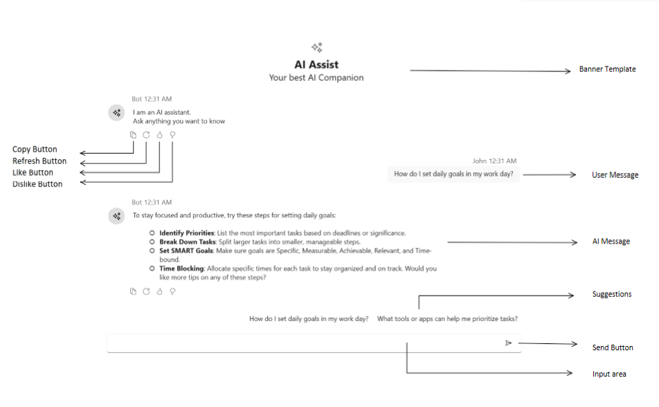
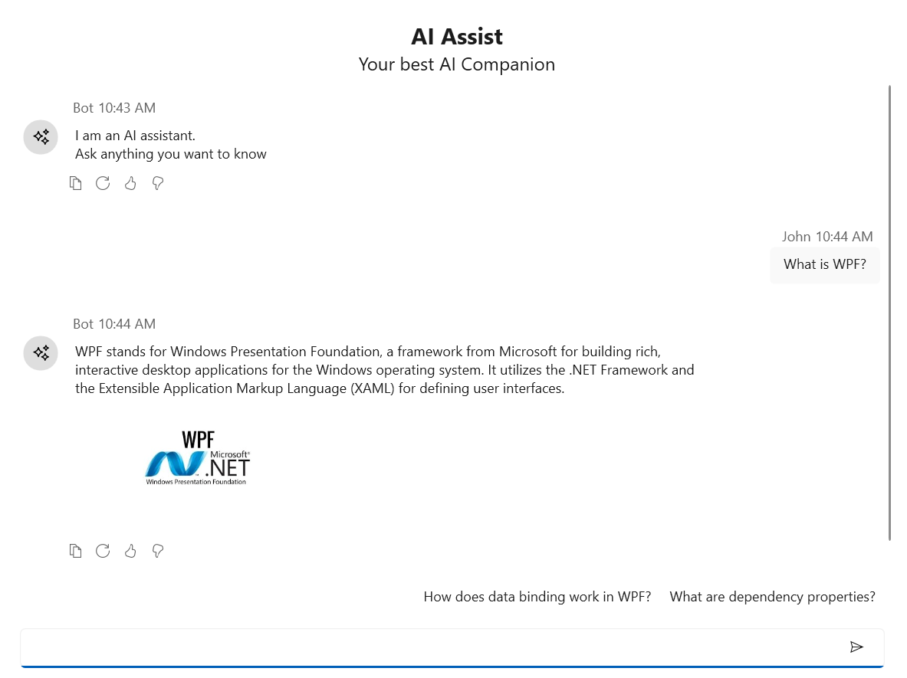

# Getting Started with WPF AI AssistView

This section explains the steps required to add the Wpf [SfAIAssistView](https://help.syncfusion.com/cr/wpf/Syncfusion.UI.Xaml.Chat.SfAIAssistView.html) control with its basic features.

## Structure of SfAIAssistView

## Adding WPF SfAIAssistview via xaml

1. Create a [Wpf desktop app for C# and .NET 6](https://learn.microsoft.com/en-us/dotnet/desktop/wpf/get-started/create-app-visual-studio?view=netdesktop-9.0).
2. Add reference to [Syncfusion.SfChat.Wpf](https://www.nuget.org/packages/Syncfusion.SfChat.Wpf) NuGet. 
3. Import the control namespace `Syncfusion.UI.Xaml.Chat` in XAML or C# code.
4. Initialize the [SfAIAssistView](https://help.syncfusion.com/cr/wpf/Syncfusion.UI.Xaml.Chat.SfAIAssistView.html) control.




<Page
    x:Class="GettingStarted.MainPage"
    xmlns="http://schemas.microsoft.com/winfx/2006/xaml/presentation"
    xmlns:x="http://schemas.microsoft.com/winfx/2006/xaml"
    xmlns:local="using:GettingStarted"
    xmlns:d="http://schemas.microsoft.com/expression/blend/2008"
    xmlns:mc="http://schemas.openxmlformats.org/markup-compatibility/2006"
    xmlns:syncfusion="using:Syncfusion.UI.Xaml.Chat"
    mc:Ignorable="d"
    Background="{ThemeResource ApplicationPageBackgroundThemeBrush}">
    <Grid>
      <syncfusion:SfAIAssistView />
    </Grid>
</Page>




## Adding WPF SfAIAssistview via C#

1. Create a [Wpf desktop app for C# and .NET 6](https://learn.microsoft.com/en-us/dotnet/desktop/wpf/get-started/create-app-visual-studio?view=netdesktop-9.0).
2. Add reference to [Syncfusion.SfChat.Wpf](https://www.nuget.org/packages/Syncfusion.SfChat.Wpf) NuGet. 
3. Import the control namespace `Syncfusion.UI.Xaml.Chat` in XAML or C# code.
4. Initialize the [SfAIAssistView](https://help.syncfusion.com/cr/wpf/Syncfusion.UI.Xaml.Chat.SfAIAssistView.html) control.




using Syncfusion.UI.Xaml.Chat;

namespace GettingStarted
{
    /// 

    /// Interaction logic for MainWindow.xaml
    /// 

    public partial class MainWindow : Window
    {
        public MainWindow()
        {
            this.InitializeComponent();
            // Creating an instance of the AIAssistView control
            SfAIAssistView assistView = new SfAIAssistView();
            grid.Children.Add(assistView);
        }
    }
}
           



## Creating ViewModel for AI AssistView

Create a simple chat collection as shown in the following code example in a new class file. Save it as ViewModel.cs file.




 public class ViewModel : INotifyPropertyChanged
 {
     private ObservableCollection<object> chats;
     private Author currentUser;
     public ViewModel()
     {
         this.Chats = new ObservableCollection<object>();          
         this.CurrentUser = new Author { Name="John"};
         this.GenerateMessages();
     }

     private async void GenerateMessages()
     {
         this.Chats.Add( new TextMessage { Author = CurrentUser, Text = "What is WPF?" } );        
         await Task.Delay(1000);
         this.Chats.Add( new TextMessage { Author = new Author { Name = "Bot" }, Text = "WPF is a user interface layer that contains modern controls and styles for building Windows apps." });
     }

     public ObservableCollection<object> Chats
     {
         get
         {
             return this.chats;
         }
         set
         {
             this.chats = value;
             RaisePropertyChanged("Messages");
         }
     }

     public Author CurrentUser
     {
         get
         {
             return this.currentUser;
         }
         set
         {
             this.currentUser = value;
             RaisePropertyChanged("CurrentUser");
         }
     }

     public void RaisePropertyChanged(string propName)
     {
         if (PropertyChanged != null)
         {
             PropertyChanged(this, new PropertyChangedEventArgs(propName));
         }
     }

     public event PropertyChangedEventHandler PropertyChanged;
  }




## Bind Messages

Set the ViewModel as the DataContext for the AI AssistView or the parent window. This allows data binding between the UI and the ViewModel properties.
To populate AI AssistView, bind the chats in ViewModel to Messages property of AI AssistView.




<Page
    x:Class="GettingStarted.MainPage"
    xmlns="http://schemas.microsoft.com/winfx/2006/xaml/presentation"
    xmlns:x="http://schemas.microsoft.com/winfx/2006/xaml"
    xmlns:local="using:GettingStarted"
    xmlns:d="http://schemas.microsoft.com/expression/blend/2008"
    xmlns:mc="http://schemas.openxmlformats.org/markup-compatibility/2006"
    xmlns:syncfusion="using:Syncfusion.UI.Xaml.Chat"
    mc:Ignorable="d"
    Background="{ThemeResource ApplicationPageBackgroundThemeBrush}">
    <Grid>
     <Grid.DataContext>
        <local:ViewModel/>
     </Grid.DataContext>
      <syncfusion:SfAIAssistView   CurrentUser="{Binding CurrentUser}"  
                                   Messages="{Binding Chats}"/>
    </Grid>
</Page>

 


