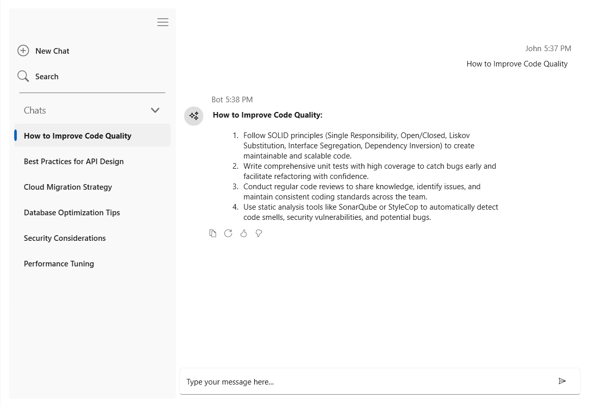
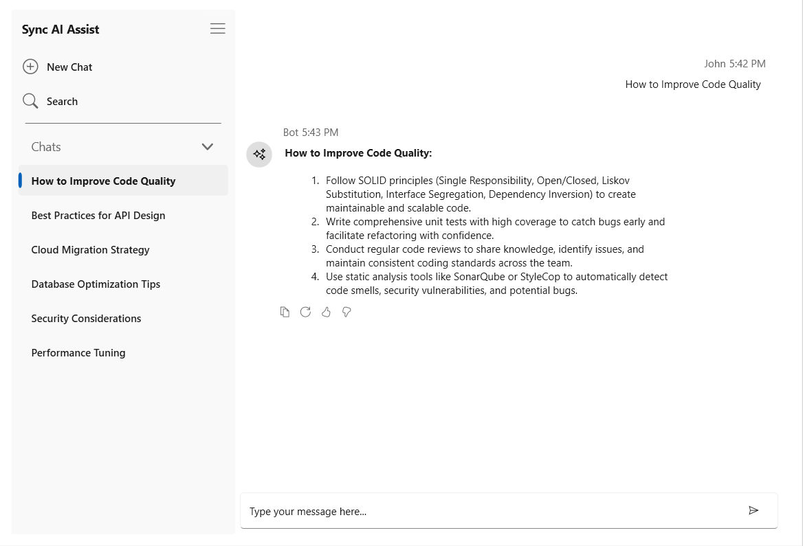

# Conversation history in WPF AI AssistView

The `SfAIAssistView` supports conversation history for creating new chats, preserving previous conversations, and switching between archived conversations through a built-in navigation view.

## Show or hide the navigation view

The `ShowNavigationView` property controls the visibility of the conversation history navigation view. Its default value is `false`.




<syncfusion:SfAIAssistView x:Name="aiAssistView"
                           ShowNavigationView="True" />




using System.Windows;

namespace AIAssistViewHistoryWPF
{
    public partial class MainWindow : Window
    {
        public MainWindow()
        {
            InitializeComponent();
            aiAssistView.ShowNavigationView = true;
        }
    }
}




The built-in hamburger button collapses or expands the navigation view when it is visible.

## Conversation history

The SfAIAssistView control provides a History feature that allows you to display the conversation history from interactions with real-time AI. To disable this feature, set the ShowNavigationView property to false.

### Binding data into conversation history

The SfAIAssistView control provides the `Conversations` property to manually set the conversation history items source. This source also updates at runtime when new requests are made in the conversation.

### Define the view model

Create a view model with an `ObservableCollection<AssistConversationItem>` and populate each conversation with its associated messages.




using System;
using System.Collections.ObjectModel;
using Syncfusion.UI.Xaml.Chat;

namespace AIAssistViewHistoryWPF
{
    public class AIAssistViewModel
    {
        public ObservableCollection<object> Chats { get; set; }

        public Author CurrentUser { get; set; }

        public ObservableCollection<AssistConversationItem> Conversations { get; set; }

        public AIAssistViewModel()
        {
            CurrentUser = new Author() { Name = "User" };
            Chats = new ObservableCollection<object>();

            DateTime today = DateTime.Today;
            DateTime yesterday = today.Subtract(TimeSpan.FromDays(1));
            DateTime twoDaysAgo = today.Subtract(TimeSpan.FromDays(2));

            Conversations = new ObservableCollection<AssistConversationItem>()
            {
                CreateConversation(
                    "Scotland",
                    "Tell me about Scotland.",
                    "Scotland is known for its historic castles, landscapes, and cultural heritage.",
                    twoDaysAgo),

                CreateConversation(
                    "Coding practices",
                    "What are some good coding practices?",
                    "Use code reviews, unit testing, clear naming, and consistent coding standards.",
                    yesterday),

                CreateConversation(
                    "Syncfusion",
                    "What does Syncfusion provide?",
                    "Syncfusion provides UI controls and components for .NET applications.",
                    today)
            };
        }

        private AssistConversationItem CreateConversation(string title, string requestText, string responseText, DateTime dateTime)
        {
            return new AssistConversationItem()
            {
                Title = title,
                DateTime = dateTime,
                AssistItems = new ObservableCollection<object>()
                {
                    new TextMessage()
                    {
                        Text = requestText,
                        DateTime = dateTime,
                        Author = CurrentUser
                    },
                    new TextMessage()
                    {
                        Text = responseText,
                        DateTime = dateTime.AddMinutes(1),
                        Author = new Author() { Name = "Syncfusion AI" }
                    }
                }
            };
        }
    }
}




### Bind conversations to SfAIAssistView

Set the window's data context and bind the `Conversations` property to display the archived conversations in the navigation view. Set `ShowNavigationView` to `True` because the navigation view is hidden by default.




<Window
    x:Class="AIAssistViewHistoryWPF.MainWindow"
    xmlns="http://schemas.microsoft.com/winfx/2006/xaml/presentation"
    xmlns:x="http://schemas.microsoft.com/winfx/2006/xaml"
    xmlns:local="clr-namespace:AIAssistViewHistoryWPF"
    xmlns:syncfusion="clr-namespace:Syncfusion.UI.Xaml.Chat;assembly=Syncfusion.SfChat.Wpf"
    Width="1000"
    Height="700">

    <Window.DataContext>
        <local:AIAssistViewModel />
    </Window.DataContext>

    <Grid Margin="20">
        <syncfusion:SfAIAssistView
            x:Name="aiAssistView"
            Messages="{Binding Chats}"
            CurrentUser="{Binding CurrentUser}"
            Conversations="{Binding Conversations}"
            ShowNavigationView="True"
            />
    </Grid>
</Window>




Selecting a conversation from the history replaces the current messages with the messages stored in its AssistItems collection. The built-in New Chat option starts a new conversation while preserving existing conversations that contain user requests in the conversation history.

## Customize the navigation header

The SfAIAssistView control provides the NavigationHeader property to set the header text for the navigation view. By default, this property is set to string.Empty.




<syncfusion:SfAIAssistView x:Name="aiAssistView"
                           NavigationHeader="Sync AI Assist" />




using System.Windows;

namespace AIAssistViewHistoryWPF
{
    public partial class MainWindow : Window
    {
        public MainWindow()
        {
            InitializeComponent();
            aiAssistView.NavigationHeader = "Sync AI Assist";
        }
    }
}




