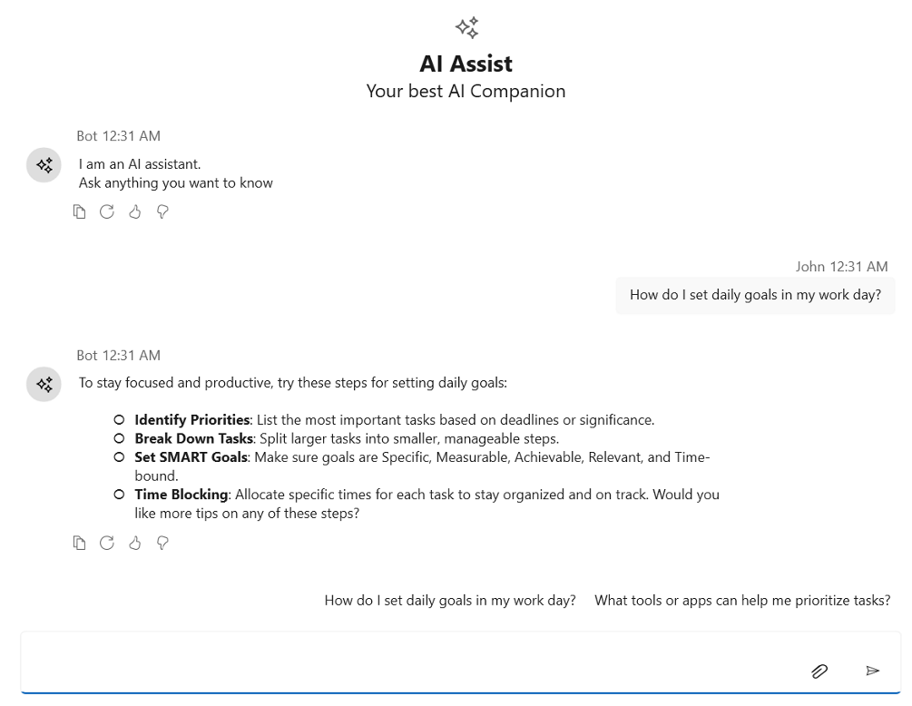

# Input Toolbar in WPF AI AssistView

The [SfAIAssistView](https://help.syncfusion.com/cr/wpf/Syncfusion.UI.Xaml.Chat.SfAIAssistView.html) control includes a toolbar feature inside the input textbox. This toolbar allows users to add custom toolbar items directly within the text input area, providing quick access to frequently used actions and tools.

## InputToolbarItem

The **InputToolbarItem** class is used to define and add items to the input textbox toolbar in the SfAIAssistView. The following properties are available in this class:

- **IsEnabled**: Specifies whether the toolbar item is enabled (interactive) or disabled (non-interactive).
- **Tooltip**: Sets the tooltip text displayed when the user hovers over the toolbar item.
- **Visible**: Indicates whether the toolbar item is visible.
- **ItemTemplate**: Allows you to set a custom template for rendering the toolbar item.

## Adding an input toolbar item to the input toolbar

The **InputToolbarItem** in [SfAIAssistView](https://help.syncfusion.com/cr/wpf/Syncfusion.UI.Xaml.Chat.SfAIAssistView.html) the text area does not include built-in toolbar items like the response toolbar (e.g., Copy, Like, Dislike, Regenerate). However, you can add custom items using the InputToolbarItem class.

Use the ItemTemplate property to define the appearance and behavior of each toolbar item. This allows you to display icons, buttons, text, or even complex UI elements such as Path, Image, or TextBlock within the toolbar.




<syncfusion:SfAIAssistView x:Name="aiAssistView" CurrentUser="{Binding CurrentUser}"
                            IsInputToolbarVisible="True"
                            Messages="{Binding Chats}" >
    <syncfusion:SfAIAssistView.InputToolbarItems>
        <syncfusion:InputToolbarItem>
            <syncfusion:InputToolbarItem.ItemTemplate>
                            <DataTemplate>
                                <Button Height="24" Width="30" Padding="3" >
                                        <Viewbox>
                                            <Path Fill="Black" Stretch="UniformToFill"
Data="M10.2656 3.0293C10.5 3.0293 10.7207 3.07422 10.9277 3.16406C11.1348 3.25391 11.3145 3.37695 11.4668 3.5332C11.623 3.68555 11.7461 3.86523 11.8359 4.07227C11.9258 4.2793 11.9707 4.5 11.9707 4.73438C11.9707 4.96484 11.9277 5.18164 11.8418 5.38477C11.7559 5.58789 11.6309 5.77148 11.4668 5.93555L6.31055 11.1152C6.16211 11.2637 5.98633 11.3633 5.7832 11.4141L3.46875 11.9824C3.45312 11.9863 3.4375 11.9902 3.42188 11.9941C3.41016 11.9941 3.39453 11.9941 3.375 11.9941C3.27344 11.9941 3.18555 11.957 3.11133 11.8828C3.04102 11.8086 3.00586 11.7207 3.00586 11.6191C3.00586 11.5996 3.00586 11.584 3.00586 11.5723C3.00977 11.5566 3.01367 11.541 3.01758 11.5254L3.60938 9.22266C3.63281 9.12891 3.66992 9.03711 3.7207 8.94727C3.77539 8.85352 3.83594 8.77344 3.90234 8.70703L9.06445 3.52734C9.22461 3.36719 9.4082 3.24414 9.61523 3.1582C9.82617 3.07227 10.043 3.0293 10.2656 3.0293ZM10.2656 3.7793C10.1406 3.7793 10.0195 3.80273 9.90234 3.84961C9.78906 3.89648 9.6875 3.96484 9.59766 4.05469L4.43555 9.24023C4.38477 9.29102 4.35156 9.34766 4.33594 9.41016L3.90234 11.1035L5.60742 10.6816C5.67383 10.666 5.73242 10.6328 5.7832 10.582L10.9395 5.4082C11.0293 5.31836 11.0977 5.21484 11.1445 5.09766C11.1914 4.98047 11.2148 4.85938 11.2148 4.73438C11.2148 4.60547 11.1895 4.48242 11.1387 4.36523C11.0918 4.24805 11.0254 4.14648 10.9395 4.06055C10.8535 3.97461 10.752 3.90625 10.6348 3.85547C10.5215 3.80469 10.3984 3.7793 10.2656 3.7793ZM5.58398 5.95898L5.00391 6.53906L4.5 5.25H1.50586L0.726562 7.25977C0.699219 7.33008 0.652344 7.38672 0.585938 7.42969C0.523438 7.47266 0.455078 7.49414 0.380859 7.49414C0.275391 7.49414 0.185547 7.45898 0.111328 7.38867C0.0371094 7.31836 0 7.23047 0 7.125C0 7.10156 0.00195312 7.07812 0.00585938 7.05469C0.00976562 7.02734 0.015625 7.00391 0.0234375 6.98438L2.64844 0.234375C2.67969 0.160156 2.72656 0.101562 2.78906 0.0585938C2.85156 0.015625 2.92188 -0.00585938 3 -0.00585938C3.07812 -0.00585938 3.14844 0.015625 3.21094 0.0585938C3.27344 0.101562 3.32031 0.160156 3.35156 0.234375L5.58398 5.95898ZM3 1.40039L1.79883 4.5H4.21289L3 1.40039Z"/>
                                        </Viewbox>
                                    </Button>
                            </DataTemplate>
            </syncfusion:InputToolbarItem.ItemTemplate>
        </syncfusion:InputToolbarItem>
    </syncfusion:SfAIAssistView.InputToolbarItems>
</syncfusion:SfAIAssistView>

 


## Input toolbar position

The **InputToolbarPosition** property of the [SfAIAssistView](https://help.syncfusion.com/cr/wpf/Syncfusion.UI.Xaml.Chat.SfAIAssistView.html) control specifies the placement of the input toolbar within the control. By default, the toolbar is positioned on the right side of the control.




<syncfusion:SfAIAssistView CurrentUser="{Binding CurrentUser}"  
                           Messages="{Binding Chats}" IsInputToolbarVisible="True"
                           InpuToolbarPosition="Left">
</syncfusion:SfAIAssistView>

 


SfAIAssistView aiAssistView = new SfAIAssistView();
aiAssistView.InputToolbarPosition = ToolbarPosition.Left;




## Input toolbar visibility

The **IsInputToolbarVisible** property of the [SfAIAssistView](https://help.syncfusion.com/cr/wpf/Syncfusion.UI.Xaml.Chat.SfAIAssistView.html) control determines whether the input toolbar is displayed in the SfAIAssistView. When set to true, the input toolbar becomes visible. By default, this property is set to false.




<syncfusion:SfAIAssistView CurrentUser="{Binding CurrentUser}"  
                           Messages="{Binding Chats}" IsInputToolbarVisible="True">
</syncfusion:SfAIAssistView>

 


SfAIAssistView aiAssistView = new SfAIAssistView();
aiAssistView.IsInputToolbarVisible = True;




## Item clicked event 

The **InputToolbarItemClicked** event is triggered whenever a toolbar item in the InputToolbarItems collection is clicked by the user. You can handle this event to perform custom actions based on which item was clicked.




<syncfusion:SfAIAssistView x:Name="sfAIAssistView" CurrentUser="{Binding CurrentUser}"  
                               Messages="{Binding Chats}" InputToolbarItemClicked="AiAssistView_InputToolbarItemClicked"/>

 


SfAIAssistView sfAIAssistView = new SfAIAssistView();
sfAIAssistView.InputToolbarItemClicked += AiAssistView_InputToolbarItemClicked;

private void AiAssistView_InputToolbarItemClicked(object sender, InputToolbarItemClickedEventArgs e)
{
    // Call your actions based on the toolbar item clicked.
}



