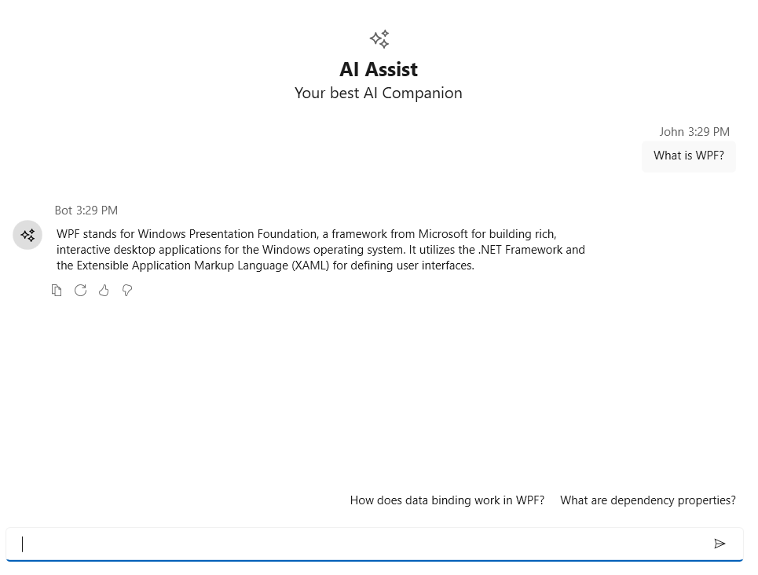
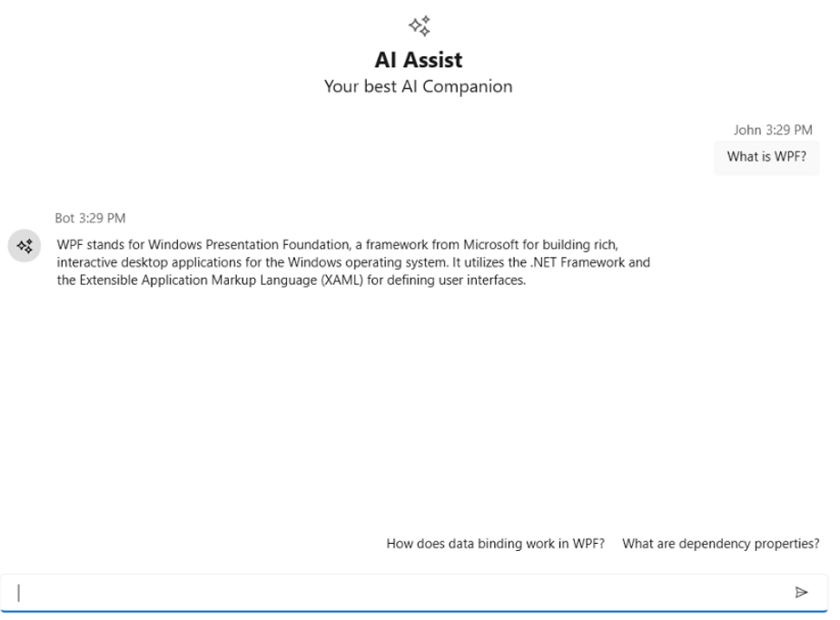
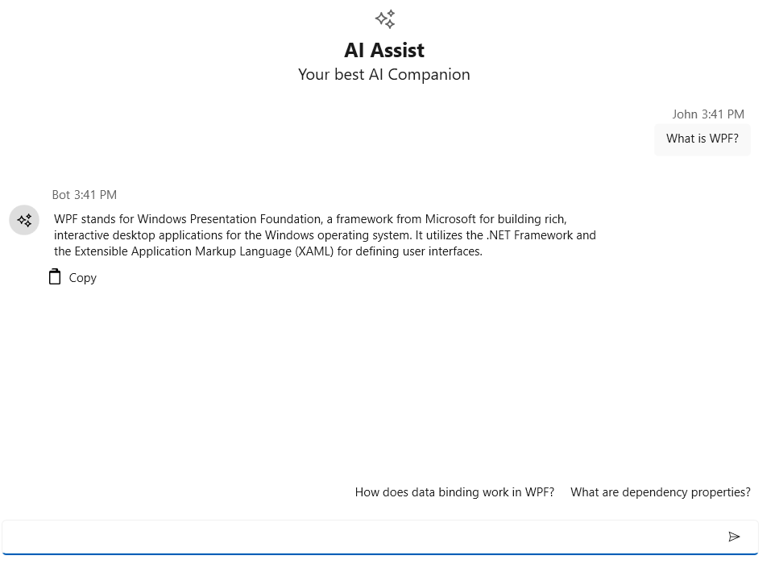

# Response Toolbar in WPF AI AssistView

The [SfAIAssistView](https://help.syncfusion.com/cr/wpf/Syncfusion.UI.Xaml.Chat.SfAIAssistView.html) control includes a **Response Toolbar** feature, which provides built-in options such as Copy, Regenerate, Like, and Dislike for each chat response. These items provide quick actions to enhance user interactions. In addition to the built-in options, users can personalize the Response Toolbar by adding their own custom toolbar items to suit specific application needs.

## ResponseToolbarItem

The **ResponseToolbarItem** class is used to define and add items in the response toolbar of chat responses for SfAIAssistView. The following properties are available in this class:

- **Index**: Specifies the internal order or position of the toolbar item.
- **IsEnabled**: Specifies whether the toolbar item is enabled (interactive) or disabled (non-interactive).
- **Tooltip**: Sets the tooltip text displayed when the user hovers over the toolbar item.
- **Visible**: Indicates whether the toolbar item is visible.
- **ItemType**: Specifies the type of the toolbar item. This is used to distinguish between built-in and custom items.
- **ItemTemplate**: Allows you to set a custom template for rendering the toolbar item.




<syncfusion:SfAIAssistView x:Name="aiAssistView" CurrentUser="{Binding CurrentUser}"  
                               Messages="{Binding Chats}" >
</syncfusion:SfAIAssistView>

 


## Response toolbar visibility

The **IsResponseToolbarVisible** property of the [SfAIAssistView](https://help.syncfusion.com/cr/wpf/Syncfusion.UI.Xaml.Chat.SfAIAssistView.html) control determines whether the response toolbar is displayed below each chat items responses. When set to false, the response toolbar is hidden. By default, this property is set to true.




<syncfusion:SfAIAssistView CurrentUser="{Binding CurrentUser}"  
                               Messages="{Binding Chats}" IsResponseToolbarVisible="False">
</syncfusion:SfAIAssistView>

 


SfAIAssistView aiAssistView = new SfAIAssistView();
aiAssistView.IsResponseToolbarVisible = false;




## Customization of Response toolbar item using ItemTemplate

The **ResponseToolbarItem** in [SfAIAssistView](https://help.syncfusion.com/cr/wpf/Syncfusion.UI.Xaml.Chat.SfAIAssistView.html) can be customized using the ItemTemplate property to define a custom appearance and behavior. This allows you to display icons, buttons, text, or even UI elements such as Path, Image, or TextBlock within the toolbar.




<syncfusion:SfAIAssistView x:Name="aiAssistView" CurrentUser="{Binding CurrentUser}"  
                            Messages="{Binding Chats}" >
    <syncfusion:SfAIAssistView.ResponseToolbarItems>
        <syncfusion:ResponseToolbarItem ItemType="Custom" Tooltip="Copy">
            <syncfusion:ResponseToolbarItem.ItemTemplate>
                <DataTemplate>
                    <Button ToolTipService.ToolTip="Copy to clipboard"
                            HorizontalAlignment="Left"
                            Padding="5,2"
                            Background="Transparent"
                            BorderThickness="0">
                        <StackPanel Orientation="Horizontal" VerticalAlignment="Center">
                            <Path Width="16" Height="16" Fill="Black"Stretch="Uniform"
                                Data="M3,1 L10,1 C10.55,1 11,1.45 11,2 L11,3 L12,3 C12.55,3 13,3.45 13,4 L13,14 C13,14.55 12.55,15 12,15 L4,15 C3.45,15 3,14.55 3,14 L3,4 C3,3.45 3.45,3 4,3 L5,3 L5,2 C5,1.45 5.45,1 6,1 Z M5,3 L9,3 L9,2 L5,2 Z M4,5 L12,5 L12,14 L4,14 Z"/>
                            <TextBlock Text="Copy" Margin="6,0,0,0" VerticalAlignment="Center"/>
                        </StackPanel>
                    </Button>
                </DataTemplate>
            </syncfusion:ResponseToolbarItem.ItemTemplate>
        </syncfusion:ResponseToolbarItem>
    </syncfusion:SfAIAssistView.ResponseToolbarItems>
</syncfusion:SfAIAssistView>

 


## Item clicked event 

The **ResponseToolbarItemClicked** event is triggered whenever a toolbar item in the ResponseToolbarItems collection is clicked by the user. You can handle this event to perform custom actions based on which item was clicked.




<syncfusion:SfAIAssistView x:Name="sfAIAssistView" CurrentUser="{Binding CurrentUser}"  
                               Messages="{Binding Chats}" ResponseToolbarItemClicked="AiAssistView_ResponseToolbarItemClicked"/>

 


SfAIAssistView sfAIAssistView = new SfAIAssistView();
sfAIAssistView.ResponseToolbarItemClicked += AiAssistView_ResponseToolbarItemClicked;

private void AiAssistView_ResponseToolbarItemClicked(object sender, ResponseToolbarItemClickedEventArgs e)
{
    // Call your actions based on the toolbar item clicked.
}



